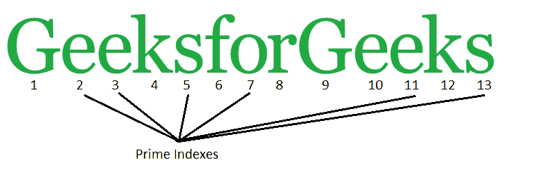

# 打印给定字符串中质数索引处字符的程序

> 原文:[https://www . geesforgeks . org/program-print-characters-present-prime-index-given-string/](https://www.geeksforgeeks.org/program-print-characters-present-prime-index-given-string/)

给定一个字符串，我们的任务是打印质数索引处的字符。

**示例:**

```
Input : I love programming 
Output : lv gan
Explanation :
prime index characters in a string are : lv gan

Input : Happy coding everyone
Output : apycn ro
```



**进场:**

1.  使用两个循环将数字除以字符串的长度值。
2.  余数为 0 时递增变量结果。
3.  如果变量 result = 1，则打印相应的字符。

下面是上述方法的实现:

## C++

```
// C++ Program to print Characters at
// Prime index in a given String
#include <bits/stdc++.h>
using namespace std;

bool isPrime(int n)
{
    // Corner case
    if (n <= 1) return false;

    // Check from 2 to n-1
    for (int i = 2; i < n; i++)
        if (n % i == 0)
            return false;

    return true;
}

// Function to print
// character at prime index
void prime_index(string input)
{
    int n = input.length();

    // Loop to check if
    // index prime or not
    for (int i = 2; i <= n; i++)
        if (isPrime(i))
            cout << input[i - 1];        
}

// Driver Code
int main()
{
    string input = "GeeksforGeeks";
    prime_index(input);
    return 0;
}
```

## Java 语言(一种计算机语言，尤用于创建网站)

```
// Java Program to print
// Characters at Prime index
// in a given String
class GFG
{
    static boolean isPrime(int n)
    {
        // Corner case
        if (n <= 1) return false;

        // Check from 2 to n-1
        for (int i = 2; i < n; i++)
            if (n % i == 0)
                return false;

        return true;
    }

    // Function to print
    // character at prime index
    static void prime_index(String input)
    {
        int n = input.length();

        // Loop to check if
        // index prime or not
        for (int i = 2; i <= n; i++)
            if (isPrime(i))

                System.out.print
                (input.charAt(i - 1));        
    }

    // Driver code
    public static void main (String[] args)
    {
        String input = "GeeksforGeeks";

        prime_index(input);
    }
}

// This code is contributed by Anant Agarwal.
```

## 蟒蛇 3

```
# Python3 program to print
# Characters at Prime index
# in a given String

def isPrime(n):

    # Corner case
    if n <= 1:
        return False

    # Check from 2 to n-1
    for i in range(2, n):
        if n % i == 0:
            return False;

    return True

# Function to print
# character at prime index
def prime_index (input):
    p = list(input)
    s = ""

    # Loop to check if
    # index prime or not
    for i in range (2, len(p) + 1):
        if isPrime(i):
            s = s + input[i-1]
    print (s)

# Driver Code
input = "GeeksforGeeks"
prime_index(input)
```

## C#

```
// C# Program to print Characters
// at Prime index in a given String
using System;

class GFG
{
    static bool isPrime(int n)
    {
        // Corner case
        if (n <= 1) return false;

        // Check from 2 to n-1
        for (int i = 2; i < n; i++)
            if (n % i == 0)
                return false;

        return true;
    }

    // Function to print character
    // at prime index
    static void prime_index(string input)
    {
        int n = input.Length;

        // Loop to check if
        // index prime or not
        for (int i = 2; i <= n; i++)
            if (isPrime(i))

                Console.Write(input[i - 1]);        
    }

    // Driver code
    public static void Main ()
    {
        string input = "GeeksforGeeks";

        prime_index(input);
    }
}

// This code is contributed by Vt_m.
```

## 服务器端编程语言（Professional Hypertext Preprocessor 的缩写）

```
<?php
// PHP Program to print
// Characters at Prime
// index in a given String

function isPrime($n)
{
    // Corner case
    if ($n <= 1) return false;

    // Check from 2 to n-1
    for ($i = 2; $i < $n; $i++)
        if ($n % $i == 0)
            return false;

    return true;
}

// Function to print
// character at prime index
function prime_index($input)
{
    $n = strlen($input);

    // Loop to check if
    // index prime or not
    for ($i = 2; $i <= $n; $i++)
        if (isPrime($i))
            echo $input[$i - 1];    
}

// Driver Code
$input = "GeeksforGeeks";
prime_index($input);

// This code is contributed by ajit.
?>
```

## java 描述语言

```
<script>

// Javascript program to print characters
// at Prime index in a given String
function isPrime(n)
{

    // Corner case
    if (n <= 1) return false;

    // Check from 2 to n-1
    for(let i = 2; i < n; i++)
        if (n % i == 0)
            return false;

    return true;
}

// Function to print character
// at prime index
function prime_index(input)
{
    let n = input.length;

    // Loop to check if
    // index prime or not
    for(let i = 2; i <= n; i++)
        if (isPrime(i))
            document.write(input[i - 1]);        
}

// Driver code
let input = "GeeksforGeeks";

prime_index(input);

// This code is contributed by suresh07 

</script>
```

**输出:**

```
eesoes
```

**优化:**
对于大字符串，我们可以使用厄拉多塞的[筛高效查找所有小于或等于字符串长度的素数。](https://www.geeksforgeeks.org/sieve-of-eratosthenes/)