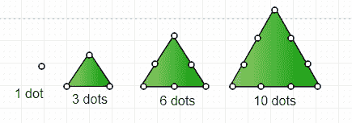

# 程序打印三角数列直到 n

> 原文:[https://www . geesforgeks . org/program-print-trial-number-series-till-n/](https://www.geeksforgeeks.org/program-print-triangular-number-series-till-n/)

一个[三角形数](https://www.geeksforgeeks.org/triangular-numbers/)或三角形数计算排列成等边三角形的物体，如右图所示。第 n 个三角形数是边上有 n 个点组成三角形的点数，等于 1 到 n 的 n 个自然数之和



**例:**

```
Input : 5
Output : 1 3 6 10 15

Input : 10 
Output : 1 3 6 10 15 21 28 36 45 55

Explanation :
For k = 1 and j = 1 -> print k ( i.e. 1);
increase j by 1 and add into k then print k ( i.e  3 ) update k
increase j by 1 and add into k then print k ( i.e  6 ) update k
increase j by 1 and add into k then print k ( i.e 10 ) update k 
increase j by 1 and add into k then print k ( i.e 15 ) update k
increase j by 1 and add into k then print k ( i.e 21 ) update k
.
.
and so on.
```

使用的方法非常简单。循环迭代，直到给定的值为 n，每次迭代将 j 增加 1，并将其添加到 k 中，这将简单地打印三角数列，直到 n。
下面是实现上述方法的程序:

## C

```
// C Program to find Triangular Number Series
#include <stdio.h>

// Function to find triangular number
void triangular_series(int n)
{
    int i, j = 1, k = 1;

    // For each iteration increase j by 1
    // and add it into k
    for (i = 1; i <= n; i++) {
        printf(" %d ", k);
        j = j + 1; // Increasing j by 1
        k = k + j; // Add value of j into k and update k
    }
}
// Driven Function
int main()
{
    int n = 5;
    triangular_series(n);
    return 0;
}
```

## Java 语言(一种计算机语言，尤用于创建网站)

```
// Java Program to print triangular number series till n
import java.util.*;

class GFG {

    // Function to find triangular number
    static void triangular_series(int n)
    {
        int i, j = 1, k = 1;

        // For each iteration increase j by 1
        // and add it into k
        for (i = 1; i <= n; i++) {

            System.out.printf("%d ", k);
            j = j + 1; // Increasing j by 1
            k = k + j; // Add value of j into k and update k
        }
    }

    // Driver function
    public static void main(String[] args)
    {
            int n = 5;
            triangular_series(n);
    }
}

// This code is contributed by Arnav Kr. Mandal.
```

## 蟒蛇 3

```
# Python3 code to find Triangular
# Number Series

# Function to find triangular number
def triangular_series( n ):
    j = 1
    k = 1

    # For each iteration increase j
    # by 1 and add it into k
    for i in range(1, n + 1):
        print(k, end = ' ')
        j = j + 1 # Increasing j by 1

        # Add value of j into k and update k
        k = k + j

# Driven Code
n = 5
triangular_series(n)

# This code is contributed by "Sharad_Bhardwaj"
```

## C#

```
// C# Program to print triangular
// number series till n
using System;

class GFG {

    // Function to find triangular number
    static void triangular_series(int n)
    {
        int i, j = 1, k = 1;

        // For each iteration increase j by 1
        // and add it into k
        for (i = 1; i <= n; i++) {

            Console.Write(k +" ");
            j += 1; // Increasing j by 1
            k += j; // Add value of j into k and update k
        }
    }

    // Driver Code
    public static void Main()
    {
            int n = 5;
            triangular_series(n);
    }
}

// This code is contributed by vt_m.
```

## 服务器端编程语言（Professional Hypertext Preprocessor 的缩写）

```
<?php
// PHP Program to find
// Triangular Number Series

// Function to find
// triangular number
function triangular_series($n)
{
    $i; $j = 1; $k = 1;

    // For each iteration increase j
    // by 1 and add it into k
    for ($i = 1; $i <= $n; $i++)
    {
        echo(" " . $k . " ");

        // Increasing j by 1
        $j = $j + 1;

        // Add value of j into k and update k
        $k = $k + $j;
    }
}

// Driver Code
$n = 5;
triangular_series($n);

// This code is contributed by Ajit.
?>
```

## java 描述语言

```
<script>
// javascript Program to find Triangular Number Series

// Function to find triangular number
function triangular_series( n)
{
    let i, j = 1, k = 1;

    // For each iteration increase j by 1
    // and add it into k
    for (i = 1; i <= n; i++)
    {
        document.write(k+" ");
        j = j + 1; // Increasing j by 1
        k = k + j; // Add value of j into k and update k
    }
}

// Driven Function
    let n = 5;
    triangular_series(n);

// This code is contributed by Rajput-Ji

</script>
```

**输出:**

```
1 3 6 10 15
```

**替代解:**
该解基于第 I 个三角数是第 I 个自然数的和，即 i * (i + 1)/2

## C

```
// C Program to find Triangular Number Series
#include <stdio.h>

// Function to find triangular number
void triangular_series(int n)
{
    for (int i = 1; i <= n; i++)
        printf(" %d ", i*(i+1)/2);
}

// Driven Function
int main()
{
    int n = 5;
    triangular_series(n);
    return 0;
}
```

## Java 语言(一种计算机语言，尤用于创建网站)

```
//Java program to print triangular number series till n
import java.util.*;

class GFG {

    // Function to find triangular number
    static void triangular_series(int n)
    {
        for (int i = 1; i <= n; i++)
            System.out.printf("%d ";, i*(i+1)/2);
    }

    // Driver function
    public static void main(String[] args)
    {
            int n = 5;
            triangular_series(n);
    }
}

//This code is contributed by Arnav Kr. Mandal.
```

## 蟒蛇 3

```
# Python3 code to find Triangular
# Number Series

def triangular_series(n):

     for i in range(1, n + 1):
         print( i*(i+1)//2,end=' ')

# Driver code
n = 5
triangular_series(n)
# This code is contributed by ihritik
```

## C#

```
// C# program to print triangular
// number series till n
using System;

class GFG {

    // Function to find triangular number
    static void triangular_series(int n)
    {
        for (int i = 1; i <= n; i++)
            Console.Write(i * (i + 1) / 2 + " ");
    }

    // Driver Code
    public static void Main()
    {
            int n = 5;
            triangular_series(n);
    }
}

// This code is contributed by vt_m.
```

## 服务器端编程语言（Professional Hypertext Preprocessor 的缩写）

```
<?php
// PHP Program to find
// Triangular Number Series

// Function to find
// triangular number
function triangular_series($n)
{
    for ($i = 1; $i <= $n; $i++)
        echo(" " . $i * ($i + 1) /
                         2 . " ");
}

// Driver Code
$n = 5;
triangular_series($n);

// This code is contributed by Ajit.
?>
```

## java 描述语言

```
<script>
// javascript Program to find Triangular Number Series

// Function to find triangular number
function triangular_series( n)
{
    for (let i = 1; i <= n; i++)
       document.write(" "+ i * (i + 1)/2);
}

// Driven Function
    let n = 5;
    triangular_series(n);

    // This code is contributed by gauravrajput1
</script>
```

**输出:**

```
1 3 6 10 15
```