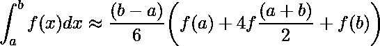

# 辛普森 1/3 法则程序

> 原文:[https://www.geeksforgeeks.org/program-simpsons-13-rule/](https://www.geeksforgeeks.org/program-simpsons-13-rule/)

在数值分析中，[辛普森 1/3 法则](https://en.wikipedia.org/wiki/Simpson%27s_rule)是定积分数值逼近的一种方法。具体来说，它是以下近似值:



在辛普森 1/3 法则中，我们用抛物线来逼近曲线的每一部分。我们将
的面积分成 n 个相等的宽度δx 的段。
Simpson 规则可以通过用二次插值 P(x)(红色)近似被积函数 f (x)(蓝色)
而得到。


**为了对区间(a，b)中的任意函数 f(x)进行积分，请遵循下面给出的步骤:**
**1。**为 n 选择一个值，n 是间隔被划分的部分的数量。
**2。**计算宽度，h = (b-a)/n
**3。**计算 x0 到 xn 的值为 x0 = a，x1 = x0 + h，…..xn-1 = xn-2 + h，xn = b.
考虑 y = f(x)。现在找到对应 x(x0 至 xn)值的 y(y0 至 yn)值。
**4。**用上述辛普森法则公式中的所有发现值代入计算积分值。
积分的近似值可由**辛普森法则**给出:


**注意:**在这个规则中，n 必须是偶数。
**应用:**
当给定的积分很难用数学方法求解时使用。
这个规则在不知道积分规则的情况下很容易给出近似值。
示例:

```
Evaluate logx dx within limit 4 to 5.2.

First we will divide interval into six equal 
parts as number of interval should be even.

x    :  4     4.2   4.4   4.6   4.8  5.0  5.2
logx :  1.38  1.43  1.48  1.52  1.56 1.60 1.64

Now we can calculate approximate value of integral
using above formula:
     = h/3[( 1.38 + 1.64) + 4 * (1.43 + 1.52 + 
                      1.60 ) +2 *(1.48 + 1.56)]
     = 1.84
Hence the approximation of above integral is 
1.827 using Simpson's 1/3 rule.  

```

## C++

```
// CPP program for simpson's 1/3 rule
#include <iostream>
#include <math.h>
using namespace std;

// Function to calculate f(x)
float func(float x)
{
    return log(x);
}

// Function for approximate integral
float simpsons_(float ll, float ul, int n)
{
    // Calculating the value of h
    float h = (ul - ll) / n;

    // Array for storing value of x and f(x)
    float x[10], fx[10];

    // Calculating values of x and f(x)
    for (int i = 0; i <= n; i++) {
        x[i] = ll + i * h;
        fx[i] = func(x[i]);
    }

    // Calculating result
    float res = 0;
    for (int i = 0; i <= n; i++) {
        if (i == 0 || i == n)
            res += fx[i];
        else if (i % 2 != 0)
            res += 4 * fx[i];
        else
            res += 2 * fx[i];
    }
    res = res * (h / 3);
    return res;
}

// Driver program
int main()
{
    float lower_limit = 4; // Lower limit
    float upper_limit = 5.2; // Upper limit
    int n = 6; // Number of interval
    cout << simpsons_(lower_limit, upper_limit, n);
    return 0;
}
```

## Java 语言(一种计算机语言，尤用于创建网站)

```
// Java program for simpson's 1/3 rule

public class GfG{

    // Function to calculate f(x)
    static float func(float x)
    {
        return (float)Math.log(x);
    }

    // Function for approximate integral
    static float simpsons_(float ll, float ul,
                                       int n)
    {
        // Calculating the value of h
        float h = (ul - ll) / n;

        // Array for storing value of x
        // and f(x)
        float[] x = new float[10];
        float[] fx= new float[10];

        // Calculating values of x and f(x)
        for (int i = 0; i <= n; i++) {
            x[i] = ll + i * h;
            fx[i] = func(x[i]);
        }

        // Calculating result
        float res = 0;
        for (int i = 0; i <= n; i++) {
            if (i == 0 || i == n)
                res += fx[i];
            else if (i % 2 != 0)
                res += 4 * fx[i];
            else
                res += 2 * fx[i];
        }

        res = res * (h / 3);
        return res;
    }

    // Driver Code
    public static void main(String s[])
    {  
        // Lower limit
        float lower_limit = 4;

        // Upper limit
        float upper_limit = (float)5.2;

        // Number of interval
        int n = 6;

        System.out.println(simpsons_(lower_limit,
                                upper_limit, n));
    }
}

// This code is contributed by Gitanjali
```

## 蟒蛇 3

```
# Python code for simpson's 1 / 3 rule
import math

# Function to calculate f(x)
def func( x ):
    return math.log(x)

# Function for approximate integral
def simpsons_( ll, ul, n ):

    # Calculating the value of h
    h = ( ul - ll )/n

    # List for storing value of x and f(x)
    x = list()
    fx = list()

    # Calculating values of x and f(x)
    i = 0
    while i<= n:
        x.append(ll + i * h)
        fx.append(func(x[i]))
        i += 1

    # Calculating result
    res = 0
    i = 0
    while i<= n:
        if i == 0 or i == n:
            res+= fx[i]
        elif i % 2 != 0:
            res+= 4 * fx[i]
        else:
            res+= 2 * fx[i]
        i+= 1
    res = res * (h / 3)
    return res

# Driver code
lower_limit = 4   # Lower limit
upper_limit = 5.2 # Upper limit
n = 6 # Number of interval
print("%.6f"% simpsons_(lower_limit, upper_limit, n))
```

## C#

```
// C# program for simpson's 1/3 rule
using System;

public class GfG
{

    // Function to calculate f(x)
    static float func(float x)
    {
        return (float)Math.Log(x);
    }

    // Function for approximate integral
    static float simpsons_(float ll, float ul,
                                        int n)
    {
        // Calculating the value of h
        float h = (ul - ll) / n;

        // Array for storing value of x
        // and f(x)
        float[] x = new float[10];
        float[] fx= new float[10];

        // Calculating values of x and f(x)
        for (int i = 0; i <= n; i++) {
            x[i] = ll + i * h;
            fx[i] = func(x[i]);
        }

        // Calculating result
        float res = 0;
        for (int i = 0; i <= n; i++) {
            if (i == 0 || i == n)
                res += fx[i];
            else if (i % 2 != 0)
                res += 4 * fx[i];
            else
                res += 2 * fx[i];
        }

        res = res * (h / 3);
        return res;
    }

    // Driver Code
    public static void Main()
    {
        // Lower limit
        float lower_limit = 4;

        // Upper limit
        float upper_limit = (float)5.2;

        // Number of interval
        int n = 6;

        Console.WriteLine(simpsons_(lower_limit,
                                upper_limit, n));
    }
}

// This code is contributed by vt_m
```

## 服务器端编程语言（Professional Hypertext Preprocessor 的缩写）

```
<?php
// PhP program for simpson's 1/3 rule

// Function to calculate f(x)
function func($x)
{
    return log($x);
}

// Function for approximate integral
function simpsons_($ll, $ul, $n)
{

    // Calculating the value of h
    $h = ($ul - $ll) / $n;

    // Calculating values of x and f(x)
    for ($i = 0; $i <= $n; $i++)
    {
        $x[$i] = $ll + $i * $h;
        $fx[$i] = func($x[$i]);
    }

    // Calculating result
    $res = 0;
    for ($i = 0; $i <= $n; $i++)
    {
        if ($i == 0 || $i == $n)
            $res += $fx[$i];
        else if ($i % 2 != 0)
            $res += 4 * $fx[$i];
        else
            $res += 2 * $fx[$i];
    }

    $res = $res * ($h / 3);

    return $res;
}

// Driver program
    $lower_limit = 4; // Lower limit
    $upper_limit = 5.2; // Upper limit
    $n = 6; // Number of interval
    echo simpsons_($lower_limit, $upper_limit, $n);

// This code is contributed by ajit.
?>
```

## java 描述语言

```
<script>

// JavaScriptprogram for simpson's 1/3 rule

    // Function to calculate f(x)
    function func(x)
    {
        return Math.log(x);
    }

    // Function for approximate integral
    function simpsons_(ll, ul, n)
    {

        // Calculating the value of h
        let h = (ul - ll) / n;

        // Array for storing value of x
        // and f(x)
        let x = [];
        let fx= [];

        // Calculating values of x and f(x)
        for (let i = 0; i <= n; i++) {
            x[i] = ll + i * h;
            fx[i] = func(x[i]);
        }

        // Calculating result
        let res = 0;
        for (let i = 0; i <= n; i++) {
            if (i == 0 || i == n)
                res += fx[i];
            else if (i % 2 != 0)
                res += 4 * fx[i];
            else
                res += 2 * fx[i];
        }

        res = res * (h / 3);
        return res;
    }

// Driver code   

        // Lower limit
        let lower_limit = 4;

        // Upper limit
        let upper_limit = 5.2;

        // Number of interval
        let n = 6;

        document.write(simpsons_(lower_limit,
                                upper_limit, n));

        // This code is contributed by code_hunt.
</script>
```

输出:

```
1.827847
```