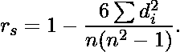

# 斯皮尔曼等级关联程序

> 原文:[https://www . geesforgeks . org/program-spearmans-rank-correlation/](https://www.geeksforgeeks.org/program-spearmans-rank-correlation/)

前提条件:[相关系数](https://www.geeksforgeeks.org/program-find-correlation-coefficient/)
给定两个数组 X[]和 Y[]。找到斯皮尔曼的等级相关性 n .在斯皮尔曼等级相关性中，它不是使用数据值本身(如相关系数中所讨论的)，而是使用这些值的等级。首先对观测值进行排序，然后将这些排序用于相关。该关联的算法如下

```
Rank each observation in X and store it in Rank_X 
Rank each observation in Y and store it in Rank_Y 
Obtain Pearson Correlation Coefficient for Rank_X and Rank_Y
```

用于计算集合 X 和 Y 的皮尔逊相关系数(r 或ρ)的公式如下:
![{{\displaystyle r=\frac {n(\sum xy)-\left ( \sum x \right )\left ( \sum y \right )}{\sqrt{[n\sum x^2-(\sum x)^2 ][n\sum y^2 - (\sum y)^2]}}}    ](img/98b96e00ee4bc4e8c5c3de2e53dcddeb.png "Rendered by QuickLaTeX.com")
计算集合 X 和 Y 的皮尔逊系数的算法

```
function correlationCoefficient(X, Y)
    n = X.size
    sigma_x = sigma_y = sigma_xy = 0
    sigma_xsq = sigma_ysq = 0
    for i in 0...N-1
        sigma_x = sigma_x + X[i]
        sigma_y = sigma_y + Y[i]
        sigma_xy = sigma_xy + X[i] * Y[i]
        sigma_xsq = sigma_xsq + X[i] * X[i]
        sigma_ysq = sigma_ysq + Y[i] * Y[i]       

    num =( n * sigma_xy - sigma_x * sigma_y)
    den = sqrt( [n*sigma_xsq - (sigma_x)^ 2]*[ n*sigma_ysq - (sigma_y) ^ 2] )
    return num/den
```

在分配等级时，它可能会遇到联系，即两个或多个观测值具有相同的等级。为了解决联系，这将使用分数排名方案。在该方案中，如果 n 个观测值具有相同的秩，则每个观测值获得一个分数秩，由下式给出:

```
fractional_rank = (rank) + (n-1)/2
```

下一个被分配的等级是等级+ n，而不是等级+ 1。例如，如果这 3 个项目具有相同的等级 r，那么每个项目都将获得上面给出的 fractional_rank。下一个可以给予另一个观测值的秩是 r + 3。注意分数秩不一定是分数。它们是 n 个连续秩的算术平均值，例如 r，r + 1，r + 2 … r + n-1。

```
(r + r+1 + r+2 + ... + r+n-1) / n = r + (n-1)/2 
```

一些例子:

```
Input :    X = [15 18 19 20 21]
           Y = [25 26 28 27 29]
Solution : Rank_X = [1 2 3 4 5]
           Rank_Y = [1 2 4 3 5 ]
           sigma_x = 1+2+3+4+5 = 15
           sigma_y = 1+2+4+3+5 = 15
           sigma_xy = 1*2+2*2+3*4+4*3+5*5 = 54
           sigma_xsq = 1*1+2*2+3*3+4*4+5*5 = 55
           sigma_ysq = 1*1+2*2+3*3+4*4+5*5 = 55
           Substitute values in formula
           Coefficient = Pearson(Rank_X, Rank_Y) = 0.9

Input:    X = [15 18 21 15 21 ]
          Y = [25 25 27 27 27 ]
Solution: Rank_X = [1.5  3 4.5 1.5 4.5]
          Rank_Y = [1.5  1.5 4 4 4]
          Calculate and substitute values of sigma_x, sigma_y,
          sigma_xy, sigma_xsq, sigma_ysq.
          Coefficient = Pearson(Rank_X, Rank_Y) = 0.456435
```

分数排序方案的算法如下:

```
function rankify(X)
    N = X.size() 

    // Vector to store ranks
    Rank_X(N)
    for i = 0 ... N-1
        r = 1 and s = 1

        // Count no of smaller elements in 0...i-1
        for j = 0...i-1
            if X[j] < X[i]
                r = r+1
            if X[j] == X[i]
                s = s+1

         // Count no of smaller elements in i+1...N-1
         for j = i+1...N-1
             if X[j] < X[i]
                r = r+1
            if X[j] == X[i]
                s = s+1

         //Assign Fractional Rank
         Rank_X[i] = r + (s-1) * 0.5

    return Rank_X 
```

**注:**
有一个由给出的计算斯皮尔曼系数的直接公式，但是我们需要输入一个修正项来解决每个平局，因此这个公式没有被讨论。从等级的相关系数计算斯皮尔曼系数是最通用的方法。

评估斯皮曼系数的 CPP 程序如下:

## C++

```
// Program to find correlation
// coefficient
#include <iostream>
#include <vector>
#include <cmath>
using namespace std;

typedef vector<float> Vector;

// Utility Function to print
// a Vector
void printVector(const Vector &X)
{
    for (auto i: X)
        cout << i << " ";

    cout << endl;
}

// Function returns the rank vector
// of the set of observations
Vector rankify(Vector & X) {

    int N = X.size();

    // Rank Vector
    Vector Rank_X(N);

    for(int i = 0; i < N; i++)
    {
        int r = 1, s = 1;

        // Count no of smaller elements
        // in 0 to i-1
        for(int j = 0; j < i; j++) {
            if (X[j] < X[i] ) r++;
            if (X[j] == X[i] ) s++;
        }

        // Count no of smaller elements
        // in i+1 to N-1
        for (int j = i+1; j < N; j++) {
            if (X[j] < X[i] ) r++;
            if (X[j] == X[i] ) s++;
        }

        // Use Fractional Rank formula
        // fractional_rank = r + (n-1)/2
        Rank_X[i] = r + (s-1) * 0.5;       
    }

    // Return Rank Vector
    return Rank_X;
}

// function that returns
// Pearson correlation coefficient.
float correlationCoefficient
        (Vector &X, Vector &Y)
{
    int n = X.size();
    float sum_X = 0, sum_Y = 0,
                    sum_XY = 0;
    float squareSum_X = 0,
        squareSum_Y = 0;

    for (int i = 0; i < n; i++)
    {
        // sum of elements of array X.
        sum_X = sum_X + X[i];

        // sum of elements of array Y.
        sum_Y = sum_Y + Y[i];

        // sum of X[i] * Y[i].
        sum_XY = sum_XY + X[i] * Y[i];

        // sum of square of array elements.
        squareSum_X = squareSum_X +
                      X[i] * X[i];
        squareSum_Y = squareSum_Y +
                      Y[i] * Y[i];
    }

    // use formula for calculating
    // correlation coefficient.
    float corr = (float)(n * sum_XY -
                  sum_X * sum_Y) /
                  sqrt((n * squareSum_X -
                       sum_X * sum_X) *
                       (n * squareSum_Y -
                       sum_Y * sum_Y));

    return corr;
}

// Driver function
int main()
{

    Vector X = {15,18,21, 15, 21};
    Vector Y= {25,25,27,27,27};

    // Get ranks of vector X
    Vector rank_x = rankify(X);

    // Get ranks of vector y
    Vector rank_y = rankify(Y);

    cout << "Vector X" << endl;
    printVector(X);

    // Print rank vector of X
    cout << "Rankings of X" << endl;
    printVector(rank_x);

    // Print Vector Y
    cout << "Vector Y" << endl;
    printVector(Y);

    // Print rank vector of Y
    cout << "Rankings of Y" << endl;
    printVector(rank_y);

    // Print Spearmans coefficient
    cout << "Spearman's Rank correlation: "
                                << endl;
    cout<<correlationCoefficient(rank_x,
                                rank_y);

    return 0;
}
```

**输出:**

```
Vector X
15   18   21   15   21   
Rankings of X
1.5   3   4.5   1.5   4.5   
Vector Y
25   25   27   27   27   
Rankings of Y
1.5   1.5   4   4   4   
Spearman's Rank correlation: 
0.456435
```

**计算斯皮尔曼等级相关性的 Python 代码:**

## 蟒蛇 3

```
# Import pandas and scipy.stats
import pandas as pd
import scipy.stats

# Two lists x and y
x = [15,18,21, 15, 21]
y = [25,25,27,27,27]

# Create a function that takes in x's and y's
def spearmans_rank_correlation(x, y):

    # Calculate the rank of x's
    xranks = pd.Series(x).rank()
    print("Rankings of X:")
    print(xranks)

    # Calculate the ranking of the y's
    yranks = pd.Series(y).rank()
    print("Rankings of Y:")
    print(yranks)

    # Calculate Pearson's correlation coefficient on the ranked versions of the data
    print("Spearman's Rank correlation:",scipy.stats.pearsonr(xranks, yranks)[0])

# Call the function
spearmans_rank_correlation(x, y)

# This code is contributed by Manish KC
# profile: mkumarchaudhary06
```

**输出:**

```
Rankings of X:
0    1.5
1    3.0
2    4.5
3    1.5
4    4.5
dtype: float64
Rankings of Y:
0    1.5
1    1.5
2    4.0
3    4.0
4    4.0
dtype: float64
Spearman's Rank correlation: 0.456435464588
```

**Python 代码使用 scipy 计算 spearman 的相关性**
有一个简单的方法可以直接使用 Scipy 获得 Spearman 的相关性值。

## 蟒蛇 3

```
# Import scipy.stats
import scipy.stats

# Two lists x and y
x = [15,18,21, 15, 21]
y = [25,25,27,27,27]

print(scipy.stats.spearmanr(x, y)[0])

# This code is contributed by Manish KC
# Profile: mkumarchaudhary06
```

**输出:**

```
0.45643546458763845
```

**参考文献:**
[https://en . Wikipedia . org/wiki/Spearman % 27s _ rank _ correlation _ coefficient](https://en.wikipedia.org/wiki/Spearman%27s_rank_correlation_coefficient)