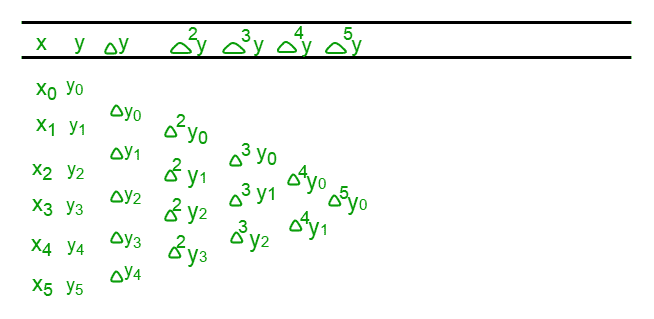
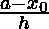
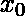
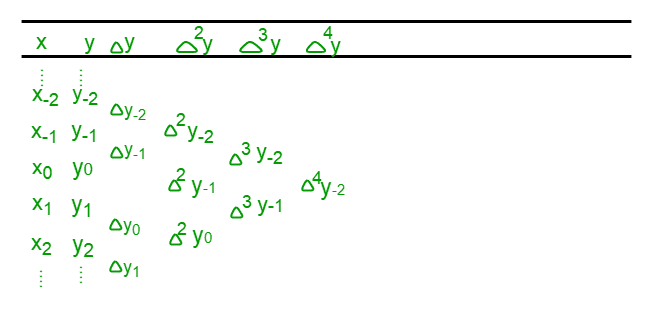
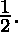
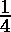

# 斯特林插值公式程序

> 原文:[https://www . geesforgeks . org/program-stirling-interpolation-formula/](https://www.geeksforgeeks.org/program-stirling-interpolation-formula/)

给定 **n** 个浮动值 x，以及它们对应的函数值 f(x)，估计自变量 x 的任何中间值的数学函数值，即在 x = a 处
**例:**

```
Input : n = 5
        x = 0, x = 0.5, 

        x = 1.0, x = 1.5, 

        x = 2.0

        f(x) = 0, f(x) = 0.191, 

        f(x) = 0.341, f(x) = 0.433, 

        f(x) = 0.477

        a = 1.22

Output : The value of function at 1.22 is 0.389 .

As can be seen f(1.0) = 0.341 and f(1.5) = 0.433, 

so f(1.22) should be somewhere in between these 

two values . Using Stirling Approximation, f(1.22)

comes out to be 0.389.
Input : n = 7

        x = 0, x = 5, 

        x = 10, x = 15,

        x = 20, x = 25, 

        x = 30 

        f(x) = 0, f(x) = 0.0875, 

        f(x) = 0.1763, f(x) = 0.2679, 

        f(x) = 0.364, f(x) = 0.4663, 

        f(x) = 0.5774

        a = 16

Output : The value of function at 16 is 0.2866 .
```

**斯特林中介贷款**

斯特林近似或斯特林插值公式是一种插值技术，用于获得已知数据点的离散集合范围内的中间点的函数值。
斯特林公式是取高斯正演公式和高斯反演公式的平均值或均值得到的。高斯向前和向后公式都是用于获得表列集中间附近的函数值的公式。

**如何找到**

Stirling 近似涉及到前向差分表的使用，它可以由给定的 x 和 f(x)或 y 的集合来准备，如下所示–



该表是在 x 及其对应的 f(x)或 y 的帮助下准备的。然后，通过计算其在前一列中的前一个值和后一个值之间的差值来计算下一列的每个值，如= y–y、= y–y、=–等。
现在，在 **a** 得到 f(x)或 y 的高斯正演公式为:

，其中，
p = ，
**a** 是我们必须确定 f(x)的点，x 是从给定的 x 中选择的值，它更接近于 **a** (一般选择表格中间的一个值)，h 是任意两个连续 x 的差 y 变为 x 对应的值，x 之前的值有负下标，之后的值有正下标，如下表–



而在 **a** 得到 f(x)或 y 的高斯倒推公式为:

现在取上述两个公式的平均值，得到如下给出的斯特林近似公式–
![P_2_n(x) = y_0 + q.\frac{\Delta y_-_1+\Delta y_0}{2}+\frac{q^2}{2!},\Delta^2 y_-_1 +\frac{q(q^2-1)}{3!}.\frac{\Delta^3 y_-_2 + \Delta^3 y_-_1}{2}+\frac{q^2(q^2-1)}{4!}. \Delta ^4 y_-_2 + \frac{q(q^2-1)(q^2-2^2)}{5!}.\frac{\Delta ^5 y_-_3+ \Delta ^5y_-_2}{2}+\frac{q^2(q^2-1)(q^2-2^2)}{6!}.\Delta^6y_-_3+....+ \frac{q(q^2-1)(q^2-2^2)(q^2-3^2)...[q^2-(n-1)^2]}{(2n-1)!}* \frac{\Delta ^{2n-1}y_-_n+ \Delta ^{2n-1}y_-_{n-1}}{2}+\frac{q^2(q^2-1)(q^2-2^2)...[q^2-(n-1)^2]}{(2n)!} \Delta^{2n}y_{-n}, ](img/18f1e6d5215fcd318cb7d2e39ffe1439.png "Rendered by QuickLaTeX.com")
这里 q 与高斯公式中的 p 相同，其余所有符号相同。
**何时使用**

*   当 q 位于和T2 之间时，斯特林近似很有用
*   在这个范围之外，它仍然可以使用，但是计算值的准确性会降低。
*   它给出了范围 < q < 的最佳估计。

## C++

```
// C++ program to demonstrate Stirling
// Approximation
#include <bits/stdc++.h>
using namespace std;

// Function to calculate value using
// Stirling formula
void Stirling(float x[], float fx[], float x1,
                                    int n)
{
    float h, a, u, y1 = 0, N1 = 1, d = 1,
    N2 = 1, d2 = 1, temp1 = 1, temp2 = 1,
    k = 1, l = 1, delta[n][n];

    int i, j, s;
    h = x[1] - x[0];
    s = floor(n / 2);
    a = x[s];
    u = (x1 - a) / h;

    // Preparing the forward difference
    // table
    for (i = 0; i < n - 1; ++i) {
        delta[i][0] = fx[i + 1] - fx[i];
    }
    for (i = 1; i < n - 1; ++i) {
        for (j = 0; j < n - i - 1; ++j) {
            delta[j][i] = delta[j + 1][i - 1]
                          - delta[j][i - 1];
        }
    }

    // Calculating f(x) using the Stirling
    // formula
    y1 = fx[s];

    for (i = 1; i <= n - 1; ++i) {
        if (i % 2 != 0) {
            if (k != 2) {
                temp1 *= (pow(u, k) -
                          pow((k - 1), 2));
            }
            else {
                temp1 *= (pow(u, 2) -
                          pow((k - 1), 2));
            }
            ++k;
            d *= i;
            s = floor((n - i) / 2);
            y1 += (temp1 / (2 * d)) *
                   (delta[s][i - 1] +
                   delta[s - 1][i - 1]);
        }
        else {
            temp2 *= (pow(u, 2) -
                      pow((l - 1), 2));
            ++l;
            d *= i;
            s = floor((n - i) / 2);
            y1 += (temp2 / (d)) *
                  (delta[s][i - 1]);
        }
    }

    cout << y1;
}

// Driver main function
int main()
{
    int n;
    n = 5;
    float x[] = { 0, 0.5, 1.0, 1.5, 2.0 };
    float fx[] = { 0, 0.191, 0.341, 0.433,
                             0.477 };

    // Value to calculate f(x)
    float x1 = 1.22;

    Stirling(x, fx, x1, n);
    return 0;
}
```

## Java 语言(一种计算机语言，尤用于创建网站)

```
// Java program to demonstrate Stirling
// Approximation
import java.io.*;
import static java.lang.Math.*;

public class A {
    static void Stirling(double x[], double fx[],
                         double x1, int n)
    {
        double h, a, u, y1 = 0, N1 = 1, d = 1,
            N2 = 1, d2 = 1, temp1 = 1,
          temp2 = 1, k = 1, l = 1, delta[][];

        delta = new double[n][n];
        int i, j, s;
        h = x[1] - x[0];
        s = (int)floor(n / 2);
        a = x[s];
        u = (x1 - a) / h;

        // Preparing the forward difference
       // table
        for (i = 0; i < n - 1; ++i) {
            delta[i][0] = fx[i + 1] - fx[i];
        }
        for (i = 1; i < n - 1; ++i) {
            for (j = 0; j < n - i - 1; ++j) {
                delta[j][i] = delta[j + 1][i - 1]
                              - delta[j][i - 1];
            }
        }

        // Calculating f(x) using the Stirling
        // formula
        y1 = fx[s];

        for (i = 1; i <= n - 1; ++i) {
            if (i % 2 != 0) {
                if (k != 2) {
                    temp1 *= (pow(u, k) -
                              pow((k - 1), 2));
                }
                else {
                    temp1 *= (pow(u, 2) -
                              pow((k - 1), 2));
                }
                ++k;
                d *= i;
                s = (int)floor((n - i) / 2);
                y1 += (temp1 / (2 * d)) *
                     (delta[s][i - 1] +
                      delta[s - 1][i - 1]);
            }
            else {
                temp2 *= (pow(u, 2) -
                        pow((l - 1), 2));
                ++l;
                d *= i;
                s = (int)floor((n - i) / 2);
                y1 += (temp2 / (d)) *
                      (delta[s][i - 1]);
            }
        }

        System.out.print(+ y1);
    }

    // Driver main function
public static void main(String args[])
    {
        int n;
        n = 5;
        double x[] = {0, 0.5, 1.0, 1.5, 2.0 };
        double fx[] = {0, 0.191, 0.341, 0.433,
                                      0.477 };

        // Value to calculate f(x)
        double x1 = 1.22;

        Stirling(x, fx, x1, n);
    }
}
```

## 蟒蛇 3

```
# Python3 program to demonstrate Stirling
# Approximation
import math

# Function to calculate value using
# Stirling formula
def Stirling(x, fx, x1, n):

    y1 = 0; N1 = 1; d = 1;
    N2 = 1; d2 = 1;
    temp1 = 1; temp2 = 1;
    k = 1; l = 1;
    delta = [[0 for i in range(n)]
                for j in range(n)];

    h = x[1] - x[0];
    s = math.floor(n / 2);
    a = x[s];
    u = (x1 - a) / h;

    # Preparing the forward difference
    # table
    for i in range(n - 1):
        delta[i][0] = fx[i + 1] - fx[i];
    for i in range(1, n - 1):
        for j in range(n - i - 1):
            delta[j][i] = (delta[j + 1][i - 1] -
                           delta[j][i - 1]);

    # Calculating f(x) using the Stirling formula
    y1 = fx[s];

    for i in range(1, n):
        if (i % 2 != 0):
            if (k != 2):
                temp1 *= (pow(u, k) - pow((k - 1), 2));
            else:
                temp1 *= (pow(u, 2) - pow((k - 1), 2));
            k += 1;
            d *= i;
            s = math.floor((n - i) / 2);
            y1 += (temp1 / (2 * d)) * (delta[s][i - 1] +
                                       delta[s - 1][i - 1]);
        else:
            temp2 *= (pow(u, 2) - pow((l - 1), 2));
            l += 1;
            d *= i;
            s = math.floor((n - i) / 2);
            y1 += (temp2 / (d)) * (delta[s][i - 1]);

    print(round(y1, 3));

# Driver Code
n = 5;
x = [0, 0.5, 1.0, 1.5, 2.0 ];
fx = [ 0, 0.191, 0.341, 0.433, 0.477];

# Value to calculate f(x)
x1 = 1.22;
Stirling(x, fx, x1, n);

# This code is contributed by mits
```

## C#

```
// C# program to demonstrate Stirling
// Approximation
using System;

public class A
{
static void Stirling(double[] x, double[] fx,
                     double x1, int n)
{
    double h, a, u, y1 = 0, d = 1, temp1 = 1,
                     temp2 = 1, k = 1, l = 1;
    double[,] delta;

    delta = new double[n, n];
    int i, j, s;
    h = x[1] - x[0];
    s = (int)Math.Floor((double)(n / 2));
    a = x[s];
    u = (x1 - a) / h;

    // Preparing the forward difference
    // table
    for (i = 0; i < n - 1; ++i)
    {
        delta[i, 0] = fx[i + 1] - fx[i];
    }
    for (i = 1; i < n - 1; ++i)
    {
        for (j = 0; j < n - i - 1; ++j)
        {
            delta[j, i] = delta[j + 1, i - 1]
                        - delta[j, i - 1];
        }
    }

    // Calculating f(x) using the Stirling
    // formula
    y1 = fx[s];

    for (i = 1; i <= n - 1; ++i)
    {
        if (i % 2 != 0)
        {
            if (k != 2)
            {
                temp1 *= (Math.Pow(u, k) -
                          Math.Pow((k - 1), 2));
            }
            else
            {
                temp1 *= (Math.Pow(u, 2) -
                          Math.Pow((k - 1), 2));
            }
            ++k;
            d *= i;
            s = (int)Math.Floor((double)((n - i) / 2));
            y1 += (temp1 / (2 * d)) *
                  (delta[s, i - 1] +
                   delta[s - 1, i - 1]);
        }
        else
        {
            temp2 *= (Math.Pow(u, 2) -
                      Math.Pow((l - 1), 2));
            ++l;
            d *= i;
            s = (int)Math.Floor((double)((n - i) / 2));
            y1 += (temp2 / (d)) *
                  (delta[s, i - 1]);
        }
    }

    Console.Write(+ y1);
}

// Driver Code
public static void Main()
{
    int n;
    n = 5;
    double[] x = {0, 0.5, 1.0, 1.5, 2.0 };
    double[] fx = {0, 0.191, 0.341, 0.433,
                                0.477 };

    // Value to calculate f(x)
    double x1 = 1.22;

    Stirling(x, fx, x1, n);
}
}

// This code is contributed
// by Akanksha Rai
```

## 服务器端编程语言（Professional Hypertext Preprocessor 的缩写）

```
<?php
// PHP program to demonstrate Stirling
// Approximation

// Function to calculate value using
// Stirling formula
function Stirling($x, $fx, $x1, $n)
{
    $y1 = 0; $N1 = 1;
    $d = 1;
    $N2 = 1; $d2 = 1; $temp1 = 1; $temp2 = 1;
    $k = 1; $l = 1; $delta[$n][$n] = array();

    $h = $x[1] - $x[0];
    $s = floor($n / 2);
    $a = $x[$s];
    $u = ($x1 - $a) / $h;

    // Preparing the forward difference
    // table
    for ($i = 0; $i < $n - 1; ++$i)
    {
        $delta[$i][0] = $fx[$i + 1] - $fx[$i];
    }
    for ($i = 1; $i < $n - 1; ++$i)
    {
        for ($j = 0; $j < $n - $i - 1; ++$j)
        {
            $delta[$j][$i] = $delta[$j + 1][$i - 1] -
                             $delta[$j][$i - 1];
        }
    }

    // Calculating f(x) using the
    // Stirling formula
    $y1 = $fx[$s];

    for ($i = 1; $i <= $n - 1; ++$i)
    {
        if ($i % 2 != 0)
        {
            if ($k != 2)
            {
                $temp1 *= (pow($u, $k) -
                           pow(($k - 1), 2));
            }
            else
            {
                $temp1 *= (pow($u, 2) -
                           pow(($k - 1), 2));
            }
            ++$k;
            $d *= $i;
            $s = floor(($n - $i) / 2);
            $y1 += ($temp1 / (2 * $d)) *
                   ($delta[$s][$i - 1] +
                    $delta[$s - 1][$i - 1]);
        }
        else
        {
            $temp2 *= (pow($u, 2) -
                       pow(($l - 1), 2));
            ++$l;
            $d *= $i;
            $s = floor(($n - $i) / 2);
            $y1 += ($temp2 / ($d)) *
                   ($delta[$s][$i - 1]);
        }
    }

    echo $y1;
}

// Driver Code
$n = 5;
$x = array(0, 0.5, 1.0, 1.5, 2.0 );
$fx = array( 0, 0.191, 0.341, 0.433,
                              0.477 );
// Value to calculate f(x)
$x1 = 1.22;
Stirling($x, $fx, $x1, $n);

// This code is contributed by jit_t
?>
```

**输出:**

```
0.389 
```

斯特林公式相对于其他类似公式的主要优点是它比其他差分公式减少得更快，因此考虑前几个项本身会给出更好的精度，而它的缺点是为了使斯特林近似适用，在任何两个连续的 x 之间应该有一致的差。
本文由**姆里根德拉·辛格**供稿。如果你喜欢 GeeksforGeeks 并想投稿，你也可以使用[write.geeksforgeeks.org](https://write.geeksforgeeks.org)写一篇文章或者把你的文章邮寄到 review-team@geeksforgeeks.org。看到你的文章出现在极客博客主页上，帮助其他极客。
如果发现有不正确的地方，或者想分享更多关于上述话题的信息，请写评论。