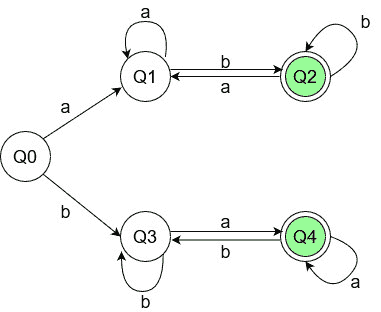

# 构建一个接受不同字符开始和结束的字符串的 DFA 的程序

> 原文:[https://www . geesforgeks . org/program-to-build-a-DFA-接受字符串-以不同字符开头和结尾/](https://www.geeksforgeeks.org/program-to-build-a-dfa-that-accepts-strings-starting-and-ending-with-different-character/)

**先决条件:** [确定性有限自动机](https://www.geeksforgeeks.org/introduction-of-finite-automata/)
给定字符串，**字符串**由字符“a”&“b”组成。任务是检查字符串是否以不同的字符开始和结束。如果是，打印“是”和状态转换，否则打印“否”。
**示例:**

> **输入:** ababab
> **输出:** YES
> **解释:**
> 字符串“ababab”以“a”开头，以“b”结尾
> **输入:**abab
> **输出:** NO
> **解释:**
> 字符串“ababab”以“a”开头，以“a”结尾

在 DFA 中，没有内存的概念，因此我们必须逐个字符地检查字符串，从第 0 个字符开始。问题的输入字符集是 **{a，b}** 。为了使 DFA 有效，必须为输入集的每个符号定义一个在每个状态到有效状态的转换规则。
**DFA 机器:**针对以上问题陈述搭建一台 DFA 机器。它类似于具有各种状态和转换的流程图。对应上述问题的 DFA 机如下图，Q2 和 Q4 为最终状态:



**解释:**
假设输入字符串中的第一个字符是‘a’，那么在读取‘a’时，控制将转移到机器的上分支。现在，它被定义为字符串不能以“a”结尾才能被接受。在 Q1 状态下，如果再次出现“a ”,它会在同一状态下循环，因为对于机器来说，最后读取的字符可能是字符串的最后一个字符。如果它得到“b”，那么它可以进入最终状态，因为在这种情况下以“b”结尾的字符串是可以接受的，所以它进入 Q2 状态。这里，如果它得到一个' a '，它再次进入非最终状态，否则连续' b '，它继续在最终状态盘旋。
检测到第一个字符为‘b’时也是如此。
T5 进场:

1.  定义制作状态图所需的最小状态数。将函数用于各种状态。
2.  列出所有有效的转换。对于每个有效符号，每个状态都必须有一个转换。
3.  通过应用基本条件来定义最终状态。
4.  使用状态函数调用定义所有状态转换。
5.  定义字符串结尾的返回条件。

对于给定的 DFA 机器，规格如下:

1.  Q0、Q1、Q2、Q3、Q4 是定义的状态。
2.  a 和 b 是有效的符号。每个状态都有一个为 a 和 b 定义的转换。
3.  Q2 和 Q4 被定义为最终状态。如果字符串输入在这些状态中的任何一个结束，它被接受或拒绝。
4.  假设在状态 Q0，如果‘a’来了，那么函数调用是对 Q1 进行的。如果‘b’来了，函数调用就进行到 Q3。
5.  如果按照这个过程，程序到达了字符串的末尾，输出将根据程序所处的状态进行。

以下是上述方法的实现:

## C++

```
// CPP Program to DFA that accepts
// string if it starts and end with
// same character
#include <bits/stdc++.h>
using namespace std;

// various states of DFA machine
// are defined using functions.
bool q1(string, int);
bool q2(string, int);
bool q3(string, int);
bool q4(string, int);

// vector to store state transition
vector<string> state_transition;

// end position is checked using string
// length value.
// q0 is the starting state.
// q2 and q4 are intermediate states.
// q1 and q3 are final states.

bool q1(string s, int i)
{
    state_transition.push_back("q1");
    if (i == s.length()) {
        return false;
    }

    // state transitions
    // a takes to q1, b takes to q2
    if (s[i] == 'a')
        return q1(s, i + 1);
    else
        return q2(s, i + 1);
}

bool q2(string s, int i)
{
    state_transition.push_back("q2");
    if (i == s.length()) {
        return true;
    }

    // state transitions
    // a takes to q1, b takes to q2
    if (s[i] == 'a')
        return q1(s, i + 1);
    else
        return q2(s, i + 1);
}

bool q3(string s, int i)
{
    state_transition.push_back("q3");
    if (i == s.length()) {
        return false;
    }

    // state transitions
    // a takes to q4, 1 takes to q3
    if (s[i] == 'a')
        return q4(s, i + 1);
    else
        return q3(s, i + 1);
}

bool q4(string s, int i)
{
    state_transition.push_back("q4");
    if (i == s.length()) {
        return true;
    }

    // state transitions
    // a takes to q4, b takes to q3
    if (s[i] == 'a')
        return q4(s, i + 1);
    else
        return q3(s, i + 1);
}

bool q0(string s, int i)
{
    state_transition.push_back("q0");
    if (i == s.length()) {
        return false;
    }

    // state transitions
    // a takes to q1, b takes to q3
    if (s[i] == 'a')
        return q1(s, i + 1);
    else
        return q3(s, i + 1);
}

int main()
{
    string s = "ababab";

    // all state transitions are printed.
    // if string is acceptable, print YES.
    // else NO is printed
    bool ans = q0(s, 0);
    if (ans) {
        cout << "YES" << endl;

        // print transition state of given
        // string str
        for (auto& it : state_transition) {
            cout << it << ' ';
        }
    }
    else
        cout << "NO" << endl;
    return 0;
}
```

## Java 语言(一种计算机语言，尤用于创建网站)

```
// Java Program to DFA that accepts
// string if it starts and end with
// same character
import java.util.*;

class GFG
{

    // vector to store state transition
    static Vector state_transition = new Vector();

    // end position is checked using string
    // length value.
    // q0 is the starting state.
    // q2 and q4 are intermediate states.
    // q1 and q3 are final states.

    static boolean q1(String s, int i)
    {
        state_transition.add("q1");
        if (i == s.length())
        {
            return false;
        }

        // state transitions
        // a takes to q1, b takes to q2
        if (s.charAt(i) == 'a')
            return q1(s, i + 1);
        else
            return q2(s, i + 1);
    }

    static boolean q2(String s, int i)
    {
        state_transition.add("q2");
        if (i == s.length())
        {
            return true;
        }

        // state transitions
        // a takes to q1, b takes to q2
        if (s.charAt(i) == 'a')
            return q1(s, i + 1);
        else
            return q2(s, i + 1);
    }

    static boolean q3(String s, int i)
    {
        state_transition.add("q3");
        if (i == s.length())
        {
            return false;
        }

        // state transitions
        // a takes to q4, 1 takes to q3
        if (s.charAt(i) == 'a')
            return q4(s, i + 1);
        else
            return q3(s, i + 1);
    }

    static boolean q4(String s, int i)
    {
        state_transition.add("q4");
        if (i == s.length())
        {
            return true;
        }

        // state transitions
        // a takes to q4, b takes to q3
        if (s.charAt(i) == 'a')
            return q4(s, i + 1);
        else
            return q3(s, i + 1);
    }

    static boolean q0(String s, int i)
    {
        state_transition.add("q0");
        if (i == s.length())
        {
            return false;
        }

        // state transitions
        // a takes to q1, b takes to q3
        if (s.charAt(i) == 'a')
            return q1(s, i + 1);
        else
            return q3(s, i + 1);
    }

    // Driver code
    public static void main (String[] args)
    {
        String s = "ababab";

        // all state transitions are printed.
        // if string is acceptable, print YES.
        // else NO is printed
        boolean ans = q0(s, 0);
        if (ans == true)
        {
            System.out.println("YES");

            // print transition state of given
            // string str
            for(int index = 0; index < state_transition.size(); index++)
            { //(auto& it : ) {
                System.out.print((String)state_transition.get(index) + ' ');
            }
        }
        else
            System.out.println("NO");
    }
}

// This code is contributed by AnkitRai01
```

## 蟒蛇 3

```
# Python3 Program to DFA that accepts
# if it starts and end with
# same character

# vector to store state transition
state_transition = []

# end position is checked using string
# length value.
# q0 is the starting state.
# q2 and q4 are intermediate states.
# q1 and q3 are final states.
def q1(s, i):

    state_transition.append("q1")
    if (i == len(s)):
        return False

    # state transitions
    # a takes to q1, b takes to q2
    if (s[i] == 'a'):
        return q1(s, i + 1)
    else:
        return q2(s, i + 1)

def q2(s, i):

    state_transition.append("q2")
    if (i == len(s)):
        return True

    # state transitions
    # a takes to q1, b takes to q2
    if (s[i] == 'a'):
        return q1(s, i + 1)
    else:
        return q2(s, i + 1)

def q3(s, i):

    state_transition.append("q3")
    if (i == len(s)):
        return False

    # state transitions
    # a takes to q4, 1 takes to q3
    if (s[i] == 'a'):
        return q4(s, i + 1)
    else:
        return q3(s, i + 1)

def q4(s, i):

    state_transition.append("q4")
    if (i == len(s)):
        return True

    # state transitions
    # a takes to q4, b takes to q3
    if (s[i] == 'a'):
        return q4(s, i + 1)
    else:
        return q3(s, i + 1)

def q0(s, i):

    state_transition.append("q0")
    if (i == len(s)):
        return False

    # state transitions
    # a takes to q1, b takes to q3
    if (s[i] == 'a'):
        return q1(s, i + 1)
    else:
        return q3(s, i + 1)

s = "ababab"

# all state transitions are printed.
# if is acceptable, print YES.
# else NO is printed
ans = q0(s, 0)
if (ans):
    print("YES")

    # print transition state of given
    # str
    for it in state_transition:
        print(it, end = " ")

else:
    print("NO")

# This code is contributed by mohit kumar 29
```

## C#

```
// C# Program to DFA that accepts
// string if it starts and end with
// same character
using System;
using System.Collections;
class GFG{

// vector to store state transition
static ArrayList state_transition =
                 new ArrayList();

// end position is checked using
// string length value.
// q0 is the starting state.
// q2 and q4 are intermediate
// states. q1 and q3 are final
// states.     
static bool q1(string s, int i)
{
  state_transition.Add("q1");
  if (i == s.Length)
  {
    return false;
  }

  // state transitions
  // a takes to q1, b
  // takes to q2
  if (s[i] == 'a')
    return q1(s, i + 1);
  else
    return q2(s, i + 1);
}

static bool q2(string s, int i)
{
  state_transition.Add("q2");
  if (i == s.Length)
  {
    return true;
  }

  // state transitions
  // a takes to q1, b takes to q2
  if (s[i] == 'a')
    return q1(s, i + 1);
  else
    return q2(s, i + 1);
}

static bool q3(string s, int i)
{
  state_transition.Add("q3");
  if (i == s.Length)
  {
    return false;
  }

  // state transitions
  // a takes to q4, 1
  // takes to q3
  if (s[i] == 'a')
    return q4(s, i + 1);
  else
    return q3(s, i + 1);
}

static bool q4(string s, int i)
{
  state_transition.Add("q4");
  if (i == s.Length)
  {
    return true;
  }

  // state transitions
  // a takes to q4, b
  // takes to q3
  if (s[i] == 'a')
    return q4(s, i + 1);
  else
    return q3(s, i + 1);
}

static bool q0(string s, int i)
{
  state_transition.Add("q0");
  if (i == s.Length)
  {
    return false;
  }

  // state transitions
  // a takes to q1, b
  // takes to q3
  if (s[i] == 'a')
    return q1(s, i + 1);
  else
    return q3(s, i + 1);
}

// Driver code
public static void Main (string[] args)
{
  string s = "ababab";

  // all state transitions are
  // printed. If string is
  // acceptable, print YES.
  // else NO is printed
  bool ans = q0(s, 0);

  if (ans == true)
  {
    Console.Write("YES\n");

    // print transition state
    // of given string str
    for(int index = 0;
            index < state_transition.Count;
            index++)
    {
      //(auto& it : ) {
      Console.Write(
      (string)state_transition[index] + ' ');
    }
  }
  else
    Console.Write("NO");
}
}

// This code is contributed bt rutvik_56
```

## java 描述语言

```
<script>
      // JavaScript Program to DFA that accepts
      // string if it starts and end with
      // same character
      // vector to store state transition
      var state_transition = [];

      // end position is checked using
      // string length value.
      // q0 is the starting state.
      // q2 and q4 are intermediate
      // states. q1 and q3 are final
      // states.
      function q1(s, i) {
        state_transition.push("q1");
        if (i === s.length) {
          return false;
        }

        // state transitions
        // a takes to q1, b
        // takes to q2
        if (s[i] === "a") return q1(s, i + 1);
        else return q2(s, i + 1);
      }

      function q2(s, i) {
        state_transition.push("q2");
        if (i === s.length) {
          return true;
        }

        // state transitions
        // a takes to q1, b takes to q2
        if (s[i] === "a") return q1(s, i + 1);
        else return q2(s, i + 1);
      }

      function q3(s, i) {
        state_transition.push("q3");
        if (i === s.length) {
          return false;
        }

        // state transitions
        // a takes to q4, 1
        // takes to q3
        if (s[i] === "a") return q4(s, i + 1);
        else return q3(s, i + 1);
      }

      function q4(s, i) {
        state_transition.push("q4");
        if (i === s.length) {
          return true;
        }

        // state transitions
        // a takes to q4, b
        // takes to q3
        if (s[i] === "a") return q4(s, i + 1);
        else return q3(s, i + 1);
      }

      function q0(s, i) {
        state_transition.push("q0");
        if (i === s.length) {
          return false;
        }

        // state transitions
        // a takes to q1, b
        // takes to q3
        if (s[i] === "a") return q1(s, i + 1);
        else return q3(s, i + 1);
      }

      // Driver code
      var s = "ababab";

      // all state transitions are
      // printed. If string is
      // acceptable, print YES.
      // else NO is printed
      var ans = q0(s, 0);

      if (ans === true) {
        document.write("YES <br>");

        // print transition state
        // of given string str
        for (var index = 0; index < state_transition.length; index++) {
          //(auto& it : ) {
          document.write(state_transition[index] + " ");
        }
      } else document.write("NO");

      // This code is contributed by rdtank.
    </script>
```

**Output:** 

```
YES
q0 q1 q2 q1 q2 q1 q2
```

**时间复杂度:** **O(n)** 长度为 n 的字符串需要遍历 n 个状态。