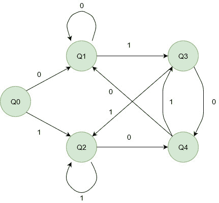

# 构建 DFA 的程序，该程序检查字符串是否以“01”或“10”结尾

> 原文:[https://www . geeksforgeeks . org/program-to-build-a-DFA-检查字符串是否以-01 或-10 结尾/](https://www.geeksforgeeks.org/program-to-build-a-dfa-that-checks-if-a-string-ends-with-01-or-10/)

[**【DFA】**](https://www.geeksforgeeks.org/introduction-of-finite-automata/)**或** [**确定性有限自动机**](https://www.geeksforgeeks.org/introduction-of-finite-automata/) 是一种有限状态机，如果某个字符串达到最终状态，则接受该字符串(在特定条件下)，否则拒绝该字符串。
**<u>问题</u> :** 给定一个由**0 的**和**1 的**字符组成的字符串，检查最后两个字符是**“01”**还是**“10”**否则拒绝该字符串。无论接受或拒绝，也打印状态图。因为在 DFA 中，没有内存的概念，所以我们一次只能检查一个字符，从第 0 个字符开始。该问题的输入设置为 **{0，1}** 。对于输入集中的每个字符，DFA 的每个状态都会重定向到另一个有效状态。
**<u>DFA 机</u> :** 对于上面的问题表述，我们首先要造一台 DFA 机。DFA 机器类似于具有各种状态和转换的流程图。上述问题对应的 DFA 机如下所示， *Q3、Q4 为最终状态* :



**例:**

```
Input: 010101
Output:
State transitions are q0->q1->q3->q4
->q3->q4->q3->YES

Explanation : 010101 ends with "01".

Input: 0100
Output:
State transitions are q0->q1->q3->q4->q1->NO
Explanation : 0100 ends with "00", 
which is not equal to any of "01" or "10".
```

**算法:**

> 1.  Define the minimum number of states required to make a state diagram. Use functions to define various states.
> 2.  List all valid transitions. For each valid symbol, each state must have a transition.
> 3.  Define the final state by applying basic conditions.
> 4.  Define all state transitions using state function calls.
> 5.  Defines the return condition for the end of a string.

对于给定的 DFA 机器:

> 1.  Q0, Q1, Q2, Q3 and Q4 are defined as the number of states.
> 2.  0 and 1 are valid symbols. Each state has a transition between 0 and 1.
> 3.  Q3 and Q4 are defined as the final state.
> 4.  Assume that in state Q0, if 0 comes, the function call is made to Q1\. So, if 1 comes, the function call is sent to Q2.
> 5.  If the program reaches the end of the string, it will be output according to the status, and the program is in.

**执行:**

## C++

```
// CPP Program to DFA that accepts string ending
// with 01 or 10.

#include <bits/stdc++.h>
using namespace std;

// Various states of DFA machine are defined
// using functions.
void q1(string, int);
void q2(string, int);
void q3(string, int);
void q4(string, int);

// End position is checked using the string
// length value.
// q0 is the starting state.
// q1 and q2 are intermediate states.
// q3 and q4 are final states.
void q1(string s, int i)
{
    cout << "q1->";

    if (i == s.length()) {
        cout << "NO \n";
        return;
    }

    // state transitions
    // 0 takes to q1, 1 takes to q3
    if (s[i] == '0')
        q1(s, i + 1);
    else
        q3(s, i + 1);
}

void q2(string s, int i)
{
    cout << "q2->";
    if (i == s.length()) {
        cout << "NO \n";
        return;
    }

    // state transitions
    // 0 takes to q4, 1 takes to q2
    if (s[i] == '0')
        q4(s, i + 1);
    else
        q2(s, i + 1);
}

void q3(string s, int i)
{
    cout << "q3->";
    if (i == s.length()) {
        cout << "YES \n";
        return;
    }

    // state transitions
    // 0 takes to q4, 1 takes to q2
    if (s[i] == '0')
        q4(s, i + 1);
    else
        q2(s, i + 1);
}

void q4(string s, int i)
{
    cout << "q4->";
    if (i == s.length()) {
        cout << "YES \n";
        return;
    }

    // state transitions
    // 0 takes to q1, 1 takes to q3
    if (s[i] == '0')
        q1(s, i + 1);
    else
        q3(s, i + 1);
}

void q0(string s, int i)
{
    cout << "q0->";
    if (i == s.length()) {
        cout << "NO \n";
        return;
    }

    // state transitions
    // 0 takes to q1, 1 takes to q2
    if (s[i] == '0')
        q1(s, i + 1);
    else
        q2(s, i + 1);
}

// Driver Code
int main()
{
    string s = "010101";
    // all state transitions are printed.
    // if string is accpetable, YES is printed.
    // else NO is printed
    cout << "State transitions are ";
    q0(s, 0);
}
```

## Java 语言(一种计算机语言，尤用于创建网站)

```
// Java Program to DFA that accepts string ending
// with 01 or 10.
class GFG
{

    // End position is checked using the string
    // length value.
    // q0 is the starting state.
    // q1 and q2 are intermediate states.
    // q3 and q4 are final states.
    static void q1(String s, int i)
    {
        System.out.print("q1->");
        if (i == s.length())
        {
            System.out.println("NO");
            return;
        }

        // state transitions
        // 0 takes to q1, 1 takes to q3
        if (s.charAt(i) == '0')
            q1(s, i + 1);
        else
            q3(s, i + 1);
    }

    static void q2(String s, int i)
    {
        System.out.print("q2->");
        if (i == s.length())
        {
            System.out.println("NO ");
            return;
        }

        // state transitions
        // 0 takes to q4, 1 takes to q2
        if (s.charAt(i) == '0')
            q4(s, i + 1);
        else
            q2(s, i + 1);
    }

    static void q3(String s, int i)
    {
        System.out.print("q3->");
        if (i == s.length())
        {
            System.out.println("YES");
            return;
        }

        // state transitions
        // 0 takes to q4, 1 takes to q2
        if (s.charAt(i) == '0')
            q4(s, i + 1);
        else
            q2(s, i + 1);
    }

    static void q4(String s, int i)
    {
        System.out.print("q4->");
        if (i == s.length())
        {
            System.out.println("YES");
            return;
        }

        // state transitions
        // 0 takes to q1, 1 takes to q3
        if (s.charAt(i) == '0')
            q1(s, i + 1);
        else
            q3(s, i + 1);
    }

    static void q0(String s, int i)
    {
        System.out.print("q0->");
        if (i == s.length())
        {
            System.out.println("NO");
            return;
        }

        // state transitions
        // 0 takes to q1, 1 takes to q2
        if (s.charAt(i) == '0')
            q1(s, i + 1);
        else
            q2(s, i + 1);
    }

    // Driver Code
    public static void main (String[] args)
    {
        String s = "010101";

        // all state transitions are printed.
        // if string is accpetable, YES is printed.
        // else NO is printed
        System.out.print("State transitions are ");
        q0(s, 0);
    }
}

// This code is contributed by AnkitRai01
```

## 蟒蛇 3

```
# Python3 Program to DFA that accepts string ending
# with 01 or 10.

# End position is checked using the string
# length value.
# q0 is the starting state.
# q1 and q2 are intermediate states.
# q3 and q4 are final states.
def q1(s, i) :

    print("q1->", end="");

    if (i == len(s)) :
        print("NO");
        return;

    # state transitions
    # 0 takes to q1, 1 takes to q3
    if (s[i] == '0') :
        q1(s, i + 1);
    else :
        q3(s, i + 1);

def q2(s, i) :

    print("q2->", end = "");
    if (i == len(s)) :
        print("NO");
        return;

    # state transitions
    # 0 takes to q4, 1 takes to q2
    if (s[i] == '0') :
        q4(s, i + 1);
    else :
        q2(s, i + 1);

def q3(s, i) :

    print("q3->", end = "");
    if (i == len(s)) :
        print("YES");
        return;

    # state transitions
    # 0 takes to q4, 1 takes to q2
    if (s[i] == '0') :
        q4(s, i + 1);
    else :
        q2(s, i + 1);

def q4(s, i) :

    print("q4->", end = "");
    if (i == len(s)) :
        print("YES");
        return;

    # state transitions
    # 0 takes to q1, 1 takes to q3
    if (s[i] == '0') :
        q1(s, i + 1);
    else :
        q3(s, i + 1);

def q0( s, i) :

    print("q0->", end = "");
    if (i == len(s)) :
        print("NO");
        return;

    # state transitions
    # 0 takes to q1, 1 takes to q2
    if (s[i] == '0') :
        q1(s, i + 1);
    else :
        q2(s, i + 1);

# Driver Code
if __name__ == "__main__" :
    s = "010101";

    # all state transitions are printed.
    # if string is accpetable, YES is printed.
    # else NO is printed
    print("State transitions are", end = " ");
    q0(s, 0);

# This code is contributed by AnkitRai01
```

## C#

```
// C# Program to DFA that accepts string ending
// with 01 or 10.
using System;

class GFG
{

    // End position is checked using the string
    // length value.
    // q0 is the starting state.
    // q1 and q2 are intermediate states.
    // q3 and q4 are final states.
    static void q1(string s, int i)
    {
        Console.Write("q1->");
        if (i == s.Length )
        {
            Console.WriteLine("NO");
            return;
        }

        // state transitions
        // 0 takes to q1, 1 takes to q3
        if (s[i] == '0')
            q1(s, i + 1);
        else
            q3(s, i + 1);
    }

    static void q2(string s, int i)
    {
        Console.Write("q2->");
        if (i == s.Length)
        {
            Console.WriteLine("NO ");
            return;
        }

        // state transitions
        // 0 takes to q4, 1 takes to q2
        if (s[i] == '0')
            q4(s, i + 1);
        else
            q2(s, i + 1);
    }

    static void q3(string s, int i)
    {
        Console.Write("q3->");
        if (i == s.Length)
        {
            Console.WriteLine("YES");
            return;
        }

        // state transitions
        // 0 takes to q4, 1 takes to q2
        if (s[i] == '0')
            q4(s, i + 1);
        else
            q2(s, i + 1);
    }

    static void q4(string s, int i)
    {
        Console.Write("q4->");
        if (i == s.Length)
        {
            Console.WriteLine("YES");
            return;
        }

        // state transitions
        // 0 takes to q1, 1 takes to q3
        if (s[i] == '0')
            q1(s, i + 1);
        else
            q3(s, i + 1);
    }

    static void q0(string s, int i)
    {
        Console.Write("q0->");
        if (i == s.Length)
        {
            Console.WriteLine("NO");
            return;
        }

        // state transitions
        // 0 takes to q1, 1 takes to q2
        if (s[i] == '0')
            q1(s, i + 1);
        else
            q2(s, i + 1);
    }

    // Driver Code
    public static void Main()
    {
        string s = "010101";

        // all state transitions are printed.
        // if string is accpetable, YES is printed.
        // else NO is printed
        Console.Write("State transitions are ");
        q0(s, 0);
    }
}

// This code is contributed by AnkitRai01
```

## java 描述语言

```
<script>
      // JavaScript Program to DFA that accepts string ending
      // with 01 or 10.
      // End position is checked using the string
      // length value.
      // q0 is the starting state.
      // q1 and q2 are intermediate states.
      // q3 and q4 are final states.
      function q1(s, i) {
        document.write("q1->");
        if (i === s.length) {
          document.write("NO");
          return;
        }

        // state transitions
        // 0 takes to q1, 1 takes to q3
        if (s[i] === "0") q1(s, i + 1);
        else q3(s, i + 1);
      }

      function q2(s, i) {
        document.write("q2->");
        if (i === s.length) {
          document.write("NO ");
          return;
        }

        // state transitions
        // 0 takes to q4, 1 takes to q2
        if (s[i] === "0") q4(s, i + 1);
        else q2(s, i + 1);
      }

      function q3(s, i) {
        document.write("q3->");
        if (i === s.length) {
          document.write("YES");
          return;
        }

        // state transitions
        // 0 takes to q4, 1 takes to q2
        if (s[i] === "0") q4(s, i + 1);
        else q2(s, i + 1);
      }

      function q4(s, i) {
        document.write("q4->");
        if (i === s.length) {
          document.write("YES");
          return;
        }

        // state transitions
        // 0 takes to q1, 1 takes to q3
        if (s[i] === "0") q1(s, i + 1);
        else q3(s, i + 1);
      }

      function q0(s, i) {
        document.write("q0->");
        if (i === s.length) {
          document.write("NO");
          return;
        }

        // state transitions
        // 0 takes to q1, 1 takes to q2
        if (s[i] === "0") q1(s, i + 1);
        else q2(s, i + 1);
      }

      // Driver Code
      var s = "010101";
      // all state transitions are printed.
      // if string is accpetable, YES is printed.
      // else NO is printed
      document.write("State transitions are ");
      q0(s, 0);
    </script>
```

**Output:** 

```
State transitions are q0->q1->q3->q4->q3->q4->q3->YES
```

**复杂度:** O(n)，其中长度为 n 的字符串需要遍历 n 个状态。
**一个问题陈述可以有多个可能的 DFA。**