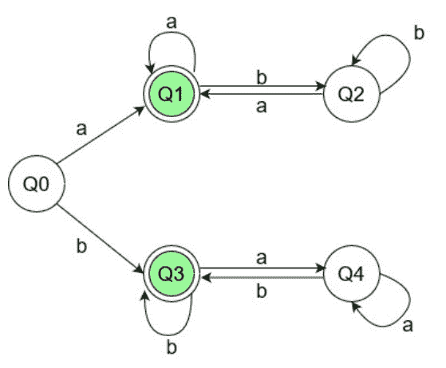

# 构建 DFA 的程序，接受以相同字符开始和结束的字符串

> 原文:[https://www . geesforgeks . org/program-to-build-a-DFA-to-accept-strings-以相同的字符开始和结束/](https://www.geeksforgeeks.org/program-to-build-a-dfa-to-accept-strings-that-start-and-end-with-same-character/)

给定一个由字符 **a** 和 **b** 组成的字符串，检查该字符串是否以相同的字符开始和结束。如果是，打印“是”，否则打印“否”。
**例:**

> **输入:**str = " abbaba "
> **输出:**是
> **解释:**
> 给定的输入字符串以相同的字符‘a’
> 开始和结束，因此下面的 DFA 机器的状态将是 Q0->q1->Q2->Q2->Q1->Q1->Q2->Q1 和 Q1 是最终状态，
> 因此输出将是
> **输入:** str = "ababab"
> **输出:**否
> **解释:**
> 给定的输入字符串以不同的字符‘a’和‘b’开始和结束，
> 因此下面 DFA Machine 的状态将为 Q0->Q1->q2->Q1->Q2->Q1->Q2 和 Q2 不是最终的

**方法:**
[DFA](https://www.geeksforgeeks.org/introduction-of-finite-automata/) 或[确定性有限自动机](https://www.geeksforgeeks.org/introduction-of-finite-automata/)是一种有限状态机，如果字符串达到最终状态，则接受该字符串(在特定条件下)，否则拒绝该字符串。
在 [DFA](https://www.geeksforgeeks.org/minimization-of-dfa/) 中，没有内存的概念，因此我们要逐个字符的检查字符串，从第 0 个字符开始。问题的输入字符集是 **{a，b}** 。为了使 DFA 有效，必须为输入集的每个符号定义一个在每个状态到有效状态的转换规则。
**<u>接受所有以相同字符开始和结束的字符串的 DFA 机器</u>**
对于上面的问题陈述，我们必须首先构建一个 DFA 机器。DFA 机器类似于具有各种状态和转换的流程图。对应上述问题的 DFA 机如下图，Q1 和 Q3 为最终状态:



**<u>这台 DFA 机器是如何工作的</u> :**
机器的工作取决于第一个字符是‘a’还是‘b’。

*   **情况 1:字符串以‘a’开头**
    1.  假设输入字符串中的第一个字符是“a”，那么在读取“a”时，控制将转移到机器的上分支。
    2.  现在，它被定义为字符串必须以“a”结尾才能被接受。
    3.  在状态 **Q1** 下，如果再次出现‘a’，它会保持在相同的状态下循环，因为对于机器来说，最后读取的字符可能是字符串的最后一个字符。
    4.  如果它得到“b”，那么它必须离开最终状态，因为以“b”结尾的字符串是不可接受的。所以它移动到状态 **Q2** 。
    5.  在这里，如果它得到一个“a”，它再次进入最终状态 **Q1** 否则连续的“b”，它继续盘旋。
*   **情况 2:字符串以‘b’开头**
    1.  假设输入字符串中的第一个字符是“b”，那么在读取“b”时，控制将转移到机器的上分支。
    2.  现在，它被定义为字符串必须以“b”结尾才能被接受。
    3.  在状态 **Q3** 下，如果再次出现‘b’，它会保持在相同的状态下循环，因为对于机器来说，最后读取的字符可能是字符串的最后一个字符。
    4.  如果它得到“a”，那么它必须离开最终状态，因为以“a”结尾的字符串是不可接受的。所以它移动到状态 **Q4** 。
    5.  这里，如果它得到一个‘b’，它再次进入最终状态 **Q3** 否则连续的‘a’，它继续盘旋。

**设计 DFA 机器的方法:**

1.  定义制作状态图所需的最小状态数。这里，Q0、Q1、Q2、Q3、Q4 是定义的状态。对各种状态使用函数。
2.  列出所有有效的转换。这里的 a 和 b 是有效的符号。对于每个有效符号，每个状态都必须有一个转换。
3.  通过应用基本条件来定义最终状态。Q1 和 Q3 被定义为最终状态。如果字符串输入在这些状态中的任何一个结束，它被接受或拒绝。
4.  使用状态函数调用定义所有状态转换。
5.  定义字符串结尾的返回条件。如果按照这个过程，程序到达了字符串的末尾，输出将根据程序所处的状态进行。

下面是上述方法的实现。

## C++

```
// C++ Program for DFA that accepts string
// if it starts and ends with same character

#include <bits/stdc++.h>
using namespace std;

// States of DFA
void q1(string, int);
void q2(string, int);
void q3(string, int);
void q4(string, int);

// Function for the state Q1
void q1(string s, int i)
{

    // Condition to check end of string
    if (i == s.length()) {
        cout << "Yes \n";
        return;
    }

    // State transitions
    // 'a' takes to q1, and
    // 'b' takes to q2
    if (s[i] == 'a')
        q1(s, i + 1);
    else
        q2(s, i + 1);
}

// Function for the state Q2
void q2(string s, int i)
{
    // Condition to check end of string
    if (i == s.length()) {
        cout << "No \n";
        return;
    }

    // State transitions
    // 'a' takes to q1, and
    // 'b' takes to q2
    if (s[i] == 'a')
        q1(s, i + 1);
    else
        q2(s, i + 1);
}

// Function for the state Q3
void q3(string s, int i)
{
    // Condition to check end of string
    if (i == s.length()) {
        cout << "Yes \n";
        return;
    }

    // State transitions
    // 'a' takes to q4, and
    // 'b' takes to q3
    if (s[i] == 'a')
        q4(s, i + 1);
    else
        q3(s, i + 1);
}

// Function for the state Q4
void q4(string s, int i)
{
    // Condition to check end of string
    if (i == s.length()) {
        cout << "No \n";
        return;
    }

    // State transitions
    // 'a' takes to q4, and
    // 'b' takes to q3
    if (s[i] == 'a')
        q4(s, i + 1);
    else
        q3(s, i + 1);
}

// Function for the state Q0
void q0(string s, int i)
{

    // Condition to check end of string
    if (i == s.length()) {
        cout << "No \n";
        return;
    }

    // State transitions
    // 'a' takes to q1, and
    // 'b' takes to q3
    if (s[i] == 'a')
        q1(s, i + 1);
    else
        q3(s, i + 1);
}

// Driver Code
int main()
{
    string s = "abbaabb";

    // Since q0 is the starting state
    // Send the string to q0
    q0(s, 0);
}
```

## Java 语言(一种计算机语言，尤用于创建网站)

```
// Java Program for DFA that accepts string
// if it starts and ends with same character
class GFG
{

    // Function for the state Q1
    static void q1(String s, int i)
    {

        // Condition to check end of string
        if (i == s.length())
        {
            System.out.println("Yes");
            return;
        }

        // State transitions
        // 'a' takes to q1, and
        // 'b' takes to q2
        if (s.charAt(i) == 'a')
            q1(s, i + 1);
        else
            q2(s, i + 1);
    }

    // Function for the state Q2
    static void q2(String s, int i)
    {
        // Condition to check end of string
        if (i == s.length())
        {
            System.out.println("No");
            return;
        }

        // State transitions
        // 'a' takes to q1, and
        // 'b' takes to q2
        if (s.charAt(i) == 'a')
            q1(s, i + 1);
        else
            q2(s, i + 1);
    }

    // Function for the state Q3
    static void q3(String s, int i)
    {
        // Condition to check end of string
        if (i == s.length())
        {
            System.out.println("Yes");
            return;
        }

        // State transitions
        // 'a' takes to q4, and
        // 'b' takes to q3
        if (s.charAt(i) == 'a')
            q4(s, i + 1);
        else
            q3(s, i + 1);
    }

    // Function for the state Q4
    static void q4(String s, int i)
    {
        // Condition to check end of string
        if (i == s.length())
        {
            System.out.println("No");
            return;
        }

        // State transitions
        // 'a' takes to q4, and
        // 'b' takes to q3
        if (s.charAt(i) == 'a')
            q4(s, i + 1);
        else
            q3(s, i + 1);
    }

    // Function for the state Q0
    static void q0(String s, int i)
    {

        // Condition to check end of string
        if (i == s.length())
        {
            System.out.println("No");
            return;
        }

        // State transitions
        // 'a' takes to q1, and
        // 'b' takes to q3
        if (s.charAt(i) == 'a')
            q1(s, i + 1);
        else
            q3(s, i + 1);
    }

    // Driver Code
    public static void main (String[] args)
    {
        String s = "abbaabb";

        // Since q0 is the starting state
        // Send the string to q0
        q0(s, 0);
    }
}

// This code is contributed by AnkitRai01
```

## 蟒蛇 3

```
# Python3 Program for DFA that accepts string
# if it starts and ends with same character

# Function for the state Q1
def q1(s, i):

    # Condition to check end of string
    if (i == len(s)):
        print("Yes");
        return;

    # State transitions
    # 'a' takes to q1, and
    # 'b' takes to q2
    if (s[i] == 'a'):
        q1(s, i + 1);
    else:
        q2(s, i + 1);

# Function for the state Q2
def q2(s, i):

    # Condition to check end of string
    if (i == len(s)):
        print("No");
        return;

    # State transitions
    # 'a' takes to q1, and
    # 'b' takes to q2
    if (s[i] == 'a'):
        q1(s, i + 1);
    else:
        q2(s, i + 1);

# Function for the state Q3
def q3(s, i):

    # Condition to check end of string
    if (i == len(s)):
        print("Yes");
        return;

    # State transitions
    # 'a' takes to q4, and
    # 'b' takes to q3
    if (s[i] == 'a'):
        q4(s, i + 1);
    else:
        q3(s, i + 1);

# Function for the state Q4
def q4(s, i):

    # Condition to check end of string
    if (i == s.length()):
        print("No");
        return;

    # State transitions
    # 'a' takes to q4, and
    # 'b' takes to q3
    if (s[i] == 'a'):
        q4(s, i + 1);
    else:
        q3(s, i + 1);

# Function for the state Q0
def q0(s, i):

    # Condition to check end of string
    if (i == len(s)):
        print("No");
        return;

    # State transitions
    # 'a' takes to q1, and
    # 'b' takes to q3
    if (s[i] == 'a'):
        q1(s, i + 1);
    else:
        q3(s, i + 1);

# Driver Code
if __name__ == '__main__':
    s = "abbaabb";

    # Since q0 is the starting state
    # Send the string to q0
    q0(s, 0);

# This code is contributed by Rajput-Ji
```

## C#

```
// C# Program for DFA that accepts string
// if it starts and ends with same character
using System;

class GFG
{

    // Function for the state Q1
    static void q1(string s, int i)
    {

        // Condition to check end of string
        if (i == s.Length)
        {
            Console.WriteLine("Yes");
            return;
        }

        // State transitions
        // 'a' takes to q1, and
        // 'b' takes to q2
        if (s[i] == 'a')
            q1(s, i + 1);
        else
            q2(s, i + 1);
    }

    // Function for the state Q2
    static void q2(string s, int i)
    {
        // Condition to check end of string
        if (i == s.Length)
        {
            Console.WriteLine("No");
            return;
        }

        // State transitions
        // 'a' takes to q1, and
        // 'b' takes to q2
        if (s[i] == 'a')
            q1(s, i + 1);
        else
            q2(s, i + 1);
    }

    // Function for the state Q3
    static void q3(string s, int i)
    {
        // Condition to check end of string
        if (i == s.Length)
        {
            Console.WriteLine("Yes");
            return;
        }

        // State transitions
        // 'a' takes to q4, and
        // 'b' takes to q3
        if (s[i] == 'a')
            q4(s, i + 1);
        else
            q3(s, i + 1);
    }

    // Function for the state Q4
    static void q4(string s, int i)
    {
        // Condition to check end of string
        if (i == s.Length)
        {
            Console.WriteLine("No");
            return;
        }

        // State transitions
        // 'a' takes to q4, and
        // 'b' takes to q3
        if (s[i] == 'a')
            q4(s, i + 1);
        else
            q3(s, i + 1);
    }

    // Function for the state Q0
    static void q0(string s, int i)
    {

        // Condition to check end of string
        if (i == s.Length)
        {
            Console.WriteLine("No");
            return;
        }

        // State transitions
        // 'a' takes to q1, and
        // 'b' takes to q3
        if (s[i] == 'a')
            q1(s, i + 1);
        else
            q3(s, i + 1);
    }

    // Driver Code
    public static void Main ()
    {
        string s = "abbaabb";

        // Since q0 is the starting state
        // Send the string to q0
        q0(s, 0);
    }
}

// This code is contributed by AnkitRai01
```

## java 描述语言

```
<script>

// Javascript Program for DFA that accepts string
// if it starts and ends with same character

// Function for the state Q1
function q1( s, i)
{

    // Condition to check end of string
    if (i == s.length) {
        document.write( "Yes<br>");
        return;
    }

    // State transitions
    // 'a' takes to q1, and
    // 'b' takes to q2
    if (s[i] == 'a')
        q1(s, i + 1);
    else
        q2(s, i + 1);
}

// Function for the state Q2
function q2( s,  i)
{
    // Condition to check end of string
    if (i == s.length) {
        document.write( "No");
        return;
    }

    // State transitions
    // 'a' takes to q1, and
    // 'b' takes to q2
    if (s[i] == 'a')
        q1(s, i + 1);
    else
        q2(s, i + 1);
}

// Function for the state Q3
function q3( s,  i)
{
    // Condition to check end of string
    if (i == s.length) {
        document.write( "Yes");
        return;
    }

    // State transitions
    // 'a' takes to q4, and
    // 'b' takes to q3
    if (s[i] == 'a')
        q4(s, i + 1);
    else
        q3(s, i + 1);
}

// Function for the state Q4
function q4( s,  i)
{
    // Condition to check end of string
    if (i == s.length) {
        document.write( "No");
        return;
    }

    // State transitions
    // 'a' takes to q4, and
    // 'b' takes to q3
    if (s[i] == 'a')
        q4(s, i + 1);
    else
        q3(s, i + 1);
}

// Function for the state Q0
function q0( s,  i)
{

    // Condition to check end of string
    if (i == s.length) {
        document.write( "No");
        return;
    }

    // State transitions
    // 'a' takes to q1, and
    // 'b' takes to q3
    if (s[i] == 'a')
        q1(s, i + 1);
    else
        q3(s, i + 1);
}

// Driver Code
var s = "abbaabb";

// Since q0 is the starting state
// Send the string to q0
q0(s, 0);

// This code is contributed by importantly.

</script>
```

**Output:** 

```
No
```

**时间复杂度:** O(N)