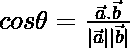
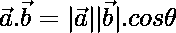

# 计算两个 N 维向量之间角度的程序

> 原文:[https://www . geeksforgeeks . org/计算二维 n 维向量夹角的程序/](https://www.geeksforgeeks.org/program-to-calculate-angle-between-two-n-dimensional-vectors/)

给定一个由两个 [N 维](https://www.geeksforgeeks.org/multidimensional-arrays-c-cpp/) [向量](https://en.wikipedia.org/wiki/Vector_(mathematics_and_physics)) **A** 和 **B** 的大小组成的[数组 **arr[]** ，任务是找到两个向量之间的角度。](https://www.geeksforgeeks.org/array-data-structure/)

**示例:**

> **输入:** arr[] = {-0.5，-2，1}，brr[] = {-1，-1，-0.3}
> **输出:** 0.845289
> **解释:**
> 将数值放入公式中，即可得到所需结果。
> 
> **输入:** arr[] = {1，-2，3}，brr[] = {2，3，-1}
> **输出:** -0.5

**方法:**思路是基于求两个向量的[点积](https://en.wikipedia.org/wiki/Dot_product)再除以向量 A、b 大小的积的数学公式

> **公式:**
> 
> 考虑将两个向量分开角度 **θ** 。两个向量的点积由等式给出:
> 
> 
> 因此，

下面是上述方法的实现:

## C++

```
// C++ program for the above approach

#include <bits/stdc++.h>
using namespace std;

// Function to find the magnitude
// of the given vector
double magnitude(double arr[], int N)
{
    // Stores the final magnitude
    double magnitude = 0;

    // Traverse the array
    for (int i = 0; i < N; i++)
        magnitude += arr[i] * arr[i];

    // Return square root of magnitude
    return sqrt(magnitude);
}

// Function to find the dot
// product of two vectors
double dotProduct(double arr[],
                  double brr[], int N)
{
    // Stores dot product
    double product = 0;

    // Traverse the array
    for (int i = 0; i < N; i++)
        product = product + arr[i] * brr[i];

    // Return the product
    return product;
}

void angleBetweenVectors(double arr[],
                         double brr[], int N)
{
    // Stores dot product of two vectors
    double dotProductOfVectors
        = dotProduct(arr, brr, N);

    // Stores magnitude of vector A
    double magnitudeOfA
        = magnitude(arr, N);

    // Stores magnitude of vector B
    double magnitudeOfB
        = magnitude(brr, N);

    // Stores angle between given vectors
    double angle = dotProductOfVectors
                   / (magnitudeOfA * magnitudeOfB);

    // Print the angle
    cout << angle;
}

// Driver Code
int main()
{
    // Given magnitude arrays
    double arr[] = { -0.5, -2, 1 };
    double brr[] = { -1, -1, 0.3 };

    // Size of the array
    int N = sizeof(arr) / sizeof(arr[0]);

    // Function call to find the
    // angle between two vectors
    angleBetweenVectors(arr, brr, N);

    return 0;
}
```

## Java 语言(一种计算机语言，尤用于创建网站)

```
// Java program for the above approach
class GFG{

// Function to find the magnitude
// of the given vector
static double magnitude(double arr[], int N)
{

    // Stores the final magnitude
    double magnitude = 0;

    // Traverse the array
    for(int i = 0; i < N; i++)
        magnitude += arr[i] * arr[i];

    // Return square root of magnitude
    return Math.sqrt(magnitude);
}

// Function to find the dot
// product of two vectors
static double dotProduct(double[] arr,
                         double[] brr, int N)
{

    // Stores dot product
    double product = 0;

    // Traverse the array
    for(int i = 0; i < N; i++)
        product = product + arr[i] * brr[i];

    // Return the product
    return product;
}

static void angleBetweenVectors(double[] arr,
                                double[] brr, int N)
{

    // Stores dot product of two vectors
    double dotProductOfVectors = dotProduct(arr, brr, N);

    // Stores magnitude of vector A
    double magnitudeOfA = magnitude(arr, N);

    // Stores magnitude of vector B
    double magnitudeOfB = magnitude(brr, N);

    // Stores angle between given vectors
    double angle = dotProductOfVectors /
                   (magnitudeOfA * magnitudeOfB);

    // Print the angle
    System.out.println(angle);
}

// Driver Code
public static void main(String[] args)
{

    // Given magnitude arrays
    double[] arr = { -0.5, -2, 1 };
    double[] brr = { -1, -1, 0.3 };

    // Size of the array
    int N = arr.length;

    // Function call to find the
    // angle between two vectors
    angleBetweenVectors(arr, brr, N);
}
}

// This code is contributed by user_qa7r
```

## 蟒蛇 3

```
# Python3 program for the above approach
import math

# Function to find the magnitude
# of the given vector
def magnitude(arr, N):

    # Stores the final magnitude
    magnitude = 0

    # Traverse the array
    for i in range(N):
        magnitude += arr[i] * arr[i]

    # Return square root of magnitude
    return math.sqrt(magnitude)

# Function to find the dot
# product of two vectors

def dotProduct(arr, brr, N):

    # Stores dot product
    product = 0

    # Traverse the array
    for i in range(N):
        product = product + arr[i] * brr[i]

    # Return the product
    return product

def angleBetweenVectors(arr, brr, N):

    # Stores dot product of two vectors
    dotProductOfVectors = dotProduct(arr, brr, N)

    # Stores magnitude of vector A
    magnitudeOfA = magnitude(arr, N)

    # Stores magnitude of vector B
    magnitudeOfB = magnitude(brr, N)

    # Stores angle between given vectors
    angle = (dotProductOfVectors
             / (magnitudeOfA * magnitudeOfB))

    # Print the angle
    print('%.5f'%angle)

# Driver Code
if __name__ == "__main__":

    # Given magnitude arrays
    arr = [-0.5, -2, 1]
    brr = [-1, -1, 0.3]

    # Size of the array
    N = len(arr)

    # Function call to find the
    # angle between two vectors
    angleBetweenVectors(arr, brr, N)

    # This code is contributed by ukasp.
```

## C#

```
// C# program for the above approach
using System;
using System.Collections.Generic;

class GFG{

// Function to find the magnitude
// of the given vector
static double magnitude(double []arr, int N)
{

    // Stores the final magnitude
    double magnitude = 0;

    // Traverse the array
    for(int i = 0; i < N; i++)
        magnitude += arr[i] * arr[i];

    // Return square root of magnitude
    return Math.Sqrt(magnitude);
}

// Function to find the dot
// product of two vectors
static double dotProduct(double []arr,
                         double []brr, int N)
{

    // Stores dot product
    double product = 0;

    // Traverse the array
    for(int i = 0; i < N; i++)
        product = product + arr[i] * brr[i];

    // Return the product
    return product;
}

static void angleBetweenVectors(double []arr,
                                double []brr, int N)
{

    // Stores dot product of two vectors
    double dotProductOfVectors = dotProduct(arr, brr, N);

    // Stores magnitude of vector A
    double magnitudeOfA = magnitude(arr, N);

    // Stores magnitude of vector B
    double magnitudeOfB = magnitude(brr, N);

    // Stores angle between given vectors
    double angle = dotProductOfVectors /
     (magnitudeOfA * magnitudeOfB);

    // Print the angle
    Console.Write(angle);
}

// Driver Code
public static void Main()
{

    // Given magnitude arrays
    double []arr = { -0.5, -2, 1 };
    double []brr = { -1, -1, 0.3 };

    // Size of the array
    int N = arr.Length;

    // Function call to find the
    // angle between two vectors
    angleBetweenVectors(arr, brr, N);
}
}

// This code is contributed by bgangwar59
```

## java 描述语言

```
<script>

// Javascript program for the above approach

// Function to find the magnitude
// of the given vector
function magnitude(arr, N)
{
    // Stores the final magnitude
    var magnitude = 0;

    // Traverse the array
    for (var i = 0; i < N; i++)
        magnitude += arr[i] * arr[i];

    // Return square root of magnitude
    return Math.sqrt(magnitude);
}

// Function to find the dot
// product of two vectors
function dotProduct(arr, brr,N)
{
    // Stores dot product
    var product = 0;

    // Traverse the array
    for (var i = 0; i < N; i++)
        product = product + arr[i] * brr[i];

    // Return the product
    return product;
}

function angleBetweenVectors(arr, brr, N)
{
    // Stores dot product of two vectors
    var dotProductOfVectors
        = dotProduct(arr, brr, N);

    // Stores magnitude of vector A
    var magnitudeOfA
        = magnitude(arr, N);

    // Stores magnitude of vector B
    var magnitudeOfB
        = magnitude(brr, N);

    // Stores angle between given vectors
    var angle = dotProductOfVectors
                   / (magnitudeOfA * magnitudeOfB);

    // Print the angle
    document.write( angle.toFixed(6));
}

// Driver Code
// Given magnitude arrays
var arr = [ -0.5, -2, 1 ];
var brr = [ -1, -1, 0.3 ];
// Size of the array
var N = arr.length;
// Function call to find the
// angle between two vectors
angleBetweenVectors(arr, brr, N);

</script>
```

**Output:** 

```
0.845289
```

***时间复杂度:**O(1)*
T5**辅助空间:** O(1)