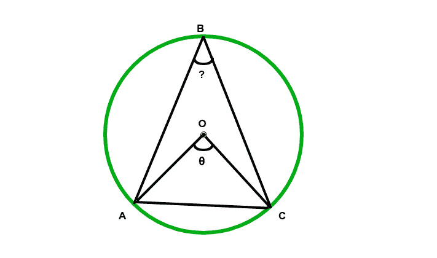

# 当弦对着的中心角给定时，计算弦对着的圆周上的角度的程序

> 原文:[https://www . geeksforgeeks . org/计算弦对圆周角的程序当给定弦对圆心角时/](https://www.geeksforgeeks.org/program-to-calculate-angle-on-circumference-subtended-by-the-chord-when-the-central-angle-subtended-by-the-chord-is-given/)

给定一个圆，该圆有一个弦和一个由弦对着圆心的角度。这里的任务是找到圆周上给定弦对着的角度的度量。



**例:**

```
Input:  = 90
Output: ABC = 45.00 degrees
Input:  = 65
Output: ABC = 32.50 degrees
```

**进场:**

*   设 **AC** 为圆心为 **O** 的圆的弦，设 **C** 为圆周上任意位置的任意点。
*   Let, angle **AOC**(on center) is the given 

    ```
    *** QuickLaTeX cannot compile formula:

    *** Error message:
    Error: Nothing to show, formula is empty

    ```

    。

*   所以角度应该在圆周上，
    **角度 ABC =角度 AOC/2**

> 圆周上的角是同一弦对着的圆心的半角。

以下是上述方法的实现:

## C++

```
// C++ Program to calculate angle
// on the circumference subtended
// by the chord when the central angle
// subtended by the chord is given
#include <iostream>
using namespace std;

float angleOncirCumference(float z)
{
    return (z / 2);
}

// Driver code
int main()
{

    // Angle on center
    float angle = 65;

    float z = angleOncirCumference(angle);

    cout << "The angle is " << (z) << " degrees";

    return 0;
}

// This code is contributed by jit_t
```

## Java 语言(一种计算机语言，尤用于创建网站)

```
// Java Program to calculate angle on the circumference
// subtended by the chord when the central angle
// subtended by the chord is given

class GFG {

    static float angleOncirCumference(float z)
    {
        return (z / 2);
    }

    // Driver code
    public static void main(String[] args)
    {

        // Angle on center
        float angle = 65;

        float z = angleOncirCumference(angle);

        System.out.println("The angle is "
                           + z + " degrees");
    }
}
```

## 蟒蛇 3

```
# Python3 Program to calculate angle
# on the circumference subtended
# by the chord when the central angle
# subtended by the chord is given
def angleOncirCumference(z):

    return (z / 2);

# Driver code

# Angle on center
angle = 65;

z = angleOncirCumference(angle);

print("The angle is", (z), "degrees");

# This code is contributed by Rajput-Ji
```

## C#

```
// C# Program to calculate angle on the circumference
// subtended by the chord when the central angle
// subtended by the chord is given
using System;

public class GFG
{

    static float angleOncirCumference(float z)
    {
        return (z / 2);
    }

    // Driver code
    public static void Main(String[] args)
    {

        // Angle on center
        float angle = 65;

        float z = angleOncirCumference(angle);

        Console.WriteLine("The angle is "
                        + z + " degrees");
    }
}

// This code is contributed by Rajput-Ji
```

## java 描述语言

```
<script>

// JavaScript Program to calculate angle
// on the circumference subtended
// by the chord when the central angle
// subtended by the chord is given

function angleOncirCumference(z)
{
    return (z / 2);
}

// Driver code

    // Angle on center
    let angle = 65;

    let z = angleOncirCumference(angle);

    document.write("The angle is " + (z) + " degrees");

// This code is contributed by Surbhi Tyagi.

</script>
```

**Output:** 

```
The angle is 32.5 degrees
```