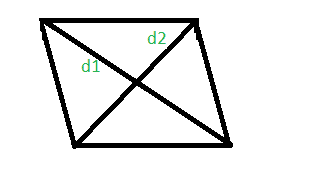

# 计算对角线给定的菱形的面积和周长的程序

> 原文:[https://www . geeksforgeeks . org/计算对角线被给定的菱形面积和周长的程序/](https://www.geeksforgeeks.org/program-to-calculate-area-and-perimeter-of-a-rhombus-whose-diagonals-are-given/)

给定菱形的对角线长度 d1 和 d2。任务是找出菱形的周长和面积。
菱形是一个有 4 条等边的多边形，其中两条相对的边是平行的，相对的角是相等的。



**例:**

```
Input: d1 = 2 and d2 = 4
Output: The area of rhombus with diagonals 2 and 4 is 4.
        The perimeter of rhombus with diagonals 2 and 4 is 8.

Input: d1 = 100 and d2 = 500
Output: The area of rhombus with diagonals 100 and 500 is 25000.
        The perimeter of rhombus with diagonals 100 and 500 is 1019.
```

> **菱形的面积=** 
> **菱形的周长=** 

以下是上述方法的实现:

## C++

```
// C++ Program to calculate area and perimeter
// of a rhombus using diagonals
#include <iostream>
#include <math.h>
using namespace std;

// calculate area and perimeter of a rhombus
int rhombusAreaPeri(int d1, int d2)
{
    long long int area, perimeter;

    area = (d1 * d2) / 2;
    perimeter = 2 * sqrt(pow(d1, 2) + pow(d2, 2));

    cout << "The area of rhombus with diagonals "
         << d1 << " and " << d2 << " is " << area << "." << endl;

    cout << "The perimeter of rhombus with diagonals "
         << d1 << " and " << d2 << " is " << perimeter << "." << endl;
}

// Driver code
int main()
{

    int d1 = 2, d2 = 4;
    rhombusAreaPeri(d1, d2);

    return 0;
}
```

## Java 语言(一种计算机语言，尤用于创建网站)

```
// Java program to calculate area and perimeter
// of a rhombus using diagonals
import java.io.*;

class GFG {

// calculate area and perimeter of a rhombus
static int rhombusAreaPeri(int d1, int d2)
{
     int area, perimeter;

    area = (d1 * d2) / 2;
    perimeter = (int)(2 * Math.sqrt(Math.pow(d1, 2) + Math.pow(d2, 2)));

    System.out.println( "The area of rhombus with diagonals "
        + d1 + " and " + d2 + " is " + area + ".");

    System.out.println("The perimeter of rhombus with diagonals "
        +d1 + " and " + d2 + " is " + perimeter + ".");
        return 0;
}

// Driver code

    public static void main (String[] args) {
        int d1 = 2, d2 = 4;
    rhombusAreaPeri(d1, d2);
    }
}
// This code is contributed by anuj_67..
```

## 蟒蛇 3

```
# Python 3 Program to calculate
# area and perimeter of a rhombus
# using diagonals
from math import sqrt, pow

# calculate area and perimeter
# of a rhombus
def rhombusAreaPeri(d1, d2):
    area = (d1 * d2) / 2
    perimeter = 2 * sqrt(pow(d1, 2) +
                         pow(d2, 2))

    print("The area of rhombus with diagonals",
                d1, "and", d2, "is", area, ".")

    print("The perimeter of rhombus with diagonals",
                d1, "and", d2, "is", perimeter, "." )

# Driver code
if __name__ == '__main__':
    d1 = 2
    d2 = 4
    rhombusAreaPeri(d1, d2)

# This code is contributed
# by Surendra_Gangwar
```

## C#

```
// C# program to calculate area
// and perimeter of a rhombus
// using diagonals
using System;

class GFG
{

// calculate area and perimeter
// of a rhombus
static int rhombusAreaPeri(int d1, 
                           int d2)
{
    int area, perimeter;

    area = (d1 * d2) / 2;
    perimeter = (int)(2 * Math.Sqrt(Math.Pow(d1, 2) +
                                    Math.Pow(d2, 2)));

    Console.WriteLine( "The area of rhombus with " +
                       "diagonals " + d1 + " and " +
                          d2 + " is " + area + ".");

    Console.WriteLine("The perimeter of rhombus " +
                      "with diagonals " + d1 + " and " +
                         d2 + " is " + perimeter + ".");
        return 0;
}

// Driver code
public static void Main ()
{
    int d1 = 2, d2 = 4;
    rhombusAreaPeri(d1, d2);
}
}

// This code is contributed by anuj_67..
```

## 服务器端编程语言（Professional Hypertext Preprocessor 的缩写）

```
<?php
// PHP Program to calculate area
// and perimeter of a rhombus
// using diagonals

// calculate area and perimeter
// of a rhombus
function rhombusAreaPeri($d1, $d2)
{

    $area = ($d1 * $d2) / 2;
    $perimeter = 2 * sqrt(pow($d1, 2) +
                          pow($d2, 2));

    echo "The area of rhombus with diagonals ". $d1 .
         " and " . $d2 . " is " . $area . "." . "\n";

    echo "The perimeter of rhombus with diagonals " . $d1 .
         " and " . $d2 . " is " . $perimeter . "." . "\n";
}

// Driver code
$d1 = 2; $d2 = 4;
rhombusAreaPeri($d1, $d2);

// This code is contributed
// by Akanksha Rai(Abby_akku)
?>
```

## java 描述语言

```
<script>
// javascript Program to calculate area and perimeter
// of a rhombus using diagonals

// calculate area and perimeter of a rhombus
function rhombusAreaPeri(d1, d2)
{
    let area, perimeter;

    area = Math.floor((d1 * d2) / 2);
    perimeter = Math.floor(2 * Math.sqrt(Math.pow(d1, 2) + Math.pow(d2, 2)));

    document.write("The area of rhombus with diagonals "
        + d1 + " and " + d2 + " is " + area + "." + "<br>");

    document.write("The perimeter of rhombus with diagonals "
        + d1 + " and " + d2 + " is " + perimeter + "." + "<br>");
}

// Driver code
    let d1 = 2, d2 = 4;
    rhombusAreaPeri(d1, d2);

// This code is contributed by Mayank Tyagi

</script>
```

**Output:** 

```
The area of rhombus with diagonals 2 and 4 is 4.
The perimeter of rhombus with diagonals 2 and 4 is 8.
```