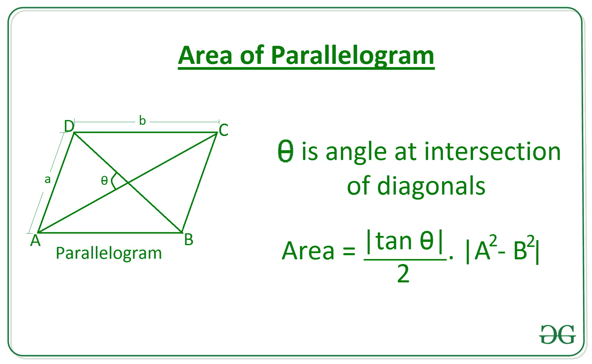
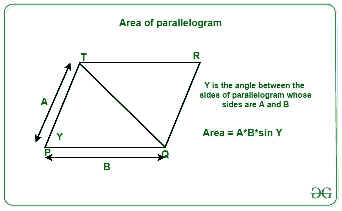
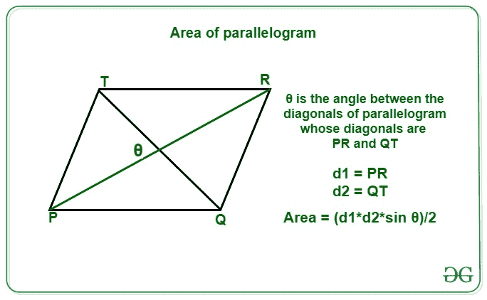

# 计算平行四边形面积的程序

> 原文:[https://www . geesforgeks . org/计算平行四边形面积的程序/](https://www.geeksforgeeks.org/program-to-calculate-area-of-a-parallelogram/)

给定表示平行四边形边长的整数 **A** 和 **B** 以及~~T5】Y~~T8 即平行四边形的边与对角线 **D1** 和 **D2** 之间的夹角以及对角线交点处的夹角 ~~**0**~~ ，任务是从提供的信息中找出平行四边形的面积。

> A **平行四边形**是一种对边相等且平行的四边形，它们之间的角度不是直角。

**示例:**

> **输入:** A = 6，B = 10， ~~0~~ = 30
> **输出:** 18.48
> **说明:**
> 对于给定的边 6 和 10 以及角度 30 度，平行四边形的面积将为 18.48。
> 
> **输入:** A = 3，B = 5， ~~Y~~ = 45
> **输出:** 10.61
> **说明:**
> 对于给定的边 3 和 5，对于 45 度角，对角线的长度为 10.61。
> 
> **输入:** D1 = 3，D2 = 5， ~~0~~ = 90
> **输出:** 7.5
> **解释:**
> 对于给定的对角线 3 和 5 以及角度 90 度，平行四边形的面积将为 7.5。

**逼近:**平行四边形的面积可以通过以下三个公式计算:

*   从给定的边 **A** 和 **B** 以及对角线之间的角度，平行四边形的面积可以通过以下公式计算:

> **边的平行四边形面积**和**对角线之间的角度**=((A<sup>2</sup>–B<sup>2</sup>)* tan~~0~~)/2



*   从给定的边 **A** 和 **B** 以及边之间的角度，平行四边形 is 的面积可以通过以下公式计算:

> **边的平行四边形面积**和**边之间的角度** = A * B * sin ~~Y~~



*   根据给定的对角线长度 **D1** 和 **D2** 以及它们之间的角度，平行四边形的面积可以通过以下公式计算:

> **对角线**和**对角线之间的角度**的平行四边形面积= (D1 * D2 *辛 ~~0~~ )/2



下面是上述方法的实现:

## C++

```
// C++ program for the
// above approach
#include <bits/stdc++.h>
using namespace std;

double toRadians(int degree)
{
  double pi = 3.14159265359;
  return ((double)degree * (pi / 180));
}

// Function to return the area of
// parallelogram using sides and
// angle at the intersection of diagonal
double Area_Parallelogram1(int a, int b,
                           int theta)
{

    // Calculate area of parallelogram
    double area = (abs(tan(toRadians(theta))) / 2) *
                   abs(a * a - b * b);

    // Return the answer
    return area;
}

// Function to return the area of
// parallelogram using sides and
// angle at the intersection of sides
double Area_Parallelogram2(int a, int b,
                           int gamma)
{    
  // Calculate area of parallelogram
  double area = (abs(sin(toRadians(gamma)))) *
                 abs(a * b);

  // Return the answer
  return area;
}

// Function to return the area of
// parallelogram using diagonals and
// angle at the intersection of diagonals
static double Area_Parallelogram3(int d1, int d2,
                                  int theta)
{    
  // Calculate area of parallelogram
  double area = (abs(sin(toRadians(theta))) / 2) *
                 abs(d1 * d2);

  // Return the answer
  return area;
}

// Driver Code
int main()
{
  // Given diagonal and angle
  int d1 = 3;
  int d2 = 5;
  int theta = 90;

  // Function call
  double area = Area_Parallelogram3(d1,
                                    d2,
                                    theta);

  // Print the area
  printf("%.2f", area);
}

// This code is contributed by rutvik_56
```

## Java 语言(一种计算机语言，尤用于创建网站)

```
// Java program for above approach
import java.io.*;

class GFG{

// Function to return the area of
// parallelogram using sides and
// angle at the intersection of diagonal
static double Area_Parallelogram1(int a, int b,
                                  int theta)
{

    // Calculate area of parallelogram
    double area = (Math.abs(Math.tan(
                   Math.toRadians(theta))) / 2) *
                   Math.abs(a * a - b * b);

    // Return the answer
    return area;
}

// Function to return the area of
// parallelogram using sides and
// angle at the intersection of sides
static double Area_Parallelogram2(int a, int b,
                                  int gamma)
{

    // Calculate area of parallelogram
    double area = (Math.abs(Math.sin(
                   Math.toRadians(gamma)))) *
                   Math.abs(a * b);

    // Return the answer
    return area;
}

// Function to return the area of
// parallelogram using diagonals and
// angle at the intersection of diagonals
static double Area_Parallelogram3(int d1, int d2,
                                  int theta)
{

    // Calculate area of parallelogram
    double area = (Math.abs(Math.sin(
                   Math.toRadians(theta))) / 2) *
                   Math.abs(d1 * d2);

    // Return the answer
    return area;
}

// Driver code
public static void main (String[] args)
{

    // Given diagonal and angle
    int d1 = 3;
    int d2 = 5;
    int theta = 90;

    // Function call
    double area = Area_Parallelogram3(
                  d1, d2, theta);

    // Print the area
    System.out.format("%.2f", area);
}
}

// This code is contributed by offbeat
```

## 蟒蛇 3

```
# Python3 program for the above approach

import math

# Function to return the area of
# parallelogram using sides and
# angle at the intersection of diagonal
def Area_Parallelogram1(a, b, theta):

    # Calculate area of parallelogram
    area = (abs(math.tan(math.radians(theta)))/2) \
           * abs(a**2 - b**2)

    # Return the answer
    return area

# Function to return the area of
# parallelogram using sides and
# angle at the intersection of sides
def Area_Parallelogram2(a, b, gamma):

    # Calculate area of parallelogram
    area = (abs(math.sin(math.radians(gamma)))) \
            * abs(a * b)

    # Return the answer
    return area

# Function to return the area of
# parallelogram using diagonals and
# angle at the intersection of diagonals
def Area_Parallelogram3(d1, d2, theta):

    # Calculate area of parallelogram
    area = (abs(math.sin(math.radians(theta)))/2) \
            * abs(d1 * d2)

    # Return the answer
    return area

# Driver Code

# Given diagonal and angle
d1 = 3
d2 = 5
theta = 90

# Function Call
area = Area_Parallelogram3(d1, d2, theta)
# Print the area
print(round(area, 2))
```

## C#

```
// C# program for
// the above approach
using System;
class GFG{

// Function to return the area of
// parallelogram using sides and
// angle at the intersection of diagonal
static double Area_Parallelogram1(int a, int b,
                                  int theta)
{
  // Calculate area of parallelogram
  double area = (Math.Abs(Math.Tan((theta *
                          Math.PI) / 180)) / 2) *
                 Math.Abs(a * a - b * b);

  // Return the answer
  return area;
}

// Function to return the area of
// parallelogram using sides and
// angle at the intersection of sides
static double Area_Parallelogram2(int a, int b,
                                  int gamma)
{   
  // Calculate area of parallelogram
  double area = (Math.Abs(Math.Sin((gamma *
                          Math.PI) / 180))) *
                 Math.Abs(a * b);

  // Return the answer
  return area;
}

// Function to return the area of
// parallelogram using diagonals and
// angle at the intersection of diagonals
static double Area_Parallelogram3(int d1, int d2,
                                  int theta)
{   
  // Calculate area of parallelogram
  double area = (Math.Abs(Math.Sin((theta *
                          Math.PI) / 180)) / 2) *
                 Math.Abs(d1 * d2);

  // Return the answer
  return area;
}

// Driver code
public static void Main(String[] args)
{
  // Given diagonal and angle
  int d1 = 3;
  int d2 = 5;
  int theta = 90;

  // Function call
  double area = Area_Parallelogram3(d1, d2, theta);

  // Print the area
  Console.Write("{0:F2}", area);
}
}

// This code is contributed by Rajput-Ji
```

## java 描述语言

```
<script>

// Javascript program for the
// above approach
function toRadians(degree)
{
    let pi = 3.14159265359;
    return (degree * (pi / 180));
}

// Function to return the area of
// parallelogram using sides and
// angle at the intersection of diagonal
function Area_Parallelogram1(a, b,
                             theta)
{

    // Calculate area of parallelogram
    let area = (Math.abs(Math.tan(toRadians(theta))) / 2) *
                Math.abs(a * a - b * b);

    // Return the answer
    return area;
}

// Function to return the area of
// parallelogram using sides and
// angle at the intersection of sides
function Area_Parallelogram2(a, b,
                             gamma)
{   

    // Calculate area of parallelogram
    let area = (Math.abs(Math.sin(toRadians(gamma)))) *
                         Math.abs(a * b);

    // Return the answer
    return area;
}

// Function to return the area of
// parallelogram using diagonals and
// angle at the intersection of diagonals
function Area_Parallelogram3(d1, d2,
                             theta)
{   

    // Calculate area of parallelogram
    let area = (Math.abs(Math.sin(toRadians(theta))) / 2) *
                         Math.abs(d1 * d2);

    // Return the answer
    return area;
}

// Driver Code

// Given diagonal and angle
let d1 = 3;
let d2 = 5;
let theta = 90;

// Function call
let area = Area_Parallelogram3(d1, d2,
                               theta);

// Print the area
document.write(area);

// This code is contributed by Mayank Tyagi

</script>
```

**Output:** 

```
7.5
```

***时间复杂度:**O(1)*
T5**辅助空间:** O(1)