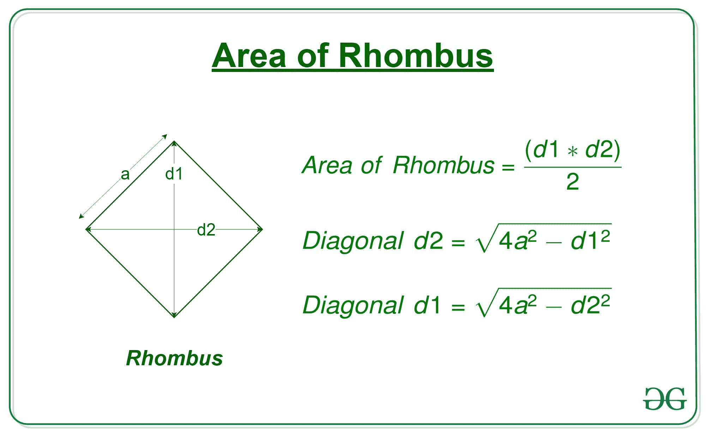
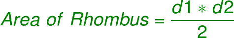
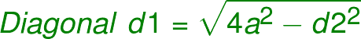

# 计算给定一边和对角线的菱形面积的程序

> 原文:[https://www . geeksforgeeks . org/计算菱形面积的程序，其一边和对角线是给定的/](https://www.geeksforgeeks.org/program-to-calculate-area-of-a-rhombus-whose-one-side-and-diagonal-are-given/)

给定菱形对角线“d1”和边“a”的长度，任务是找到菱形的面积。

> A **菱形**是一个有 4 条等边的多边形，其中两条相对的边是平行的，并且相对的角度是相等的。



**例:**

```
Input: d = 15, a = 10
Output: 99.21567416492215

Input: d = 20, a = 18
Output: 299.3325909419153
```

**进场:**

*   得到菱形的对角线“d1”和边“a”
*   我们知道，



*   但是由于我们不知道另一个对角线 d2，我们还不能使用这个公式
*   所以我们首先借助 d1 和 a
    找到第二条对角线 d2



*   现在我们可以用面积公式来计算菱形的面积

## C++

```
// C++ program to calculate the area of a rhombus
// whose one side and one diagonal is given
#include<bits/stdc++.h>
using namespace std;

// function to calculate the area of the rhombus
double area(double d1, double a)
{

    // Second diagonal
    double d2 = sqrt(4 * (a * a) - d1 * d1);

    // area of rhombus
    double area = 0.5 * d1 * d2;

    // return the area
    return area;
}

// Driver code
int main()
{
    double d = 7.07;
    double a = 5;
    printf("%0.8f", area(d, a));
}

// This code is contributed by Mohit Kumar
```

## Java 语言(一种计算机语言，尤用于创建网站)

```
// Java program to calculate the area of a rhombus
// whose one side and one diagonal is given
class GFG
{

    // function to calculate the area of the rhombus
    static double area(double d1, double a)
    {

        // Second diagonal
        double d2 = Math.sqrt(4 * (a * a) - d1 * d1);

        // area of rhombus
        double area = 0.5 * d1 * d2;

        // return the area
        return area;
    }

    // Driver code
    public static void main (String[] args)
    {
        double d = 7.07;
        double a = 5;
        System.out.println(area(d, a));
    }
}

// This code is contributed by AnkitRai01
```

## 蟒蛇 3

```
# Python program to calculate
# the area of a rhombus
# whose one side and
# one diagonal is given

# function to calculate
# the area of the rhombus
def area(d1, a):

    # Second diagonal
    d2 = (4*(a**2) - d1**2)**0.5

    # area of rhombus
    area = 0.5 * d1 * d2

    # return the area
    return(area)

# driver code
d = 7.07
a = 5
print(area(d, a))
```

## C#

```
// C# program to calculate the area of a rhombus
// whose one side and one diagonal is given
using System;

class GFG
{

    // function to calculate the area of the rhombus
    static double area(double d1, double a)
    {

        // Second diagonal
        double d2 = Math.Sqrt(4 * (a * a) - d1 * d1);

        // area of rhombus
        double area = 0.5 * d1 * d2;

        // return the area
        return area;
    }

    // Driver code
    public static void Main (String []args)
    {
        double d = 7.07;
        double a = 5;
        Console.WriteLine(area(d, a));
    }
}

// This code is contributed by Arnab Kundu
```

## java 描述语言

```
<script>
// javascript program to calculate the area of a rhombus
// whose one side and one diagonal is given  
// function to calculate the area of the rhombus
function area(d1 , a)
{

    // Second diagonal
    var d2 = Math.sqrt(4 * (a * a) - d1 * d1);

    // area of rhombus
    var area = 0.5 * d1 * d2;

    // return the area
    return area;
}

// Driver code
var d = 7.07;
var a = 5;
document.write(area(d, a));

// This code is contributed by 29AjayKumar
</script>
```

**Output:** 

```
24.999998859949972
```