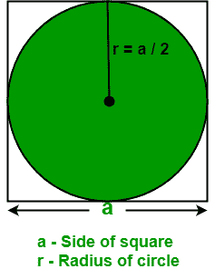

# 计算正方形内切圆面积的程序

> 原文:[https://www . geesforgeks . org/计算正方形内切圆面积的程序/](https://www.geeksforgeeks.org/program-to-calculate-area-of-an-circle-inscribed-in-a-square/)

给定正方形的边。任务是找出正方形内切圆的面积。
**例:**

```
Input : a = 8
Output : Area of an inscribed circle: 50.24

Input : a = 12.04
Output : Area of an inscribed circle: 113.795
```

给定一个正方形，即正方形的所有边都等长，所有四个角都是 90 度。下图描绘了正方形中的内切圆。



**正方形内切圆的性质:**

*   正方形内切圆的直径等于正方形边长。
*   用圆或正方形的至少一种度量，可以计算出内接圆的正方形的面积和周长。
*   正方形的中心和圆形的中心位于同一点。
*   当给出圆或正方形的至少一个度量时，可以计算圆的周长和面积。

> 求内切圆面积的公式:∏ /{4} a <sup>2</sup>
> 
> 其中 a 是内接圆的正方形的边。
> 
> 公式是如何工作的？
> 
> 假设 a 是正方形的边，我们知道正方形有 4 条边。
> 
> 圆的面积= ∏ r <sup>2</sup>
> 
> 其中 r 是圆的半径和正方形的面积= a <sup>2</sup>
> 
> 因此，正方形内切圆的面积= ∏ r <sup>2</sup>
> 
> 现在，把 r = a / 2
> 
> 所以，正方形内切圆的面积∏ /{4} a <sup>2</sup>

## C++

```
// C++ Program to find the area of
// an inscribed circle in a square.
#include<bits/stdc++.h>
#define PI 3.14
using namespace std;

// Function to find area of an
// inscribed circle in a square.
float areaOfInscribedCircle(float a)
{
    return ( PI / 4 ) * a * a;
}

// Driver's code
int main()
{
    float a = 8;

    cout << "Area of an inscribed circle: "
        << areaOfInscribedCircle(a);

    return 0;
}
```

## Java 语言(一种计算机语言，尤用于创建网站)

```
// Java Program to find the area of
// an inscribed circle in a square.
import java.io.*;

class GFG {

    static double PI = 3.14;

    // Function to find area of an
    // inscribed circle in a square.
    static double areaOfInscribedCircle(float a)
    {
        return ( PI / 4 ) * a * a;
    }

    // Driver code
    public static void main (String[] args)
    {
        float a = 8;

        System.out.println("Area of an inscribed"
        + " circle: " + areaOfInscribedCircle(a));
    }
}
```

## 蟒蛇 3

```
# Python Program to find the area of
# an inscribed circle in a square.

PI = 3.14

# Function to find area of an
# inscribed circle in a square.
def areaOfInscribedCircle(a):
    return ( PI / 4 ) * a * a

# Driver code
a = 8
print("Area of an inscribed circle:",
round(areaOfInscribedCircle(a), 2))
```

## C#

```
// C# Program to find the
// area of an inscribed
// circle in a square.
using System;

class GFG
{
    static double PI = 3.14;

    // Function to find area
    // of an inscribed circle
    // in a square.
    static double areaOfInscribedCircle(float a)
    {
        return (PI / 4 ) * a * a;
    }

    // Driver code
    public static void Main ()
    {
        float a = 8;

        Console.WriteLine("Area of an inscribed" +
                                    " circle: " +
                        areaOfInscribedCircle(a));
    }
}

// This code is contributed
// by anuj_6
```

## 服务器端编程语言（Professional Hypertext Preprocessor 的缩写）

```
<?php
// PHP Program to find
// the area of an
// inscribed circle in
// a square.
$PI = 3.14;

// Function to find area
// of an inscribed circle
// in a square.
function areaOfInscribedCircle( $a)
{
    global $PI;
    return ($PI / 4 ) *
            $a * $a;
}

// Driver Code
$a = 8;

echo "Area of an inscribed circle: ",
        areaOfInscribedCircle($a);

// This code is contributed
// by anuj_6
?>
```

## java 描述语言

```
<script>
// JavaScript Program to find the area of
// an inscribed circle in a square.
var PI =3.14;
function areaOfInscribedCircle(a)
{
    return ( PI / 4 ) * a * a;
}

var a = 8;

    document.write( "Area of an inscribed circle: "
        + areaOfInscribedCircle(a));

</script>
```

**Output**

```
Area of an inscribed circle: 50.24
```