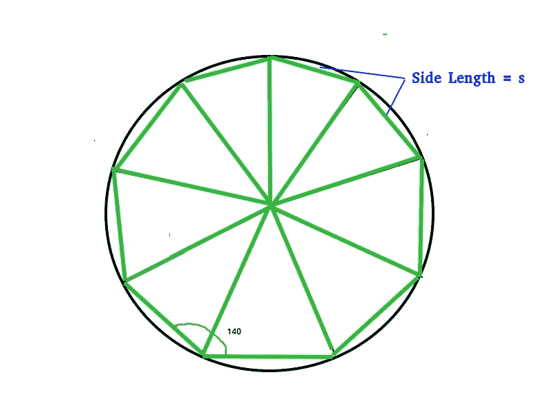

# 计算恩内根面积的程序

> 原文:[https://www . geesforgeks . org/program-to-compute-area-of-enne agon/](https://www.geeksforgeeks.org/program-to-calculate-area-of-enneagon/)

恩内阿贡是一个有 9 条边和 9 个内角的多边形。恩内阿贡也被称为诺康。正九边形的内角各为 140 度。九边形的内角之和是 1260 度。
外接圆的中心也作为正九边形的中心。
垂直于九边形的一边绘制的线段称为顶点，用“a”表示。



```
 Area &approx; 6.1818 * s * s 
 where s is side length.
```

示例:

```
Input : 6
Output :Area of Regular Nonagon = 222.5448

Input : 8 
Output :Area of Regular Nonagon = 395.6352
```

## C++

```
// CPP program to find area of a Enneagon
#include <iomanip>
#include <iostream>
#include <math.h>
using namespace std;

// Function to calculate area of nonagon
double Nonagon_Area(double s) {
  return (6.1818 * s * s);
}

// driver function
int main() {
  double s = 6; // Length of a side
  cout << "Area of Regular Nonagon = " << std::setprecision(7)
       << Nonagon_Area(s);
  return 0;
}
```

## Java 语言(一种计算机语言，尤用于创建网站)

```
// Java program to find area of a Enneagon
class Nonagon {

  // Function for calculating the area of the nonagon
  public static double Nonagon_Area(double s) {
    return ((6.1818 * (s * s)));
  }

  // driver code
  public static void main(String[] args) {
    double s = 6; // Length of a side
    System.out.print("Area of Regular Nonagon = " + Nonagon_Area(s));
  }
}
```

## 计算机编程语言

```
# python program to find area of a Enneagon
length = 6
Nonagon_area = 6.1818 * (length ** 2)
print("Area of regular Nonagon is = ", Nonagon_area)
```

## C#

```
// C# program to find area of a Hexagon
using System;

class Nonagon {

    // Function for calculating
    // the area of the nonagon
    public static double Nonagon_Area(double s)
    {
        return ((6.1818 * (s * s)));
    }

    // driver code
    public static void Main()
    {  
        // Length of a side
        double s = 6;
        Console.WriteLine("Area of Regular Nonagon = " +
                                       Nonagon_Area(s));
    }
}

// This article is contributed by vt_m
```

## 服务器端编程语言（Professional Hypertext Preprocessor 的缩写）

```
<?php
// PHP program to find area of a Hexagon

    // Function to calculate
    // area of nonagon
    function Nonagon_Area($s)
    {
        return (6.1818 * $s * $s);
    }

// Driver Code

// Length of a side
$s = 6;

echo "Area of Regular Nonagon = "
    , Nonagon_Area($s);

// This code is contributed by anuj_67.
?>
```

## java 描述语言

```
<script>

// javascript program to find area of a Enneagon

    // Function for calculating the area of the nonagon
    function Nonagon_Area(s) {
        return ((6.1818 * (s * s)));
    }

    // driver code

        var s = 6; // Length of a side
        document.write("Area of Regular Nonagon = " + Nonagon_Area(s));

// This code contributed by aashish1995

</script>
```

**Output:** 

```
Area of Regular Nonagon = 222.5448
```