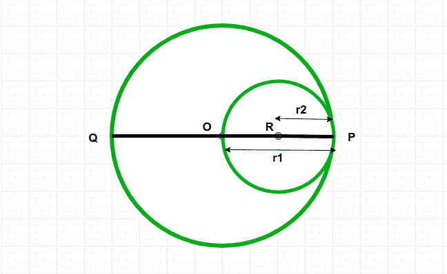
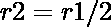
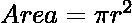

# 计算通过外圆中心并接触其圆周的内圆面积的程序

> 原文:[https://www . geeksforgeeks . org/程序计算通过外圆心并触及其圆周的内圆面积/](https://www.geeksforgeeks.org/program-to-calculate-area-of-inner-circle-which-passes-through-center-of-outer-circle-and-touches-its-circumference/)

给定一个圆 **C1** ，半径为 **r1** 。另一个圆 **C2** 穿过圆心 **C1** 接触圆 **C1** 的圆周。任务是找出圆 **C2** 的面积。
**示例:**

```
Input: r1 = 4
Output:Area of circle c2 = 12.56

Input: r1 = 7
Output:Area of circle c2 = 38.465
```



**进近:**T2**半径【R2】T4**圆 C2** 为。
所以我们知道圆的面积是。
以下是上述方法的实施:** 

## C++

```
// C++ implementation of the above approach
#include<bits/stdc++.h>
#include <iostream>
using namespace std;

// Function calculate the area of the inner circle
double innerCirclearea(double radius)
{

    // the radius cannot be negative
    if (radius < 0)
    {
        return -1;
    }

    // area of the circle
    double r = radius / 2;
    double Area = (3.14 * pow(r, 2));

    return Area;
}

// Driver Code
int main()
{

    double radius = 4;
    cout << ("Area of circle c2 = ",
                innerCirclearea(radius));
    return 0;
}

// This code is contributed by jit_t.
```

## Java 语言(一种计算机语言，尤用于创建网站)

```
// Java implementation of the above approach

class GFG {

    // Function calculate the area of the inner circle
    static double innerCirclearea(double radius)
    {

        // the radius cannot be negative
        if (radius < 0) {
            return -1;
        }

        // area of the circle
        double r = radius / 2;
        double Area = (3.14 * Math.pow(r, 2));

        return Area;
    }

    // Driver Code
    public static void main(String arr[])
    {
        double radius = 4;
        System.out.println("Area of circle c2 = "
                           + innerCirclearea(radius));
    }
}
```

## 蟒蛇 3

```
# Python3 implementation of the above approach

# Function calculate the area of the inner circle
def innerCirclearea(radius) :

    # the radius cannot be negative
    if (radius < 0) :
        return -1;

    # area of the circle
    r = radius / 2;
    Area = (3.14 * pow(r, 2));

    return Area;

# Driver Code
if __name__ == "__main__" :

    radius = 4;
    print("Area of circle c2 =",
           innerCirclearea(radius));

# This code is contributed by AnkitRai01
```

## C#

```
// C# Implementation of the above approach
using System;

class GFG
{

    // Function calculate the area
    // of the inner circle
    static double innerCirclearea(double radius)
    {

        // the radius cannot be negative
        if (radius < 0)
        {
            return -1;
        }

        // area of the circle
        double r = radius / 2;
        double Area = (3.14 * Math.Pow(r, 2));

        return Area;
    }

    // Driver Code
    public static void Main(String []arr)
    {
        double radius = 4;
        Console.WriteLine("Area of circle c2 = " +
                          innerCirclearea(radius));
    }
}

// This code is contributed by PrinciRaj1992
```

## java 描述语言

```
<script>

// JavaScript implementation of the above approach

// Function calculate the area of the inner circle
function innerCirclearea(radius)
{

    // the radius cannot be negative
    if (radius < 0)
    {
        return -1;
    }

    // area of the circle
    let r = radius / 2;
    let Area = (3.14 * Math.pow(r, 2));

    return Area;
}

// Driver Code

    let radius = 4;
    document.write("Area of circle c2 = " +
                innerCirclearea(radius));

// This code is contributed by Surbhi Tyagi.

</script>
```

**Output:** 

```
Area of circle c2 = 12.56
```