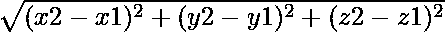

# 计算三维两点间距离的程序

> 原文:[https://www . geeksforgeeks . org/计算三维两点间距离的程序/](https://www.geeksforgeeks.org/program-to-calculate-distance-between-two-points-in-3-d/)

给定三维空间中的两个坐标(x1，y1，z1)和(x2，y2，z2)。任务是找到它们之间的距离。
**例:**

```
Input: x1, y1, z1 = (2, -5, 7)
       x2, y2, z1 = (3, 4, 5)
Output: 9.2736184955

Input: x1, y1, z1 = (0, 0, 0)
       x2, y2, z1 = (1, 1, 1)
Output: 1.73205080757
```

**方法:**由毕达哥拉斯定理推导出三维空间(x1，y1，z1)和(x2，y2，z2)两点间距离的公式，即:
距离= 
以下是上述公式的实现:

## C++

```
// C++ program to find
// distance between
// two points in 3 D.
#include <bits/stdc++.h>
#include <iomanip>
#include <iostream>
#include <math.h>
using namespace std;

// function to print distance
void distance(float x1, float y1,
            float z1, float x2,
            float y2, float z2)
{
    float d = sqrt(pow(x2 - x1, 2) +
                pow(y2 - y1, 2) +
                pow(z2 - z1, 2) * 1.0);
    std::cout << std::fixed;
    std::cout << std::setprecision(2);
    cout << " Distance is " << d;
    return;
}

// Driver Code
int main()
{
    float x1 = 2;
    float y1 = -5;
    float z1 = 7;
    float x2 = 3;
    float y2 = 4;
    float z2 = 5;

    // function call for distance
    distance(x1, y1, z1,
            x2, y2, z2);
    return 0;
}

// This code is contributed
// by Amber_Saxena.
```

## C

```
// C program to find
// distance between
// two points in 3 D.
#include <stdio.h>
#include<math.h>

// function to print distance
void distance(float x1, float y1,
              float z1, float x2,
              float y2, float z2)
{
    float d = sqrt(pow(x2 - x1, 2) +
                   pow(y2 - y1, 2) +
                   pow(z2 - z1, 2) * 1.0);
    printf("Distance is %f", d);
    return;
}

// Driver Code
int main()
{
    float x1 = 2;
    float y1 = -5;
    float z1 = 7;
    float x2 = 3;
    float y2 = 4;
    float z2 = 5;

    // function call for distance
    distance(x1, y1, z1,   
             x2, y2, z2);
    return 0;
}

// This code is contributed
// by Amber_Saxena.
```

## Java 语言(一种计算机语言，尤用于创建网站)

```
// Java program to find
// distance between
// two points in 3 D.
import java .io.*;
import java.lang.Math;

class GFG
{

// Function for
// distance
static void distance(float x1, float y1,
                     float z1, float x2,
                     float y2, float z2)
{

    double d = Math.pow((Math.pow(x2 - x1, 2) +
                         Math.pow(y2 - y1, 2) +
                         Math.pow(z2 - z1, 2) *
                                    1.0), 0.5);
    System.out.println("Distance is "+ d);
    return;
}

// Driver code
public static void main(String[] args)
{
    float x1 = 2;
    float y1 = -5;
    float z1 = 7;
    float x2 = 3;
    float y2 = 4;
    float z2 = 5;

    // function call
    // for distance
    distance(x1, y1, z1,
             x2, y2, z2);
}
}

// This code is contributed
// by Amber_Saxena.
```

## 计算机编程语言

```
# Python program to find distance between
# two points in 3 D.

import math

# Function to find distance
def distance(x1, y1, z1, x2, y2, z2):

    d = math.sqrt(math.pow(x2 - x1, 2) +
                math.pow(y2 - y1, 2) +
                math.pow(z2 - z1, 2)* 1.0)
    print("Distance is ")
    print(d)

# Driver Code
x1 = 2
y1 = -5
z1 = 7
x2 = 3
y2 = 4
z2 = 5

# function call for distance
distance(x1, y1, z1, x2, y2, z2)   
```

## C#

```
// C# program to find
// distance between
// two points in 3 D.
using System;

class GFG
{

// Function for
// distance
static void distance(float x1, float y1,
                     float z1, float x2,
                     float y2, float z2)
{
    double d = Math.Pow((Math.Pow(x2 - x1, 2) +
                         Math.Pow(y2 - y1, 2) +
                         Math.Pow(z2 - z1, 2) *
                                   1.0), 0.5);
    Console.WriteLine("Distance is \n" + d);
    return;
}

// Driver code
public static void Main()
{
    float x1 = 2;
    float y1 = -5;
    float z1 = 7;
    float x2 = 3;
    float y2 = 4;
    float z2 = 5;

    // function call
    // for distance
    distance(x1, y1, z1,
             x2, y2, z2);
}
}

// This code is contributed
// by chandan_jnu.
```

## 服务器端编程语言（Professional Hypertext Preprocessor 的缩写）

```
<?php
// PHP program to find
// distance between
// two points in 3 D.

// function to print distance
function distance($x1, $y1, $z1,
                  $x2, $y2, $z2)
{
    $d = sqrt(pow($x2 - $x1, 2) +
              pow($y2 - $y1, 2) +
              pow($z2 - $z1, 2) * 1.0);
    echo "Distance is ". $d;
}

// Driver Code
$x1 = 2;
$y1 = -5;
$z1 = 7;
$x2 = 3;
$y2 = 4;
$z2 = 5;

// function call for distance
distance($x1, $y1, $z1,
         $x2, $y2, $z2);

// This code is contributed
// by Mahadev.
?>
```

## java 描述语言

```
<script>

// javascript program to find
// distance between
// two points in 3 D.   

// Function for distance
    function distance(x1 , y1 , z1 , x2 , y2 , z2) {

        var d = Math.pow((Math.pow(x2 - x1, 2) +
                Math.pow(y2 - y1, 2) +
                Math.pow(z2 - z1, 2) * 1.0), 0.5);
        document.write("Distance is " + d.toFixed(10));
        return;
    }

    // Driver code

        var x1 = 2;
        var y1 = -5;
        var z1 = 7;
        var x2 = 3;
        var y2 = 4;
        var z2 = 5;

        // function call
        // for distance
        distance(x1, y1, z1, x2, y2, z2);

// This code contributed by aashish1995

</script>
```

**Output:** 

```
Distance is 
9.2736184955
```