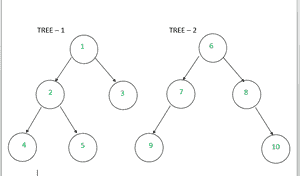

# 计算两个给定节点的祖先点积的程序

> 原文:[https://www . geesforgeks . org/program-to-compute-dot-product-of-prevents-of-2-给定节点/](https://www.geeksforgeeks.org/program-to-calculate-dot-product-of-ancestors-of-2-given-nodes/)

给定两个[二叉树](https://www.geeksforgeeks.org/binary-tree-data-structure/)和两个整数键 **K1、K2** ，其中两个 **K1、K2** 可以出现在同一棵树或不同的树上。设 **F1，F2** 为[向量](https://www.geeksforgeeks.org/vector-in-cpp-stl/)表示顶点从**根**到 **K1** 和**K2**T16】(K1&K2 除外)的顺序，任务是[求这两个向量的点积](https://www.geeksforgeeks.org/program-dot-product-cross-product-two-vector/)。

**注意:**树中没有重复，两棵树互不相同。如果键出现在不同的深度，那么只考虑节点，直到相同的深度级别。

**示例:**

> **输入:** K1 = 4，K2 = 5
> 
> 
> 
> **输出** : 5
> **解释** :
> 从 2 棵树上可以清楚的看到，两把钥匙都出现在第一棵树上。从根到 K1 或 F1 向量的顶点序列是，F1 = (1，2)和 F2 = (1，2)。
> 现在的点积即 F1。F2 = 1×1 + 2×2 = 5。
> 
> **输入:** K1 = 5，K2 = 7
> **输出** : 6
> **解释** :
> F1 = (1，2)和 F2 = (6)
> 由于只需要考虑节点直到相同深度级别，点积为 F1。F2 = 1×6 = 6。

**方法:**思路是找到给定键值所在的树，然后计算祖先的点积。按照以下步骤解决问题:

*   初始化两个不同的辅助向量。
*   将两个键的祖先存储在向量中。
*   [遍历向量](https://www.geeksforgeeks.org/how-to-iterate-through-a-vector-without-using-iterators-in-c/)直到到达任意一个向量的末尾，并继续计算向量对应元素的点积。
*   打印最终的点积作为答案。

## C++

```
// C++ program for the above approach

#include <bits/stdc++.h>
using namespace std;

// Structure of the tree node
struct node {
    int data;
    struct node* left;
    struct node* right;
};

// Utility function to create a new node
struct node* newNode(int data)
{
    struct node* node
        = (struct node*)malloc(
            sizeof(struct node));
    node->data = data;
    node->left = NULL;
    node->right = NULL;
    return (node);
}

// Function to store the ancestors
// of the given key in the vector
bool printAncestors(struct node* root,
                    int K, vector<int>& v)
{
    // Base case
    if (root == NULL)
        return false;
    if (root->data == K)
        return true;

    // If target is present in either left
    // or right subtree of this node,
    // then print this node
    if (printAncestors(root->left, K, v)
        || printAncestors(root->right, K, v)) {
        v.push_back(root->data);
        return true;
    }

    return false;
}

// Function to store the dot product of the vectors
int dotProductOfVectors(vector<int>& v1, vector<int>& v2)
{
    // Traverse the vectors from the end because the
    // ancestors starts from the root of the
    // tree and root of the tree is present at the end
    int size1 = v1.size();
    int size2 = v2.size();
    int i = size1 - 1;
    int j = size2 - 1;
    int answer = 0;

    // Traverse the vectors side by side and storing answer
    while (i >= 0 && j >= 0) {

        answer = answer + (v1[i] * v2[j]);
        i--;
        j--;
    }

    // Return dot product
    return answer;
}

// Utility function to calculate the dot product of
// the ancestors of the keys
int dotProductOfAncestorsUtil(struct node* root1,
                              struct node* root2, int K1,
                              int K2)
{
    // To store the ancestors of each key
    vector<int> F1, F2;

    // If both keys are present in the first tree
    if (printAncestors(root1, K1, F1)
        && printAncestors(root1, K2, F2)) {
        return dotProductOfVectors(F1, F2);
    }

    // If both keys are present in the second tree
    else if (printAncestors(root2, K1, F1)
             && printAncestors(root2, K2, F2)) {
        return dotProductOfVectors(F1, F2);
    }

    // If first key exists in first tree and
    // the second key exists in second tree
    else if (printAncestors(root1, K1, F1)
             && printAncestors(root2, K2, F2)) {
        return dotProductOfVectors(F1, F2);
    }

    // Otherwise, first key exists in second tree and
    // the second key exists in first tree
    else {
        if (printAncestors(root2, K1, F1)
            && printAncestors(root1, K2, F2)) {
            return dotProductOfVectors(F1, F2);
        }
    }

    // If either of the nodes doesn't exist
    return 0;
}

void dotProductOfAncestors(struct node* root1,
                           struct node* root2, int K1,
                           int K2)
{
    // To store dot product of two vectors
    int dotProduct
        = dotProductOfAncestorsUtil(root1, root2, K1, K2);

    // Print dot product as the answer
    cout << dotProduct;
}

// Driver Code
int main()
{
    /* Construct the following binary trees
              1                         6
            /   \                     /   \
          2      3                  7      8
        /  \                       /       \
      4     5                     9        10
    */
    // Given Tree 1
    struct node* root1 = newNode(1);
    root1->left = newNode(2);
    root1->right = newNode(3);
    root1->left->left = newNode(4);
    root1->left->right = newNode(5);

    // Given Tree 2
    struct node* root2 = newNode(6);
    root2->left = newNode(7);
    root2->right = newNode(8);
    root2->left->left = newNode(9);
    root2->right->right = newNode(10);

    // Given keys
    int K1 = 4, K2 = 5;

    // Function Call
    dotProductOfAncestors(root1, root2, K1, K2);
}
```

## Java 语言(一种计算机语言，尤用于创建网站)

```
// Java program for the above approach
import java.io.*;
import java.util.*;
class GFG
{

  // Structure of the tree node
  static class node
  {
    int data;
    node left, right;
  }

  // Utility function to create a new node
  static node newNode(int data)
  {
    node node = new node();
    node.data = data;
    node.left = null;
    node.right = null;
    return (node);
  }

  // Function to store the ancestors
  // of the given key in the vector
  static boolean printAncestors(node root, int K,
                                Vector<Integer> v)
  {
    // Base case
    if (root == null)
      return false;
    if (root.data == K)
      return true;

    // If target is present in either left
    // or right subtree of this node,
    // then print this node
    if (printAncestors(root.left, K, v)
        || printAncestors(root.right, K, v))
    {
      v.add(root.data);
      return true;
    }

    return false;
  }

  // Function to store the dot product of the vectors
  static int dotProductOfVectors(Vector<Integer> v1,
                                 Vector<Integer> v2)
  {

    // Traverse the vectors from the end because the
    // ancestors starts from the root of the
    // tree and root of the tree is present at the end
    int size1 = v1.size();
    int size2 = v2.size();
    int i = size1 - 1;
    int j = size2 - 1;
    int answer = 0;

    // Traverse the vectors side by side and storing
    // answer
    while (i >= 0 && j >= 0)
    {
      answer = answer + (v1.get(i) * v2.get(j));
      i--;
      j--;
    }

    // Return dot product
    return answer;
  }

  // Utility function to calculate the dot product of
  // the ancestors of the keys
  static int dotProductOfAncestorsUtil(node root1,
                                       node root2, int K1,
                                       int K2)
  {
    // To store the ancestors of each key
    Vector<Integer> F1 = new Vector<Integer>();
    Vector<Integer> F2 = new Vector<Integer>();

    // If both keys are present in the first tree
    if (printAncestors(root1, K1, F1)
        && printAncestors(root1, K2, F2)) {
      return dotProductOfVectors(F1, F2);
    }

    // If both keys are present in the second tree
    else if (printAncestors(root2, K1, F1)
             && printAncestors(root2, K2, F2)) {
      return dotProductOfVectors(F1, F2);
    }

    // If first key exists in first tree and
    // the second key exists in second tree
    else if (printAncestors(root1, K1, F1)
             && printAncestors(root2, K2, F2)) {
      return dotProductOfVectors(F1, F2);
    }

    // Otherwise, first key exists in second tree and
    // the second key exists in first tree
    else {
      if (printAncestors(root2, K1, F1)
          && printAncestors(root1, K2, F2)) {
        return dotProductOfVectors(F1, F2);
      }
    }

    // If either of the nodes doesn't exist
    return 0;
  }

  static void dotProductOfAncestors(node root1,
                                    node root2, int K1,
                                    int K2)
  {
    // To store dot product of two vectors
    int dotProduct = dotProductOfAncestorsUtil(
      root1, root2, K1, K2);

    // Print dot product as the answer
    System.out.println(dotProduct);
  }

  // Driver Code
  public static void main(String[] args)
  {
    /* Construct the following binary trees
              1                         6
            /   \                     /   \
          2      3                  7      8
        /  \                       /       \
      4     5                     9        10
    */
    // Given Tree 1
    node root1 = newNode(1);
    root1.left = newNode(2);
    root1.right = newNode(3);
    root1.left.left = newNode(4);
    root1.left.right = newNode(5);

    // Given Tree 2
    node root2 = newNode(6);
    root2.left = newNode(7);
    root2.right = newNode(8);
    root2.left.left = newNode(9);
    root2.right.right = newNode(10);

    // Given keys
    int K1 = 4, K2 = 5;

    // Function Call
    dotProductOfAncestors(root1, root2, K1, K2);
  }
}

// This code is contributed by Dharanendra L V
```

## 蟒蛇 3

```
# Python3 program for the above approach

# Structure of the tree node
class Node:

    def __init__(self, x):

        self.data = x
        self.left = None
        self.right = None

# Function to store the ancestors
# of the given key in the vector
def printAncestors(root, K, v):

    # Global v
    if (root == None):
        return False
    if (root.data == K):
        return True

    # If target is present in either left
    # or right subtree of this node,
    # then prthis node
    if (printAncestors(root.left, K, v) or
        printAncestors(root.right, K, v)):
        v.append(root.data)
        return True

    return False

# Function to store the dot product
# of the vectors
def dotProductOfVectors(v1, v2):

    # Global v1,v2
    # Ancestors starts from the root of
    # the tree and root of the tree is
    # present at the end
    size1 = len(v1)
    size2 = len(v2)
    i = size1 - 1
    j = size2 - 1
    answer = 0

    # Traverse the vectors side by
    # side and storing answer
    while (i >= 0 and j >= 0):
        answer = answer + (v1[i] * v2[j])
        i -= 1
        j -= 1

    # Return dot product
    return answer

# Utility function to calculate the dot product
# of the ancestors of the keys
def dotProductOfAncestorsUtil(root1, root2,
                              K1, K2):

    # To store the ancestors of each key
    F1, F2 = [], []

    # If both keys are present in the first tree
    if (printAncestors(root1, K1, F1) and
        printAncestors(root1, K2, F2)):
        return dotProductOfVectors(F1, F2)

    # If both keys are present in the second tree
    elif (printAncestors(root2, K1, F1) and
          printAncestors(root2, K2, F2)):
        return dotProductOfVectors(F1, F2)

    # If first key exists in first tree and
    # the second key exists in second tree
    elif (printAncestors(root1, K1, F1) and
          printAncestors(root2, K2, F2)):
        return dotProductOfVectors(F1, F2)

    # Otherwise, first key exists in second tree
    # and the second key exists in first tree
    else:
        if (printAncestors(root2, K1, F1) and
            printAncestors(root1, K2, F2)):
            return dotProductOfVectors(F1, F2)

    # If either of the nodes doesn't exist
    return 0

def dotProductOfAncestors(root1, root2, K1, K2):

    # To store dot product of two vectors
    dotProduct = dotProductOfAncestorsUtil(
        root1, root2, K1, K2)

    # Print dot product as the answer
    print (dotProduct)

# Driver Code
if __name__ == '__main__':

    v, v1, v2 = [], [], []

    # Construct the following binary trees
    #           1                         6
    #         /   \                     /   \
    #       2      3                  7      8
    #     /  \                       /       \
    #   4     5                     9        10
    # Given Tree 1
    root1 = Node(1)
    root1.left = Node(2)
    root1.right = Node(3)
    root1.left.left = Node(4)
    root1.left.right = Node(5)

    # Given Tree 2
    root2 = Node(6)
    root2.left = Node(7)
    root2.right = Node(8)
    root2.left.left = Node(9)
    root2.right.right = Node(10)

    # Given keys
    K1, K2 = 4, 5

    # Function Call
    dotProductOfAncestors(root1, root2, K1, K2)

# This code is contributed by mohit kumar 29
```

## C#

```
// C# program for the above approach
using System;
using System.Collections.Generic;
class GFG {

    // Structure of the tree node
  public class node
  {
    public int data;
    public node left, right;
  }

  // Utility function to create a new node
  public static node newNode(int data)
  {
    node Node = new node();
    Node.data = data;
    Node.left = null;
    Node.right = null;
    return (Node);
  }

  // Function to store the ancestors
  // of the given key in the vector
  static bool printAncestors(node root, int K, List<int> v)
  {
    // Base case
    if (root == null)
      return false;
    if (root.data == K)
      return true;

    // If target is present in either left
    // or right subtree of this node,
    // then print this node
    if (printAncestors(root.left, K, v)
        || printAncestors(root.right, K, v))
    {
      v.Add(root.data);
      return true;
    }

    return false;
  }

  // Function to store the dot product of the vectors
  static int dotProductOfVectors(List<int> v1, List<int> v2)
  {

    // Traverse the vectors from the end because the
    // ancestors starts from the root of the
    // tree and root of the tree is present at the end
    int size1 = v1.Count;
    int size2 = v2.Count;
    int i = size1 - 1;
    int j = size2 - 1;
    int answer = 0;

    // Traverse the vectors side by side and storing
    // answer
    while (i >= 0 && j >= 0)
    {
      answer = answer + (v1[i] * v2[j]);
      i--;
      j--;
    }

    // Return dot product
    return answer;
  }

  // Utility function to calculate the dot product of
  // the ancestors of the keys
  static int dotProductOfAncestorsUtil(node root1,
                                       node root2, int K1,
                                       int K2)
  {

    // To store the ancestors of each key
    List<int> F1 = new List<int>();
    List<int> F2 = new List<int>();

    // If both keys are present in the first tree
    if (printAncestors(root1, K1, F1)
        && printAncestors(root1, K2, F2)) {
      return dotProductOfVectors(F1, F2);
    }

    // If both keys are present in the second tree
    else if (printAncestors(root2, K1, F1)
             && printAncestors(root2, K2, F2)) {
      return dotProductOfVectors(F1, F2);
    }

    // If first key exists in first tree and
    // the second key exists in second tree
    else if (printAncestors(root1, K1, F1)
             && printAncestors(root2, K2, F2)) {
      return dotProductOfVectors(F1, F2);
    }

    // Otherwise, first key exists in second tree and
    // the second key exists in first tree
    else {
      if (printAncestors(root2, K1, F1)
          && printAncestors(root1, K2, F2)) {
        return dotProductOfVectors(F1, F2);
      }
    }

    // If either of the nodes doesn't exist
    return 0;
  }

  static void dotProductOfAncestors(node root1,
                                    node root2, int K1,
                                    int K2)
  {
    // To store dot product of two vectors
    int dotProduct = dotProductOfAncestorsUtil(
      root1, root2, K1, K2);

    // Print dot product as the answer
    Console.WriteLine(dotProduct);
  }

  static void Main() {
    /* Construct the following binary trees
              1                         6
            /   \                     /   \
          2      3                  7      8
        /  \                       /       \
      4     5                     9        10
    */
    // Given Tree 1
    node root1 = newNode(1);
    root1.left = newNode(2);
    root1.right = newNode(3);
    root1.left.left = newNode(4);
    root1.left.right = newNode(5);

    // Given Tree 2
    node root2 = newNode(6);
    root2.left = newNode(7);
    root2.right = newNode(8);
    root2.left.left = newNode(9);
    root2.right.right = newNode(10);

    // Given keys
    int K1 = 4, K2 = 5;

    // Function Call
    dotProductOfAncestors(root1, root2, K1, K2);
  }
}

// This code is contributed by divyeshrabadiya07.
```

## java 描述语言

```
<script>

  // JavaScript program for the above approach

  // Structure of the tree node
  class node
  {
      constructor(data) {
         this.left = null;
         this.right = null;
         this.data = data;
      }
  }

  // Utility function to create a new node
  function newNode(data)
  {
      let Node = new node(data);
      return (Node);
  }

  // Function to store the ancestors
  // of the given key in the vector
  function printAncestors(root, K, v)
  {
    // Base case
    if (root == null)
      return false;
    if (root.data == K)
      return true;

    // If target is present in either left
    // or right subtree of this node,
    // then print this node
    if (printAncestors(root.left, K, v)
        || printAncestors(root.right, K, v))
    {
      v.push(root.data);
      return true;
    }

    return false;
  }

  // Function to store the dot product of the vectors
  function dotProductOfVectors(v1, v2)
  {

    // Traverse the vectors from the end because the
    // ancestors starts from the root of the
    // tree and root of the tree is present at the end
    let size1 = v1.length;
    let size2 = v2.length;
    let i = size1 - 1;
    let j = size2 - 1;
    let answer = 0;

    // Traverse the vectors side by side and storing
    // answer
    while (i >= 0 && j >= 0)
    {
      answer = answer + (v1[i] * v2[j]);
      i--;
      j--;
    }

    // Return dot product
    return answer;
  }

  // Utility function to calculate the dot product of
  // the ancestors of the keys
  function dotProductOfAncestorsUtil(root1, root2, K1, K2)
  {

    // To store the ancestors of each key
    let F1 = [];
    let F2 = [];

    // If both keys are present in the first tree
    if (printAncestors(root1, K1, F1)
        && printAncestors(root1, K2, F2)) {
      return dotProductOfVectors(F1, F2);
    }

    // If both keys are present in the second tree
    else if (printAncestors(root2, K1, F1)
             && printAncestors(root2, K2, F2)) {
      return dotProductOfVectors(F1, F2);
    }

    // If first key exists in first tree and
    // the second key exists in second tree
    else if (printAncestors(root1, K1, F1)
             && printAncestors(root2, K2, F2)) {
      return dotProductOfVectors(F1, F2);
    }

    // Otherwise, first key exists in second tree and
    // the second key exists in first tree
    else {
      if (printAncestors(root2, K1, F1)
          && printAncestors(root1, K2, F2)) {
        return dotProductOfVectors(F1, F2);
      }
    }

    // If either of the nodes doesn't exist
    return 0;
  }

  function dotProductOfAncestors(root1, root2, K1, K2)
  {
    // To store dot product of two vectors
    let dotProduct = dotProductOfAncestorsUtil(
      root1, root2, K1, K2);

    // Print dot product as the answer
    document.write(dotProduct + "</br>");
  }

  /* Construct the following binary trees
              1                         6
            /   \                     /   \
          2      3                  7      8
        /  \                       /       \
      4     5                     9        10
    */
    // Given Tree 1
    let root1 = newNode(1);
    root1.left = newNode(2);
    root1.right = newNode(3);
    root1.left.left = newNode(4);
    root1.left.right = newNode(5);

    // Given Tree 2
    let root2 = newNode(6);
    root2.left = newNode(7);
    root2.right = newNode(8);
    root2.left.left = newNode(9);
    root2.right.right = newNode(10);

    // Given keys
    let K1 = 4, K2 = 5;

    // Function Call
    dotProductOfAncestors(root1, root2, K1, K2);

</script>
```

**Output:** 

```
5
```

***时间复杂度:** O(N)其中 N 是树中的节点数。*
***辅助空间:** O(N)*