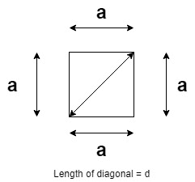
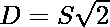

# 计算正方形对角线长度的程序

> 原文:[https://www . geesforgeks . org/计算正方形对角线长度的程序/](https://www.geeksforgeeks.org/program-to-calculate-length-of-diagonal-of-a-square/)

给定一个正整数 **S** ，任务是找到一个边长为**S**T5 的[正方形的对角线长度。](https://www.geeksforgeeks.org/program-area-square/)

**示例:**

> **输入:** S = 10
> **输出:** 14.1421
> **说明:**边长为 10 的正方形对角线长度为 14.1421
> 
> **输入:**S = 24
> T3】输出: 33.9411

**方法:**给定的问题可以根据正方形边长和正方形对角线长度之间的数学关系来求解，如下图所示:

> [](https://media.geeksforgeeks.org/wp-content/uploads/20210206151007/Square.jpg)
> 
> 从上图可以看到，对角线和正方形的两边形成了一个直角三角形。因此，应用[勾股定理](https://en.wikipedia.org/wiki/Pythagorean_theorem) :
> **(斜边) <sup>2</sup> =(底) <sup>2</sup> +(垂直) <sup>2</sup>** ，其中 D 和 S 为对角线和正方形的长度。
> 
> 因此，
> =>
> =>
> =>

因此，简单地使用上面导出的关系计算对角线的长度。

下面是上述方法的实现:

## C++

```
// C++ program for the above approach
#include <bits/stdc++.h>
using namespace std;

// Function to find the length of the
// diagonal of a square of a given side
double findDiagonal(double s)
{
    return sqrt(2) * s;
}

// Driver Code
int main()
{
    double S = 10;
    cout << findDiagonal(S);

    return 0;
}
```

## Java 语言(一种计算机语言，尤用于创建网站)

```
// Java program for the above approach
import java.util.*;

class GFG{

// Function to find the length of the
// diagonal of a square of a given side
static double findDiagonal(double s)
{
    return (double)Math.sqrt(2) * s;
}

// Driver Code
public static void main(String[] args)
{
    double S = 10;

    System.out.print(findDiagonal(S));
}
}

// This code is contributed by splevel62
```

## 蟒蛇 3

```
# Python3 program for the above approach
import math

# Function to find the length of the
# diagonal of a square of a given side
def findDiagonal(s):

    return math.sqrt(2) * s

# Driver Code
if __name__ == "__main__":

    S = 10

    print(findDiagonal(S))

# This code is contributed by chitranayal
```

## C#

```
// C# program for the above approach
using System;
public class GFG
{

// Function to find the length of the
// diagonal of a square of a given side
static double findDiagonal(double s)
{
    return (double)Math.Sqrt(2) * s;
}

// Driver Code
public static void Main(String[] args)
{
    double S = 10;

    Console.Write(findDiagonal(S));
}
}

// This code is contributed by 29AjayKumar
```

## java 描述语言

```
<script>

// JavaScript program for the above approach

// Function to find the length of the
// diagonal of a square of a given side
function findDiagonal(s)
{
    return Math.sqrt(2) * s;
}

// Driver Code
var S = 10;

document.write(findDiagonal(S).toFixed(6));

// This code contributed by shikhasingrajput

</script>
```

**Output:** 

```
14.1421
```

***时间复杂度:**O(1)*
T5**辅助空间:** O(1)