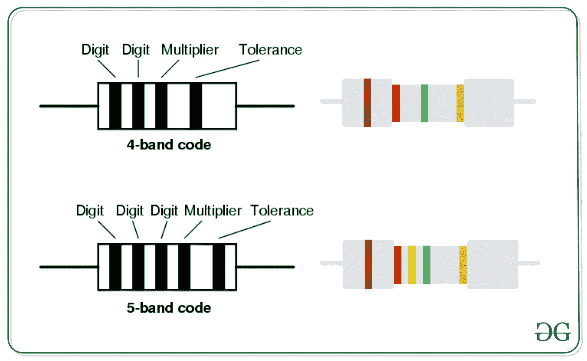

# 使用电路中给定的颜色代码计算电阻的程序

> 原文:[https://www . geesforgeks . org/利用电路中给定颜色代码计算电阻的程序/](https://www.geeksforgeeks.org/program-to-calculate-resistance-using-given-color-code-in-circuits/)

有许多不同类型的**电阻器**可用于电气和电子电路。电阻值、容差和额定功率通常以色带的形式印刷在电阻体上。任务是找到 **4 带电阻**和 **5 带电阻**的电阻。
[](https://media.geeksforgeeks.org/wp-content/uploads/20200602172903/abckl.jpg)

### 计算 4 波段电阻的程序

给定四个字符串 **A** 、 **B** 、 **C** 和 **D** ，表示 4 波段电阻的颜色代码。任务是使用给定的颜色代码找到电阻、公差和额定功率。

**示例:**

> **输入:** A =“黑色”，B =“棕色”，C =“红色”，D =“绿色”
> **输出:**电阻= 01×100 欧姆+/- 0.5 %
> 
> **输入:** A =“红色”，B =“橙色”，C =“黄色”，D =“绿色”
> **输出:**电阻= 23×10k 欧姆+/- 0.5 %

**方法:**想法是将数字和多路复用器存储在[散列图](https://www.geeksforgeeks.org/java-util-hashmap-in-java-with-examples/)中，然后可以计算电阻器的电阻。

下面是上述方法的实现:

## 蟒蛇 3

```
# Python implementation to find the 
# resistance of the resistor with
# the given color codes

# Function to find the resistance 
# using color codes
def findResistance(a, b, c, d):

    # Hash-map to store the values 
    # of the color-digits
    color_digit = {'black': '0',
                   'brown': '1', 
                   'red': '2',
                   'orange': '3', 
                   'yellow': '4',
                   'green' : '5', 
                   'blue' : '6',
                   'violet' : '7', 
                   'grey' : '8',
                   'white': '9'}

    multiplier = {'black': '1',
                  'brown': '10', 
                  'red': '100', 
                  'orange': '1k', 
                  'yellow': '10k', 
                  'green' : '100k', 
                  'blue' : '1M', 
                  'violet' : '10M', 
                  'grey' : '100M', 
                  'white': '1G'}

    tolerance = {'brown': '+/- 1 %', 
                  'red' : '+/- 2 %', 
                 'green': "+/- 0.5 %", 
                  'blue': '+/- 0.25 %', 
                 'violet' : '+/- 0.1 %', 
                  'gold': '+/- 5 %', 
                 'silver' : '+/- 10 %', 
                  'none': '+/-20 %'}

    if a in color_digit
       and b in color_digit\
       and c in multiplier 
       and d in tolerance:
           xx = color_digit.get(a)
           yy = color_digit.get(b)
           zz = multiplier.get(c)
           aa = tolerance.get(d)
           print("Resistance = "+xx + yy+\
                 " x "+zz+" ohms "+aa)
    else:
        print("Invalid Colors")

# Driver Code
if __name__ == "__main__":
    a = "black"
    b = "brown"
    c = "red"
    d = "green"

    # Function Call
    findResistance(a, b, c, d)
```

**Output:**

```
Resistance = 01 x 100 ohms +/- 0.5 %

```

### 计算 5 波段电阻的程序

给定五个字符串 **A** 、 **B** 、 **C** 、 **D** 和 **E** ，表示 5 波段电阻的色码。任务是使用给定的颜色代码找到电阻、公差和额定功率。

**示例:**

> **输入:** A =“黑色”，B =“棕色”，C =“红色”，D =“绿色”，E =“银色”
> T3】输出:电阻= 012 x 100k 欧姆+/- 10 %
> 
> **输入:** A =“红”，B =“橙”，C =“黄”，D =“绿”，E =“金”
> T3】输出:电阻= 234×100k 欧姆+/- 5 %

**方法:**想法是将数字和多路复用器存储在[散列图](https://www.geeksforgeeks.org/java-util-hashmap-in-java-with-examples/)中，然后可以计算电阻器的电阻。

下面是上述方法的实现:

## 蟒蛇 3

```
# Python implementation to find the 
# resistance of the resistor with
# the given color codes

# Function to find the resistance 
# using color codes
def findResistance(a, b, c, d, e):

    # Hash-map to store the values 
    # of the color-digits
    color_digit = {'black': '0',
                   'brown': '1', 
                   'red': '2',
                   'orange': '3', 
                   'yellow': '4',
                   'green' : '5', 
                   'blue' : '6',
                   'violet' : '7', 
                   'grey' : '8',
                   'white': '9'}

    multiplier = {'black': '1',
                  'brown': '10', 
                  'red': '100', 
                  'orange': '1k', 
                  'yellow': '10k', 
                  'green' : '100k', 
                  'blue' : '1M', 
                  'violet' : '10M', 
                  'grey' : '100M', 
                  'white': '1G'}

    tolerance = {'brown': '+/- 1 %', 
                  'red' : '+/- 2 %', 
                 'green': "+/- 0.5 %", 
                  'blue': '+/- 0.25 %', 
                 'violet' : '+/- 0.1 %', 
                  'gold': '+/- 5 %', 
                 'silver' : '+/- 10 %', 
                  'none': '+/-20 %'}

    if a in color_digit
       and b in color_digit\
       and c in color_digit
       and d in multiplier\
       and e in  tolerance:
           xx = color_digit.get(a)
           yy = color_digit.get(b)
           zz = color_digit.get(c)
           aa = multiplier.get(d)
           bb = tolerance.get(e)
           print("Resistance = "+xx + yy\
               + zz+" x "+aa+" ohms "+bb)
    else:
        print("Invalid Colors")

# Driver Code
if __name__ == "__main__":
    a = "red"
    b = "orange"
    c = "yellow"
    d = "green"
    e = "gold"

    # Function Call
    findResistance(a, b, c, d, e)
```

**Output:**

```
Resistance = 234 x 100k ohms +/- 5 %

```