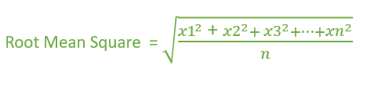

# 计算均方根的程序

> 原文:[https://www . geesforgeks . org/计算均方根程序/](https://www.geeksforgeeks.org/program-to-calculate-root-mean-square/)

给定一组 N 个数字。任务是计算给定数字的[均方根(RMS)](https://en.wikipedia.org/wiki/Root_mean_square) 。
**示例** :

```
Input: arr[] = {1, 2, 3, 4, 5}
Output: 3.31662

Input: arr[] = {10, 4, 6, 8}
Output: 7.34847
```

**方法:**N 个数 x1，x2，x3，…的均方根值..xn 可以给出为，



RMS 方法首先计算每个数字的平方，然后计算平均值，最后计算平均值的平方根。
下面是求 N 个数 RMS 的程序:

## C++

```
// CPP program to calculate Root Mean Square
#include <bits/stdc++.h>
using namespace std;

// Function that Calculate Root Mean Square
float rmsValue(int arr[], int n)
{
    int square = 0;
    float mean = 0.0, root = 0.0;

    // Calculate square.
    for (int i = 0; i < n; i++) {
        square += pow(arr[i], 2);
    }

    // Calculate Mean.
    mean = (square / (float)(n));

    // Calculate Root.
    root = sqrt(mean);

    return root;
}

// Driver code
int main()
{
    int arr[] = { 10, 4, 6, 8 };
    int n = sizeof(arr) / sizeof(arr[0]);

    cout << rmsValue(arr, n);

    return 0;
}
```

## Java 语言(一种计算机语言，尤用于创建网站)

```
// Java program to calculate
// Root Mean Square

class GFG
{

// Function that Calculate Root
// Mean Square
static float rmsValue(int arr[], int n)
{
    int square = 0;
    float mean = 0;
    float root = 0;

    // Calculate square.
    for(int i = 0; i < n; i++)
    {
        square += Math.pow(arr[i], 2);
    }

    // Calculate Mean.
    mean = (square / (float) (n));

    // Calculate Root.
    root = (float)Math.sqrt(mean);

    return root;
}

// Driver Code
public static void main(String args[])
{
    int arr[] = { 10, 4, 6, 8};

    int n = arr.length;

    System.out.println(rmsValue(arr, n));
}
}

// This code is contributed by ANKITRAI1
```

## 蟒蛇 3

```
#Python3 program to calculate Root Mean Square

import math
#Function that Calculate Root Mean Square
def rmsValue(arr, n):
    square = 0
    mean = 0.0
    root = 0.0

    #Calculate square
    for i in range(0,n):
        square += (arr[i]**2)

    #Calculate Mean
    mean = (square / (float)(n))

    #Calculate Root
    root = math.sqrt(mean)

    return root

#Driver code
if __name__=='__main__':
    arr = [10, 4, 6, 8]
    n = len(arr)
    print(rmsValue(arr, n))

#This code is contributed by Shashank_Sharma
```

## C#

```
// C# program to calculate
// Root Mean Square
using System;
class GFG
{

// Function that Calculate
// Root Mean Square
static float rmsValue(int[] arr, int n)
{
    int square = 0;
    float mean = 0;
    float root = 0;

    // Calculate square.
    for(int i = 0; i < n; i++)
    {
        square += (int)Math.Pow(arr[i], 2);
    }

    // Calculate Mean.
    mean = (square / (float) (n));

    // Calculate Root.
    root = (float)Math.Sqrt(mean);

    return root;
}

// Driver Code
public static void Main()
{
    int[] arr = {10, 4, 6, 8};

    int n = arr.Length;

    Console.Write(rmsValue(arr, n));
}
}

// This code is contributed
// by ChitraNayal
```

## 服务器端编程语言（Professional Hypertext Preprocessor 的缩写）

```
<?php
// PHP program to calculate Root
// Mean Square

// Function that Calculate Root
// Mean Square
function rmsValue($arr, $n)
{
    $square = 0;
    $mean = 0.0;
    $root = 0.0;

    // Calculate square.
    for ($i = 0; $i < $n; $i++)
    {
        $square += pow($arr[$i], 2);
    }

    // Calculate Mean.
    $mean = ($square / (float)($n));

    // Calculate Root.
    $root = sqrt($mean);

    return $root;
}

// Driver code
$arr = array( 10, 4, 6, 8 );
$n = sizeof($arr);

echo rmsValue($arr, $n);

// This code is contributed
// by jit_t
?>
```

## java 描述语言

```
<script>

// javascript program to calculate
// Root Mean Square

    // Function that Calculate Root
    // Mean Square
    function rmsValue(arr , n) {
        var square = 0;
        var mean = 0;
        var root = 0;

        // Calculate square.
        for (i = 0; i < n; i++) {
            square += Math.pow(arr[i], 2);
        }

        // Calculate Mean.
        mean = (square /  (n));

        // Calculate Root.
        root =  Math.sqrt(mean);

        return root;
    }

    // Driver Code

        var arr = [ 10, 4, 6, 8 ];

        var n = arr.length;

        document.write(rmsValue(arr, n).toFixed(5));

// This code contributed by aashish1995

</script>
```

**Output:** 

```
7.34847
```