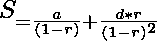

# 计算无穷算术-几何序列之和的程序

> 原文:[https://www . geesforgeks . org/计算无穷算术几何序列和的程序/](https://www.geeksforgeeks.org/program-to-calculate-sum-of-an-infinite-arithmetic-geometric-sequence/)

给定三个整数 **A** 、 **D** 和 **R** 代表无穷[等差-几何级数](https://www.geeksforgeeks.org/sum-arithmetic-geometric-sequence/)的第一项、公差和公比，任务是求给定无穷[等差-几何级数](https://www.geeksforgeeks.org/sum-arithmetic-geometric-sequence/)的和，使得 **R** 的绝对值始终小于 **1** 。

**示例:**

> **输入:** A = 0，D = 1，R = 0.5
> T3】输出: 0.666667
> 
> **输入:** A = 2，D = 3，R =-0.3
> T3】输出: 0.549451

**方法:**算术-几何序列是[几何级数](https://www.geeksforgeeks.org/geometric-progression/)系列与[算术级数](https://www.geeksforgeeks.org/arithmetic-progression/)系列的相应项的逐项相乘的结果。该系列由下式给出:

> a、(a + d) * r、(a + 2 * d) * r <sup>2</sup> 、(a + 3 * d) * r <sup>3</sup> 、…、[a+(n1)* d]* r<sup>(n1)</sup>。

[算术几何级数](https://www.geeksforgeeks.org/sum-arithmetic-geometric-sequence/)的第 **N <sup>个</sup>项**由下式给出:

> => ![T_N = [a + (N - 1) * d] * (b * r^{n - 1})](img/c6abed475c58a4577cc169a39b21164c.png "Rendered by QuickLaTeX.com")

[算术-几何级数](https://www.geeksforgeeks.org/sum-arithmetic-geometric-sequence/)的和由下式给出:

> => 
> 
> 其中，|r| < 1。

下面是上述方法的实现:

## C++

```
// C++ program for the above approach

#include <bits/stdc++.h>
using namespace std;

// Function to find the sum of the
// infinite AGP
void sumOfInfiniteAGP(double a, double d,
                      double r)
{
    // Stores the sum of infinite AGP
    double ans = a / (1 - r)
                 + (d * r) / (1 - r * r);

    // Print the required sum
    cout << ans;
}

// Driver Code
int main()
{
    double a = 0, d = 1, r = 0.5;
    sumOfInfiniteAGP(a, d, r);

    return 0;
}
```

## Java 语言(一种计算机语言，尤用于创建网站)

```
// Java program for the above approach
class GFG{

// Function to find the sum of the
// infinite AGP
static void sumOfInfiniteAGP(double a, double d,
                             double r)
{

    // Stores the sum of infinite AGP
    double ans = a / (1 - r) +
           (d * r) / (1 - r * r);

    // Print the required sum
    System.out.print(ans);
}

// Driver Code
public static void main(String[] args)
{
    double a = 0, d = 1, r = 0.5;

    sumOfInfiniteAGP(a, d, r);
}
}

// This code is contributed by 29AjayKumar
```

## 蟒蛇 3

```
# Python3 program for the above approach

# Function to find the sum of the
# infinite AGP
def sumOfInfiniteAGP(a, d, r):

    # Stores the sum of infinite AGP
    ans = a / (1 - r) + (d * r) / (1 - r * r);

    # Print the required sum
    print (round(ans,6))

# Driver Code
if __name__ == '__main__':
    a, d, r = 0, 1, 0.5
    sumOfInfiniteAGP(a, d, r)

# This code is contributed by mohit kumar 29.
```

## C#

```
// C# program for the above approach
using System;
class GFG
{

    // Function to find the sum of the
    // infinite AGP
    static void sumOfInfiniteAGP(double a, double d,
                                 double r)
    {

        // Stores the sum of infinite AGP
        double ans = a / (1 - r) + (d * r) / (1 - r * r);

        // Print the required sum
        Console.Write(ans);
    }

    // Driver Code
    public static void Main()
    {
        double a = 0, d = 1, r = 0.5;
        sumOfInfiniteAGP(a, d, r);
    }
}

// This code is contributed by ukasp.
```

## java 描述语言

```
<script>
        // Javascript program for the above approach

        // Function to find the sum of the
        // infinite AGP
        function sumOfInfiniteAGP(a, d, r) {

            // Stores the sum of infinite AGP
            let ans = a / (1 - r) +
                (d * r) / (1 - r * r);

            // Print the required sum
            document.write(ans)
        }

        // Driver Code

        let a = 0, d = 1, r = 0.5;

        sumOfInfiniteAGP(a, d, r);

        // This code is contributed by Hritik
    </script>
```

**Output**

```
0.666667
```

***时间复杂度:**O(1)*
T5**辅助空间:** O(1)