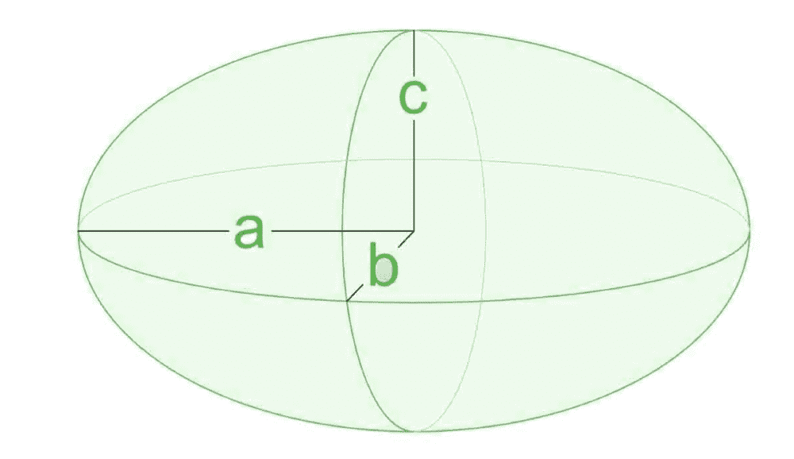

# 椭球表面积计算程序

> 原文:[https://www . geesforgeks . org/计算椭球表面积程序/](https://www.geeksforgeeks.org/program-to-calculate-surface-area-of-ellipsoid/)

给定三个半轴的长度为 **A** 、 **B** 和 **C** ，任务是找到给定椭球的表面积。

> **椭球体**是一个闭合曲面，其所有平面截面要么是椭圆，要么是圆。椭球体关于在中心相交的三个相互垂直的轴是对称的。它是一个三维的、封闭的几何形状，所有平面部分都是椭圆或圆。
> 
> 椭球体有三个独立的轴，通常由三个半轴的长度 a、b、c 来指定。如果一个椭圆体是由一个椭圆围绕它的一个轴旋转而成的，那么这个椭圆体的两个轴是相同的，它被称为旋转椭圆体。如果它的三个轴的长度都相同，它就是一个球体。
> 
> [](https://media.geeksforgeeks.org/wp-content/uploads/20210721091533/Screenshot1076758.jpg)

**示例:**

> **输入:** A = 1，B = 1，C = 1
> T3】输出: 12.57
> 
> **输入:** A = 11，B = 12，C = 13
> T3】输出: 1807.89

**方法:**给定的问题可以通过使用椭球**表面积的公式**来解决:

> 

下面是上述方法的实现:

## C++

```
// C++ program for the above approach

#include <iomanip>
#include <iostream>
#include <math.h>
using namespace std;

// Function to find the surface area of
// the given Ellipsoid
void findArea(double a, double b, double c)
{

    // Formula to find surface area
    // of an Ellipsoid
    double area = 4 * 3.141592653
                  * pow((pow(a * b, 1.6) + pow(a * c, 1.6)
                         + pow(b * c, 1.6))
                            / 3,
                        1 / 1.6);

    // Print the area
    cout << fixed << setprecision(2)
         << area;
}

// Driver Code
int main()
{
    double A = 11, B = 12, C = 13;
    findArea(A, B, C);

    return 0;
}
```

## Java 语言(一种计算机语言，尤用于创建网站)

```
// Java program of the above approach
import java.util.*;

class GFG{

// Function to find the surface area of
// the given Ellipsoid
static void findArea(double a, double b, double c)
{

    // Formula to find surface area
    // of an Ellipsoid
    double area = 4 * 3.141592653 * Math.pow((Math.pow(a * b, 1.6) +
                       Math.pow(a * c, 1.6) + Math.pow(b * c, 1.6)) /
                             3, 1 / 1.6);

    // Print the area
    System.out.print(String.format("%.2f", area));
}

// Driver Code
public static void main(String[] args)
{
    double A = 11, B = 12, C = 13;

    findArea(A, B, C);
}
}

// This code is contributed by code_hunt
```

## 蟒蛇 3

```
# Python3 program for the above approach
from math import pow

# Function to find the surface area of
# the given Ellipsoid
def findArea(a, b, c):

    # Formula to find surface area
    # of an Ellipsoid
    area = (4 * 3.141592653 * pow((pow(a * b, 1.6) +
            pow(a * c, 1.6) + pow(b * c, 1.6)) / 3, 1 / 1.6))

    # Print the area
    print("{:.2f}".format(round(area, 2)))

# Driver Code
if __name__ == '__main__':

    A = 11
    B = 12
    C = 13

    findArea(A, B, C)

# This code is contributed by SURENDRA_GANGWAR
```

## C#

```
// C# program of the above approach
using System;

class GFG{

// Function to find the surface area of
// the given Ellipsoid
static void findArea(double a, double b, double c)
{

    // Formula to find surface area
    // of an Ellipsoid
    double area = 4 * 3.141592653 * Math.Pow((Math.Pow(a * b, 1.6) +
                       Math.Pow(a * c, 1.6) + Math.Pow(b * c, 1.6)) /
                             3, 1 / 1.6);

    // Print the area
    Console.Write(Math.Round(area, 2));
}

// Driver Code
public static void Main(String[] args)
{
    double A = 11, B = 12, C = 13;

    findArea(A, B, C);
}
}

// This code is contributed by shivanisinghss2110
```

## java 描述语言

```
<script>
        // JavaScript Program to implement
        // the above approach

        // Function to find the surface area of
        // the given Ellipsoid
        function findArea(a, b, c) {

            // Formula to find surface area
            // of an Ellipsoid
            let area = 4 * 3.141592653
                * Math.pow((Math.pow(a * b, 1.6) + Math.pow(a * c, 1.6)
                    + Math.pow(b * c, 1.6))
                    / 3,
                    1 / 1.6);

            // Print the area
            document.write(area.toPrecision(6));
        }

        // Driver Code
        let A = 11, B = 12, C = 13;
        findArea(A, B, C);

// This code is contributed by Potta Lokesh
    </script>
```

**Output:** 

```
1807.89
```

***时间复杂度:**O(1)*
T5**辅助空间:** O(1)