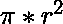
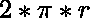

# 计算等边三角形内圆面积和周长的程序

> 原文:[https://www . geesforgeks . org/计算等边三角形内圆面积和周长的程序/](https://www.geeksforgeeks.org/program-to-calculate-the-area-and-perimeter-of-incircle-of-an-equilateral-triangle/)

给定等边三角形的边长，任务是求给定等边三角形的内圆的面积和周长。

**示例:**

```
Input: side = 6 
Output: Area = 9.4\. Perimeter = 10.88

Input: side = 9
Output: Area = 21.21, Perimeter = 16.32

```

**内圆的特性是:**

*   内圆的中心与三角形的中心相同，即等边三角形的中点相交的点。
*   等边三角形的内切圆是通过等边三角形的边的中点构成的。
*   The Inradius of an Incircle of an equilateral triangle can be calculated using the formula:

    ```
     ,

    ```

    其中为等边三角形边长。

*   下图显示了一个内圆为:的等边三角形
*   **Approach:**

    圆的面积= 和圆的周长= ，其中 r 是给定圆的半径。

    同样等边三角形的内圆半径=(等边三角形的边)/ 3。
    因此，

    1.  使用 Inradius 计算内圆面积的公式为:
    2.  使用 Inradius 计算 Incircle 周长的公式为:

        ## C

        ```
        // C program to find the area of Inscribed circle 
        // of equilateral triangle
        #include <math.h>
        #include <stdio.h>
        #define PI 3.14159265

        // function to find area of inscribed circle
        float area_inscribed(float a)
        {
            return (a * a * (PI / 12));
        }

        // function to find Perimeter of inscribed circle
        float perm_inscribed(float a)
        {
            return (PI * (a / sqrt(3)));
        }

        // Driver code
        int main()
        {
            float a = 6;
            printf("Area of inscribed circle is :%f\n",
                   area_inscribed(a));

            printf("Perimeter of inscribed circle is :%f",
                   perm_inscribed(a));

            return 0;
        }
        ```

        ## Java 语言（一种计算机语言,尤用于创建网站)

        ```
        // Java code to find the area of inscribed
        // circle of equilateral triangle
        import java.lang.*;

        class GFG {

            static double PI = 3.14159265;

            // function to find the area of
            // inscribed circle
            public static double area_inscribed(double a)
            {
                return (a * a * (PI / 12));
            }

            // function to find the perimeter of
            // inscribed circle
            public static double perm_inscribed(double a)
            {
                return (PI * (a / Math.sqrt(3)));
            }

            // Driver code
            public static void main(String[] args)
            {
                double a = 6.0;
                System.out.println("Area of inscribed circle is :"
                                   + area_inscribed(a));

                System.out.println("\nPerimeter of inscribed circle is :"
                                   + perm_inscribed(a));
            }
        }
        ```

        ## 蟒蛇 3

        ```
        # Python3 code to find the area of inscribed 
        # circle of equilateral triangle
        import math
        PI = 3.14159265

        # Function to find the area of 
        # inscribed circle
        def area_inscribed(a):
            return (a * a * (PI / 12))

        # Function to find the perimeter of 
        # inscribed circle
        def perm_inscribed(a):
            return ( PI * (a / math.sqrt(3) ) )    

        # Driver code
        a = 6.0
        print("Area of inscribed circle is :% f"
                                % area_inscribed(a))
        print("\nPerimeter of inscribed circle is :% f"
                                % perm_inscribed(a))
        ```

        ## c#

        ```
        // C# code to find the area of
        // inscribed circle
        // of equilateral triangle
        using System;

        class GFG {
            static double PI = 3.14159265;

            // function to find the area of
            // inscribed circle
            public static double area_inscribed(double a)
            {
                return (a * a * (PI / 12));
            }

            // function to find the perimeter of
            // inscribed circle
            public static double perm_inscribed(double a)
            {
                return (PI * (a / Math.Sqrt(3)));
            }

            // Driver code
            public static void Main()
            {
                double a = 6.0;
                Console.Write("Area of inscribed circle is :"
                              + area_inscribed(a));

                Console.Write("\nPerimeter of inscribed circle is :"
                              + perm_inscribed(a));
            }
        }
        ```

        ## 服务器端编程语言(专业超文本预处理器的缩写)

        ```
        <?php
        // PHP program to find the 
        // area of inscribed 
        // circle of equilateral triangle
        $PI = 3.14159265;

        // function to find area of 
        // inscribed circle
        function area_inscribed($a)
        {
            global $PI;
            return ($a * $a * ($PI / 12));
        }

        // function to find perimeter of 
        // inscribed circle
        function perm_inscribed($a)
        {
            global $PI;
            return ( $PI * ( $a / sqrt(3) ) );
        }

        // Driver code
        $a = 6;
        echo("Area of inscribed circle is :");
        echo(area_inscribed($a));
        echo("Perimeter of inscribed circle is :");
        echo(perm_inscribed($a));

        ?>
        ```

        **输出:**

        ```
        Area of inscribed circle is :9.424778
        Perimeter of inscribed circle is :10.882796

        ```