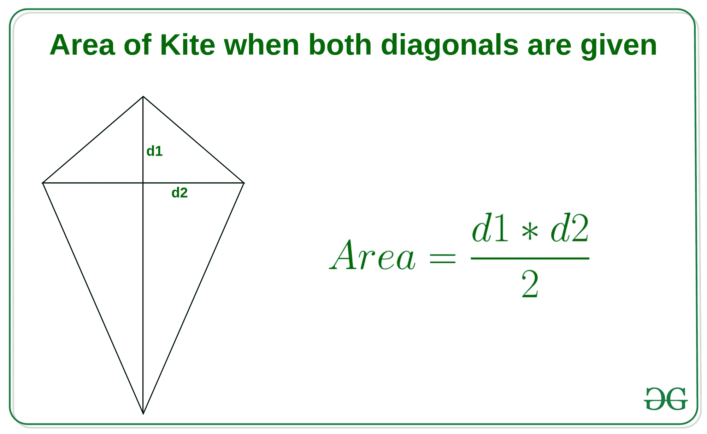
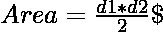

# 计算风筝面积的程序

> 原文:[https://www . geesforgeks . org/计算风筝面积的程序/](https://www.geeksforgeeks.org/program-to-calculate-the-area-of-kite/)

风筝有点像菱形，但在风筝中，相邻边相等，对角线一般不相等。

**方法 1:当两条对角线都给定时**

如果风筝的对角线为 **d1** 和 **d2** ，则风筝的面积为两条对角线乘积的一半，即



**示例:**

```
Input: d1 = 4, d2 = 6
Output: Area of Kite  = 12

Input: d1 = 5, d2 = 7
Output: Area of Kite  = 17.5
```

**方法:**在该方法中，我们简单地使用上述公式。
以下是上述办法的实施情况:

## C++

```
// C++ implementation of the approach

#include <bits/stdc++.h>
using namespace std;

// Function to return the area of kite
float areaOfKite(int d1, int d2)
{
    // use above formula
    float area = (d1 * d2) / 2;
    return area;
}

// Driver code
int main()
{
    int d1 = 4, d2 = 6;
    cout << "Area of Kite = "
         << areaOfKite(d1, d2);

    return 0;
}
```