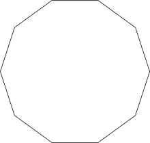

# 计算十边形周长的程序

> 原文:[https://www . geesforgeks . org/计算十边形周长的程序/](https://www.geeksforgeeks.org/program-to-calculate-the-perimeter-of-a-decagon/)

给定十边形的边，任务是找出十边形的周长。
**解释:**在几何学中，十边形是十边形或十边形。正十边形的所有边的长度相等，每个内角总是等于 144 度。



**示例** :

```
Input : S = 5
Output : The Perimeter of Decagon is : 50

Input : S = 8
Output : The Perimeter of Decagon is : 80
```

**求十边形周长的公式是:**T2

```
Perimeter = 10 * S

where "S" is the side of the Decagon
```

下面是寻找十边形周长的程序:

## C++

```
// C++ program to Calculate the Perimeter of a Decagon
#include <iostream>
using namespace std;

// Function for finding the perimeter
void CalPeri()
{
    int s = 5, Perimeter;

    Perimeter = 10 * s;

    cout << "The Perimeter of Decagon is : "
                                << Perimeter;
}

// Driver code
int main()
{
    CalPeri();

    return 0;
}
```

## C

```
// C program to Calculate the Perimeter of a Decagon
#include <stdio.h>

// Function for finding the perimeter
void CalPeri()
{
    int s = 5, Perimeter;

    Perimeter = 10 * s;

    printf("The Perimeter of Decagon is : %d",
                                    Perimeter);
}

// Driver code
int main()
{
    CalPeri();

    return 0;
}
```

## Java 语言(一种计算机语言，尤用于创建网站)

```
/*package whatever //do not write package name here */
// Java program to Calculate the Perimeter of a Decagon

import java.io.*;

class GFG {

// Function for finding the perimeter
static void CalPeri()
{
    int S = 5, Perimeter;

    Perimeter = 10 * S;

    System.out.println("The Perimeter of Decagon is : "+
                                Perimeter);
}

// Driver code
    public static void main (String[] args) {
            CalPeri();
    }
}
//This Code is contributed by ajit
```

## 蟒蛇 3

```
# Python3 program to Calculate
# the Perimeter of a Decagon

# Function for finding the
# perimeter
def CalPeri():
    s = 5
    Perimeter = 10 * s

    print ("The Perimeter of Decagon is : "
           , Perimeter)

# Driver code
if __name__ == '__main__':
    CalPeri();

# This code is contributed by
# Surendra_Gangwar
```

## C#

```
// C# program to Calculate the
// Perimeter of a Decagon
using System;

class GFG
{

// Function for finding the perimeter
static void CalPeri()
{
    int S = 5, Perimeter;

    Perimeter = 10 * S;

    Console.WriteLine("The Perimeter of " +
                           "Decagon is : "+
                                Perimeter);
}

// Driver code
public static void Main ()
{
    CalPeri();
}
}

// This Code is contributed
// by anuj_67
```

## 服务器端编程语言（Professional Hypertext Preprocessor 的缩写）

```
<?php
// PHP program to Calculate the Perimeter of a Decagon
function CalPeri($s)
{
    $Perimeter = 10 * $s;
    echo "The Perimeter of Decagon is : $Perimeter";
}

// Driver Code
$s = 5;
CalPeri($s);
?>
```

## java 描述语言

```
<script>

// JavaScript program to Calculate the Perimeter of a Decagon   

// Function for finding the perimeter
    function CalPeri() {
        var S = 5, Perimeter;

        Perimeter = 10 * S;

        document.write("The Perimeter of Decagon is : " + Perimeter);
    }

    // Driver code

        CalPeri();

// This code contributed by gauravrajput1

</script>
```

**Output:** 

```
The Perimeter of Decagon is : 50
```