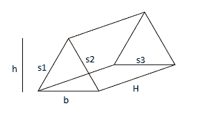

# 计算三棱柱表面积的程序

> 原文:[https://www . geeksforgeeks . org/计算三棱柱表面积的程序/](https://www.geeksforgeeks.org/program-to-calculate-the-surface-area-of-a-triangular-prism/)

在数学中，三棱柱是一种三维立体形状，两个相同的末端由相等的平行线连接，有 5 个面、9 条边和 6 个顶点。



其中“b”是底部的长度，“H”是三角形的高度，“s1，s2，s3”是三角形每条边各自的长度，H 是棱镜的高度(也是矩形的长度)。
给定底边、三角形的高度、棱镜的高度和三角形底边各边的长度，任务是计算三棱镜的表面积。
**例:**

> **输入:** b = 3，h = 4，s1 = 3，s2 = 6，s3 = 6，Ht = 8
> **输出:**三棱镜面积为 132.000000
> **输入:** b = 2，h = 3，s1 = 4，s2 = 5，s3 = 6，Ht = 8
> **输出:**三棱镜面积为 126.000000

**表面积计算公式:**
如上所述，棱镜包含面积为 **(1/2)*(b)*(h)** 的两个三角形和面积为 **H*s1、H*s2 和 H*s3** 的三个矩形。
现在在加上所有的术语后，我们得到总表面积:

```
SA = b * h + (s1 + s2 + s3 ) * H
```

## C++

```
// C++ Program to calculate the
// Surface area of a triangular prism
#include <bits/stdc++.h>
using namespace std;

// Function for calculating the area
void Calculate_area()
{
    // Initialization
    float b = 3, h = 4, s1 = 3, s2 = 6;
    float s3 = 6, Ht = 8, SA;

    // Formula for calculating the area
    SA = b * h + (s1 + s2 + s3) * Ht;

    // Displaying the area
    cout << "The area of triangular prism is : " << SA;
}

// Driver code
int main()
{
    // Function calling
    Calculate_area();

    return 0;
}
```

## C

```
// C Program to calculate the
// Surface area of a triangular prism
#include <stdio.h>

// Function for calculating the area
void Calculate_area()
{
    // Initialization
    float b = 3, h = 4, s1 = 3, s2 = 6;
    float s3 = 6, Ht = 8, SA;

    // Formula for calculating the area
    SA = b * h + (s1 + s2 + s3) * Ht;

    // Displaying the output
    printf("The area of triangular prism is : %f", SA);
}

// Driver code
int main()
{
    // Function calling
    Calculate_area();

    return 0;
}
```

## Java 语言(一种计算机语言，尤用于创建网站)

```
// Java Program to calculate the
// Surface area of a triangular prism

import java.util.Scanner;
public class Prism {

    public static void Calculate_area()
    {
        // Initialization
        double b = 3, h = 4, s1 = 3, s2 = 6;
        double s3 = 6, Ht = 8, SA;

        // Formula for calculating the area
        SA = b * h + (s1 + s2 + s3) * Ht;

        // Displaying the area
        System.out.printf("The area of triangular prism is : %f", SA);
    }
    public static void main(String[] args)
    {
        Calculate_area();
    }
}
// This code is contributed by Nishant Tanwar
```

## 蟒蛇 3

```
# Python3 Program to calculate the
# Surface area of a triangular prism

# Function for calculating the area
def Calculate_area():

    # Initialization
    b = 3
    h = 4
    s1 = 3
    s2 = 6
    s3 = 6
    Ht = 8

    # Formula for calculating the area
    SA = b * h + (s1 + s2 + s3) * Ht

    # Displaying the area
    print ("The area of triangular prism is :",SA)

# Driver code
if __name__ == '__main__':
    # Function calling
    Calculate_area()

# This code is contributed by
# Surendra_Gangwar
```

## C#

```
// C# Program to calculate the
// Surface area of a triangular prism
using System;
public class Prism {

    static void Calculate_area()
    {
        // Initialization
        double b = 3, h = 4, s1 = 3, s2 = 6;
        double s3 = 6, Ht = 8, SA;

        // Formula for calculating the area
        SA = b * h + (s1 + s2 + s3) * Ht;

        // Displaying the area
        Console.WriteLine("The area of triangular prism is : " + SA);
    }
    static public void Main(String[] args)
    {
        Calculate_area();
    }
}
```

## 服务器端编程语言（Professional Hypertext Preprocessor 的缩写）

```
<?php
// PHP Program to calculate
// the Surface area of a
// triangular prism

// Function for calculating
// the area
function Calculate_area()
{
    // Initialization
    $b = 3; $h = 4;
    $s1 = 3; $s2 = 6;
    $s3 = 6; $Ht = 8; $SA;

    // Formula for calculating
    // the area
    $SA = $b * $h + ($s1 +
          $s2 + $s3) * $Ht;

    // Displaying the area
    echo "The area of triangular".
             " prism is : " , $SA;
}

// Driver code

// Function calling
Calculate_area();

// This code is contributed by m_kit
?>
```

## java 描述语言

```
<script>
// javascript Program to calculate the
// Surface area of a triangular prism

// Function for calculating the area
function Calculate_area()
{

    // Initialization
    let b = 3, h = 4, s1 = 3, s2 = 6;
    let s3 = 6, Ht = 8, SA;

    // Formula for calculating the area
    SA = b * h + (s1 + s2 + s3) * Ht;

    // Displaying the area
    document.write( "The area of triangular prism is : " +SA);
}

// Driver code

    // Function calling
    Calculate_area();

// This code is contributed by Rajput-Ji

</script>
```

**Output**

```
The area of triangular prism is : 132
```