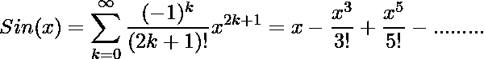
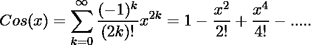

# 使用扩展

计算 sin(x)和 cos(x)值的程序

> 原文:[https://www . geeksforgeeks . org/计算 sinx 和 cosx 使用扩展值的程序/](https://www.geeksforgeeks.org/program-to-calculate-the-value-of-sinx-and-cosx-using-expansion/)

给定一个角度值，你需要计算与之对应的正弦和余弦值。

**为赎罪功能**

**示例:**

```
Input : 90
Output : 1
```



## C++

```
// CPP code for implementing sin function
#include <iostream>
#include <math.h>
using namespace std;

// Function for calculating sin value
void cal_sin(float n)
{   
    float accuracy = 0.0001, denominator, sinx, sinval;

    // Converting degrees to radian
    n = n * (3.142 / 180.0);

    float x1 = n;

    // maps the sum along the series
    sinx = n;        

    // holds the actual value of sin(n)
    sinval = sin(n);   
    int i = 1;
    do
    {
        denominator = 2 * i * (2 * i + 1);
        x1 = -x1 * n * n / denominator;
        sinx = sinx + x1;
        i = i + 1;
    } while (accuracy <= fabs(sinval - sinx));
    cout << sinx;
}

// Main function
int main()
{
    float n = 90;
    cal_sin(n);
    return 0;
}
```

## Java 语言(一种计算机语言，尤用于创建网站)

```
import static java.lang.Math.sin;

// JAVA code for implementing sin function

class GFG {

// Function for calculating sin value
static void cal_sin(float n)
{    
    float accuracy = (float) 0.0001, denominator, sinx, sinval;

    // Converting degrees to radian
    n = n * (float)(3.142 / 180.0);

    float x1 = n;

    // maps the sum along the series
    sinx = n;        

    // holds the actual value of sin(n)
    sinval = (float)sin(n);    
    int i = 1;
    do
    {
        denominator = 2 * i * (2 * i + 1);
        x1 = -x1 * n * n / denominator;
        sinx = sinx + x1;
        i = i + 1;
    } while (accuracy <= sinval - sinx);
       System.out.println(sinx);
}

// Main function

    public static void main(String[] args) {
        float n = 90;
    cal_sin(n);

    }
}
```

## 蟒蛇 3

```
# Python3 code for implementing
# sin function
import math;

# Function for calculating sin value
def cal_sin(n):

    accuracy = 0.0001;

    # Converting degrees to radian
    n = n * (3.142 / 180.0);

    x1 = n;

    # maps the sum along the series
    sinx = n;    

    # holds the actual value of sin(n)
    sinval = math.sin(n);
    i = 1;
    while(True):

        denominator = 2 * i * (2 * i + 1);
        x1 = -x1 * n * n / denominator;
        sinx = sinx + x1;
        i = i + 1;
        if(accuracy <= abs(sinval - sinx)):
            break;

    print(round(sinx));

# Driver Code
n = 90;
cal_sin(n);

# This code is contributed by mits
```

## C#

```
// C# code for implementing sin function
using System;

class GFG
{
// Function for calculating sin value
static void cal_sin(float n)
{
    float accuracy = (float) 0.0001,
                      denominator, sinx, sinval;

    // Converting degrees to radian
    n = n * (float)(3.142 / 180.0);

    float x1 = n;

    // maps the sum along the series
    sinx = n;    

    // holds the actual value of sin(n)
    sinval = (float)Math.Sin(n);    
    int i = 1;
    do
    {
        denominator = 2 * i * (2 * i + 1);
        x1 = -x1 * n * n / denominator;
        sinx = sinx + x1;
        i = i + 1;
    } while (accuracy <= sinval - sinx);

    Console.WriteLine(sinx);
}

// Driver Code
static public void Main ()
{
    float n = 90;
    cal_sin(n);
}
}

// This code is contributed by jit_t
```

## 服务器端编程语言（Professional Hypertext Preprocessor 的缩写）

```
<?php
// PHP code for implementing sin function

// Function for calculating sin value
function cal_sin($n)
{
    $accuracy = 0.0001;

    // Converting degrees to radian
    $n = $n * (3.142 / 180.0);

    $x1 = $n;

    // maps the sum along the series
    $sinx = $n;        

    // holds the actual value of sin(n)
    $sinval = sin($n);
    $i = 1;
    do
    {
        $denominator = 2 * $i * (2 * $i + 1);
        $x1 = -$x1 * $n * $n / $denominator;
        $sinx = $sinx + $x1;
        $i = $i + 1;
    } while ($accuracy <= abs($sinval - $sinx));
    echo round($sinx);
}

// Main function

    $n = 90;
    cal_sin($n);

// This code is contributed by mits
?>
```

## java 描述语言

```
<script>

// javascript code for implementing sin function

    // Function for calculating sin value
    function cal_sin(n) {
        var accuracy =  0.0001, denominator, sinx, sinval;

        // Converting degrees to radian
        n = n *  (3.142 / 180.0);

        var x1 = n;

        // maps the sum along the series
        sinx = n;

        // holds the actual value of sin(n)
        sinval =  Math.sin(n);
        var i = 1;
        do {
            denominator = 2 * i * (2 * i + 1);
            x1 = -x1 * n * n / denominator;
            sinx = (sinx + x1);
            i = i + 1;
        } while (accuracy <= sinval - sinx);
        document.write(sinx.toFixed(0));
    }

    // Main function

        var n = 90;
        cal_sin(n);

// This code is contributed by todaysgaurav

</script>
```

**输出:**

```
1
```

**对于 cos 功能**

**示例:**

```
Input : 30
Output : 0.86602
```



## C++

```
// CPP code for implementing cos function
#include <iostream>
#include <math.h>
using namespace std;

// Function for calculation
void cal_cos(float n)
{
    float accuracy = 0.0001, x1, denominator, cosx, cosval;

    // Converting degrees to radian
    n = n * (3.142 / 180.0);

    x1 = 1;

    // maps the sum along the series
    cosx = x1;        

    // holds the actual value of sin(n)
    cosval = cos(n);
    int i = 1;
    do
    {
        denominator = 2 * i * (2 * i - 1);
        x1 = -x1 * n * n / denominator;
        cosx = cosx + x1;
        i = i + 1;
    } while (accuracy <= fabs(cosval - cosx));
    cout << cosx;
}

// Main function
int main()
{
    float n = 30;
    cal_cos(n);
}
```

## Java 语言(一种计算机语言，尤用于创建网站)

```
// Java code for implementing cos function

import static java.lang.Math.cos;

class GFG {
// Function for calculation

static void cal_cos(float n) {
    float accuracy = (float) 0.0001, x1, denominator, cosx, cosval;
    // Converting degrees to radian
    n = n * (float) (3.142 / 180.0);
    x1 = 1;
    // maps the sum along the series
    cosx = x1;
    // holds the actual value of sin(n)
    cosval = (float) cos(n);
    int i = 1;
    do {
        denominator = 2 * i * (2 * i - 1);
        x1 = -x1 * n * n / denominator;
        cosx = cosx + x1;
        i = i + 1;

    }
    while (accuracy <= cosval - cosx);
    System.out.println(cosx);

}

// Main function
public static void main(String[] args) {
    float n = 30;
    cal_cos(n);

}
}
```

## 蟒蛇 3

```
# Python 3 code for implementing cos function

from math import fabs, cos

# Function for calculation
def cal_cos(n):
    accuracy = 0.0001

    # Converting degrees to radian
    n = n * (3.142 / 180.0)

    x1 = 1

    # maps the sum along the series
    cosx = x1

    # holds the actual value of sin(n)
    cosval = cos(n)
    i = 1

    denominator = 2 * i * (2 * i - 1)
    x1 = -x1 * n * n / denominator
    cosx = cosx + x1
    i = i + 1
    while (accuracy <= fabs(cosval - cosx)):
        denominator = 2 * i * (2 * i - 1)
        x1 = -x1 * n * n / denominator
        cosx = cosx + x1
        i = i + 1

    print('{0:.6}'.format(cosx))

# Driver Code
if __name__ == '__main__':
    n = 30
    cal_cos(n)

# This code is contributed by
# Sahil_Shelangia
```

## C#

```
// C# code for implementing cos function

using System;
class GFG {
// Function for calculation

static void cal_cos(float n) {
    float accuracy = (float) 0.0001, x1, denominator, cosx, cosval;
    // Converting degrees to radian
    n = n * (float) (3.142 / 180.0);
    x1 = 1;
    // maps the sum along the series
    cosx = x1;
    // holds the actual value of sin(n)
    cosval = (float) Math.Cos(n);
    int i = 1;
    do {
        denominator = 2 * i * (2 * i - 1);
        x1 = -x1 * n * n / denominator;
        cosx = cosx + x1;
        i = i + 1;

    }
    while (accuracy <= cosval - cosx);
    Console.WriteLine(cosx);

}

// Main function
static void Main() {
    float n = 30;
    cal_cos(n);

}
}
// This code is contributed by mits
```

## 服务器端编程语言（Professional Hypertext Preprocessor 的缩写）

```
<?php
// PHP code for implementing cos function

// Function for calculation
function cal_cos($n)
{
    $accuracy = 0.0001;

    // Converting degrees to radian
    $n = $n * (3.142 / 180.0);

    $x1 = 1;

    // maps the sum along the series
    $cosx = $x1;        

    // holds the actual value of sin(n)
    $cosval = cos($n);
    $i = 1;
    do
    {
        $denominator = 2 * $i * (2 * $i - 1);
        $x1 = -$x1 * $n * $n / $denominator;
        $cosx = $cosx + $x1;
        $i = $i + 1;
    } while ($accuracy <= abs($cosval - $cosx));
    echo round($cosx, 6);
}

// Driver Code
$n = 30;
cal_cos($n);

// This code is contributed by mits
?>
```

## java 描述语言

```
<script>

// JavaScript code for implementing cos function

// Function for calculation
function cal_cos(n)
{
    let accuracy = 0.0001, x1, denominator, cosx, cosval;

    // Converting degrees to radian
    n = n * (3.142 / 180.0);

    x1 = 1;

    // maps the sum along the series
    cosx = x1;       

    // holds the actual value of sin(n)
    cosval = Math.cos(n);
    let i = 1;
    do
    {
        denominator = 2 * i * (2 * i - 1);
        x1 = -x1 * n * n / denominator;
        cosx = cosx + x1;
        i = i + 1;
    } while (accuracy <= Math.abs(cosval - cosx));
    document.write(cosx.toFixed(5));
}

// Main function

    let n = 30;
    cal_cos(n);

// This code is contributed by Surbhi Tyagi.

</script>
```

**输出:**

```
0.86602
```

本文由**萨基提瓦里**供稿。如果你喜欢极客(我们知道你喜欢！)并愿意投稿，也可以使用[write.geeksforgeeks.org](http://www.write.geeksforgeeks.org)写一篇文章或者将文章邮寄到 review-team@geeksforgeeks.org。看到你的文章出现在极客博客主页上，帮助其他极客。
如果你发现任何不正确的地方，或者你想分享更多关于上面讨论的话题的信息，请写评论。