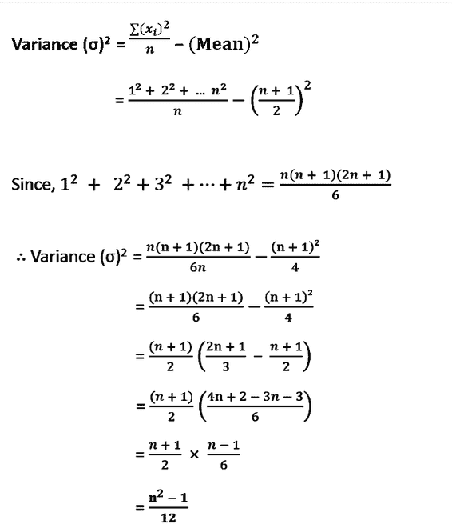

# 计算前 N 个自然数方差的程序

> 原文:[https://www . geesforgeks . org/计算第一 n 个自然数方差的程序/](https://www.geeksforgeeks.org/program-to-calculate-variance-of-first-n-natural-numbers/)

给定一个整数 **N** ，任务是求第一个 **N** 自然数的[方差](https://www.geeksforgeeks.org/mathematics-mean-variance-and-standard-deviation/)。

> **方差**用于确定数据与它们的平均值相差多少。一般用符号**σ<sup>2</sup>T5 表示，求方差的公式一般用下面的公式给出:** 
> 
> **∑<sup>N</sup>T3】I = 1(x<sub>I</sub>–均值(x)<sup>2</sup>/N**
> 
> 其中 **N** 为数据总数

**示例:**

> **输入:** 5
> **输出:** 2
> **解释:**
> 前 5 个数的平均值= (1 + 2 + 3 + 4 + 5) / 5 = 3
> 因此，方差=((1–3)<sup>2</sup>+(2–3)<sup>2</sup>+(3–3)<sup>2</sup>+(4–3)<sup>2</sup>+(5–5)
> 
> **输入:** 4
> **输出:** 1.25
> **解释:**
> 前 4 个数的平均值= (1 + 2 + 3 + 4) / 4 = 2.5
> 因此，方差=((1–2.5)<sup>2</sup>+(2–2.5)<sup>2</sup>+(3–2.5)<sup>2</sup>+(4–2.5)

**天真法:**解决这个问题的简单方法是先计算第一个 **N 个**自然数的[均值](https://www.geeksforgeeks.org/mathematics-mean-variance-and-standard-deviation/)值，然后遍历范围**【1，N】**计算方差。

***时间复杂度:**O(N)*
T5**辅助空间:** O(1)

**高效解:**通过简化上述**均值**和**方差**的公式，利用第一个 N 个自然数的[和第一个 **N 个**自然数](https://www.geeksforgeeks.org/sum-of-natural-numbers-using-recursion/)的平方和的性质，可以优化上述解，如下图所示。



。因此，计算**(N<sup>2</sup>–1)/12**，并将其打印为所需结果。

下面是上述方法的实现:

## C++

```
// C++ Program to implement
// the above approach

#include <bits/stdc++.h>
using namespace std;

// Function to calculate Variance
// of first N natural numbers
long double find_Variance(int n)
{
    long long int numerator = n * n - 1;
    long double ans = (numerator * 1.0) / 12;
    return ans;
}

// Driver Code
int main()
{
    int N = 5;

    cout << fixed << setprecision(6)
         << find_Variance(N);
}
```

## Java 语言(一种计算机语言，尤用于创建网站)

```
// Java program to implement
// the above approach
class GFG{

// Function to calculate Variance
// of first N natural numbers
static double find_Variance(int n)
{
    long  numerator = n * n - 1;
    double ans = (numerator * 1.0) / 12;
    return ans;
}

// Driver Code
public static void main(String[] args)
{
    int N = 5;

    System.out.println(find_Variance(N));
}
}

// This code is contributed by AnkThon
```

## 蟒蛇 3

```
# Python3 program to implement
# the above approach

# Function to calculate Variance
# of first N natural numbers
def find_Variance(n):

    numerator = n * n - 1
    ans = (numerator * 1.0) / 12

    return ans

# Driver Code
if __name__ == '__main__':

    N = 5

    a = find_Variance(N)

    print("{0:.6f}".format(a))

# This code is contributed by mohit kumar 29
```

## C#

```
// C# program to implement
// the above approach
using System;
class GFG
{

    // Function to calculate Variance
    // of first N natural numbers
    static double find_Variance(int n)
    {
        long  numerator = n * n - 1;
        double ans = (numerator * 1.0) / 12;
        return ans;
    }

    // Driver Code
    public static void Main(string[] args)
    {
        int N = 5;
        Console.WriteLine(find_Variance(N));
    }
}

// This code is contributed by AnkThon
```

## java 描述语言

```
<script>

// Javascript program to implement
// the above approach

// Function to calculate Variance
// of first N natural numbers
function find_Variance(n)
{
    var numerator = n * n - 1
    var ans = (numerator * 1.0) / 12

    return ans
}

// Driver Code
var N = 5;

document.write (find_Variance(N).toFixed(6));

// This code is contributed by bunnyram19

</script>
```

**Output:** 

```
2.000000
```

***时间复杂度:**O(1)*
T5**辅助空间:** O(1)