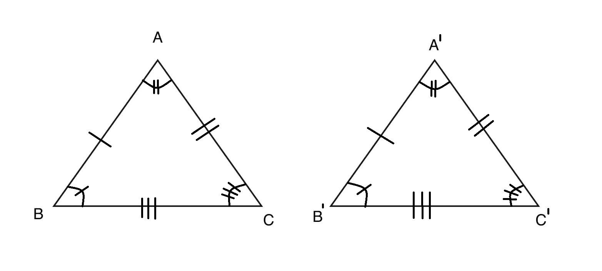
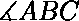
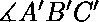
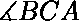
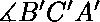

# 检查两个三角形一致性的程序

> 原文:[https://www . geesforgeks . org/程序检查两个三角形的一致性/](https://www.geeksforgeeks.org/program-to-check-congruency-of-two-triangles/)

给定四个 3 个数的数组，每个数组代表两个三角形的边和角。任务是检查两个三角形是否[全等](https://en.wikipedia.org/wiki/Congruence_(geometry))。也打印它们全等的定理。

**注意:**输入的所有边和角度都是有效三角形。

**示例:**

```
Input : side1 = [3, 4, 5]  angle1 = [90, 60, 30]
        side2 = [4, 3, 5]  angle2 = [60, 30, 90]
Output: Triangles are congruent by SSS SAS ASA AAS HL.  

Input : side1 = [3, 5, 6]  angle1 = [80, 50, 50]
        side2 = [1, 1, 1]  angle2 = [60, 60, 60]
Output: Triangles are not congruent

```

全等三角形是指两个或两个以上的三角形，其所有对应的边相等，或者一对边和夹角相等，或者一对角和夹角相等，或者一对角和另一边相等，或者斜边和一边相等。



三角形的一致性可以由以下定理证明:

1.  **边-边-边(SSS)一致性标准:**如果一个三角形的所有边都等于另一个三角形的边，那么这些三角形就被认为是符合*边-边-边* (SSS)的性质的。
    在上面的三角形 ABC 和 A'B'C '如果，AB=A'B '和 BC=B'C '和 CA=C'A '那么，三角形是全等的。
2.  **侧角-边(SAS)全等标准:**如果两个三角形的两条边相等，并且它们之间的角度在两个三角形中都相同，则根据*侧角-边* (SAS)的性质，这两个三角形被称为全等。在上面的三角形 ABC 和 A'B'C' if 中，AB=A'B '和 BC=B'C '和 = 三角形全等。
3.  **角-边-角(ASA)全等标准:**如果两个三角形的两个角相等，并且两个三角形之间的边长相同，则根据*角-边-角* (ASA)的性质，这两个三角形被称为全等。在上面的三角形 ABC 和 A'B'C' if 中， =
    和 = 和 BC=B'C '那么，三角形全等。
4.  **角-角-边(AAS)全等标准:**如果两个三角形的两个角相等，并且另一边的长度在两个三角形中都相同，那么根据*角-角-边* (AAS)的性质，这两个三角形被称为全等的。在上面的三角形 ABC 和 A'B'C' if 中， = 和 = 和 CA=C'A '那么，三角形是全等的。
5.  **斜边-腿(HL)全等准则:**
    如果两个三角形的斜边相等，并且两个三角形中任何一条边的长度相同，则根据*斜边-腿* (HL)的性质，这两个三角形被称为全等的。

下面是上述定理的实现。

```
# Python program to check 
# similarity between two triangles.

# Function for SAS congruency
def cong_sas(s1, s2, a1, a2): 

    s1 = [float(i) for i in s1]
    s2 = [float(i) for i in s2]
    a1 = [float(i) for i in a1]
    a2 = [float(i) for i in a2]

    s1.sort()
    s2.sort()
    a1.sort()
    a2.sort()

    # Check for SAS

    # angle b / w two smallest sides is largest.
    if s1[0] == s2[0] and s1[1] == s2[1]:

        # since we take angle b / w the sides.
        if a1[2] == a2[2]:         
            return 1

    if s1[1] == s2[1] and s1[2] == s2[2]:
        if a1[0] == a2[0]:
            return 1

    if s1[2] == s2[2] and s1[0] == s2[0]:
        if a1[1] == a2[1]:
            return 1

    return 0

# Function for ASA congruency
def cong_asa(s1, s2, a1, a2): 

    s1 = [float(i) for i in s1]
    s2 = [float(i) for i in s2]
    a1 = [float(i) for i in a1]
    a2 = [float(i) for i in a2]

    s1.sort()
    s2.sort()
    a1.sort()
    a2.sort()

    # Check for ASA

    # side b / w two smallest angle is largest.
    if a1[0] == a2[0] and a1[1] == a2[1]:

        # since we take side b / w the angle.
        if s1[2] == s2[2]:         
            return 1

    if a1[1] == a2[1] and a1[2] == a2[2]:
        if s1[0] == s2[0]:
            return 1

    if a1[2] == a2[2] and a1[0] == a2[0]:
        if s1[1] == s2[1]:
            return 1

    return 0

# Function for AAS congruency
def cong_aas(s1, s2, a1, a2): 

    s1 = [float(i) for i in s1]
    s2 = [float(i) for i in s2]
    a1 = [float(i) for i in a1]
    a2 = [float(i) for i in a2]

    s1.sort()
    s2.sort()
    a1.sort()
    a2.sort()

    # Check for AAS

    # side other two smallest angle is smallest or 2nd smallest.
    if a1[0] == a2[0] and a1[1] == a2[1]:

        # since we take side other than angles.
        if s1[0] == s2[0] or s1[1] == s2[1]:         
            return 1

    if a1[1] == a2[1] and a1[2] == a2[2]:
        if s1[1] == s2[1] or s1[2] == s2[2]:
            return 1

    if a1[2] == a2[2] and a1[0] == a2[0]:
        if s1[0] == s2[0] or s1[2] == s2[2]:
            return 1

    return 0

# Function for HL congruency
def cong_hl(s1, s2): 

    s1 = [float(i) for i in s1]
    s2 = [float(i) for i in s2] 
    s1.sort()
    s2.sort() 

    # Check for HL
    if s1[2] == s2[2]:
        if s1[1] == s2[1] or s1[0] == s2[0]:
            return 1

    return 0

# Function for SSS congruency
def cong_sss(s1, s2): 

    s1 = [float(i) for i in s1]
    s2 = [float(i) for i in s2] 
    s1.sort()
    s2.sort() 

    # Check for SSS
    if(s1[0] == s2[0] and s1[1] == s2[1] and s1[2] == s2[2]):
        return 1

    return 0

# Driver Code 
s1 = [3, 4, 5]
s2 = [4, 3, 5]

a1 = [90, 60, 30]
a2 = [60, 30, 90]

# function call for SSS congruency
sss = cong_sss(s1, s2) 

# function call for SAS congruency 
sas = cong_sas(s1, s2, a1, a2) 

# function call for ASA congruency 
asa = cong_asa(s1, s2, a1, a2) 

# function call for AAS congruency
aas = cong_aas(s1, s2, a1, a2)

# function call for HL congruency
hl = cong_hl(s1, s2, ) 

# Check if triangles are congruent or not 
if sss or sas or asa or aas or hl : 
    print "Triangles are congruent by",
    if sss: print "SSS", 
    if sas: print "SAS",
    if asa: print "ASA",
    if aas: print "AAS",
    if hl: print "HL",
else: print "Triangles are not congruent"
```

**Output:**

```
Triangles are congruent by SSS SAS ASA AAS HL

```