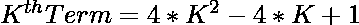
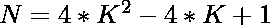
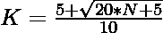

# 检查 N 是否为居中十边形数的程序

> 原文:[https://www . geesforgeks . org/program-to-check-if-n-a-centered-decangal-number/](https://www.geeksforgeeks.org/program-to-check-if-n-is-a-centered-decagonal-number/)

给定一个整数 **N** ，任务是检查 **N** 是否为[中心十边形数](https://www.geeksforgeeks.org/centered-decagonal-number/)。如果编号 **N** 是居中十边形编号，则打印**“是”**否则打印**“否”**。

> [**【居中十边形数】**](https://www.geeksforgeeks.org/centered-decagonal-number/) 是居中的具象数，代表一个十边形，中间有一个点，其他点都以连续的[十边形数](https://www.geeksforgeeks.org/decagonal-numbers/)形式围绕着它。前几个居中的十边形数字是 **1、11、31、61、101、151……**

**示例:**

> **输入:** N = 11
> **输出:**是
> **说明:**
> 秒居中十边形数为 11。
> 
> **输入:**N = 30
> T3】输出:否

**进场:**

1.中心十边形数的第**K**项给出为


2.因为我们必须检查给定的数字是否可以表示为[中心十边形数字](https://www.geeksforgeeks.org/centered-decagonal-number/)。这可以通过以下方式进行检查:

> => 
> = > 

3.如果用上述公式计算出的 **K** 的值是一个整数，那么 **N** 就是一个居中的十边形数。

4.否则数字 **N** 不是一个居中的十边形数字。

下面是上述方法的实现:

## C++

```
// C++ program for the above approach
#include <bits/stdc++.h>
using namespace std;

// Function to check if number N
// is a Centered decagonal number
bool isCentereddecagonal(int N)
{
    float n
        = (5 + sqrt(20 * N + 5))
          / 10;

    // Condition to check if N
    // is Centered Decagonal Number
    return (n - (int)n) == 0;
}

// Driver Code
int main()
{
    int N = 11;

    // Function call
    if (isCentereddecagonal(N)) {
        cout << "Yes";
    }
    else {
        cout << "No";
    }
    return 0;
}
```

## Java 语言(一种计算机语言，尤用于创建网站)

```
// Java implementation to check that a number
// is a centered decagonal number or not
import java.lang.Math;

class GFG{

// Function to check that the number
// is a centered decagonal number
public static boolean isCentereddecagonal(int N)
{
    double n = (5 + Math.sqrt(20 * N + 5)) / 10;

    // Condition to check if the number
    // is a centered decagonal number
    return (n - (int)n) == 0;
}

// Driver Code
public static void main(String[] args)
{
    int n = 11;

    // Function call
    if (isCentereddecagonal(n))
    {
        System.out.println("Yes");
    }
    else
    {
        System.out.println("No");
    }
}
}

// This code is contributed by ShubhamCoder
```

## 蟒蛇 3

```
# Python3 program for the above approach
import numpy as np

# Function to check if the number N
# is a centered decagonal number
def isCentereddecagonal(N):

    n = (5 + np.sqrt(20 * N + 5)) / 10

    # Condition to check if N
    # is centered decagonal number
    return (n - int(n)) == 0

# Driver Code
N = 11

# Function call
if (isCentereddecagonal(N)):
    print ("Yes")
else:
    print ("No")

# This code is contributed by PratikBasu
```

## C#

```
// C# implementation to check that a number
// is a centered decagonal number or not
using System;

class GFG{

// Function to check that the number
// is a centered decagonal number
static bool isCentereddecagonal(int N)
{
    double n = (5 + Math.Sqrt(20 * N + 5)) / 10;

    // Condition to check if the number
    // is a centered decagonal number
    return (n - (int)n) == 0;
}

// Driver Code
static public void Main ()
{
    int n = 11;

    // Function call
    if (isCentereddecagonal(n))
    {
        Console.Write("Yes");
    }
    else
    {
        Console.Write("No");
    }
}
}

// This code is contributed by ShubhamCoder
```

## java 描述语言

```
<script>
// Javascript program for the above approach

// Function to check if number N
// is a Centered decagonal number
function isCentereddecagonal(N)
{
    let n
        = (5 + Math.sqrt(20 * N + 5))
          / 10;

    // Condition to check if N
    // is Centered Decagonal Number
    return (n - parseInt(n)) == 0;
}

// Driver Code
let N = 11;

// Function call
if (isCentereddecagonal(N)) {
document.write("Yes");
}
else {
document.write("No");
}

</script>
```

**Output:** 

```
Yes
```

***时间复杂度:** O(1)*

***辅助空间:** O(1)*