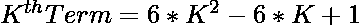

# 程序检查 N 是否是一个居中的十二边形数字

> 原文:[https://www . geeksforgeeks . org/program-to-check-if-n-a-centered-decodagonal-number/](https://www.geeksforgeeks.org/program-to-check-if-n-is-a-centered-dodecagonal-number/)

给定一个整数 **N** ，任务是检查 **N** 是否为[中心十二边形数](https://www.geeksforgeeks.org/centered-dodecagonal-number/)。如果数字 **N** 是居中的十二边形数字，则打印**“是”**否则打印**“否”**。

> [**【居中十二边形编号】**](https://www.geeksforgeeks.org/centered-dodecagonal-number/) 表示在连续的[十二边形编号](https://www.geeksforgeeks.org/dodecagonal-number/) ( **12 边多边形**)层中，位于中心的一个点及其周围的其他点。前几个居中的十二边形数字是 **1、13、37、73……**

**示例:**

> **输入:** N = 13
> **输出:**是
> **说明:**
> 第二个居中的十二边形数是 13。
> 
> **输入:**N = 30
> T3】输出:否

**进场:**

1 中心十二边形数的第**K**项给出为:


2.因为我们必须检查给定的数是否可以表示为[中心十二边形数](https://www.geeksforgeeks.org/centered-dodecagonal-number/)。这可以检查为:

> => 
> = > 

3.如果用上述公式计算的 **K** 的值是一个整数，那么 **N** 就是一个中心十二边形数。

4.否则数字 **N** 不是一个居中的十二边形数。

下面是上述方法的实现:

## C++

```
// C++ program for the above approach
#include <bits/stdc++.h>
using namespace std;

// Function to check if number N
// is a Centered dodecagonal number
bool isCentereddodecagonal(int N)
{
    float n
        = (6 + sqrt(24 * N + 12))
          / 12;

    // Condition to check if N
    // is a Centered Dodecagonal Number
    return (n - (int)n) == 0;
}

// Driver Code
int main()
{
    // Given Number
    int N = 13;

    // Function call
    if (isCentereddodecagonal(N)) {
        cout << "Yes";
    }
    else {
        cout << "No";
    }
    return 0;
}
```

## Java 语言(一种计算机语言，尤用于创建网站)

```
// Java program for the above approach
import java.util.*;

class GFG{

// Function to check if number N
// is a centered dodecagonal number
static boolean isCentereddodecagonal(int N)
{
    float n = (float) ((6 + Math.sqrt(24 * N +
                                      12)) / 12);

    // Condition to check if N is a
    // centered dodecagonal number
    return (n - (int)n) == 0;
}

// Driver Code
public static void main(String[] args)
{

    // Given Number
    int N = 13;

    // Function call
    if (isCentereddodecagonal(N))
    {
        System.out.print("Yes");
    }
    else
    {
        System.out.print("No");
    }
}
}

// This code is contributed by sapnasingh4991
```

## 蟒蛇 3

```
# Python3 program for the above approach
import numpy as np

# Function to check if the number N
# is a centered dodecagonal number
def isCentereddodecagonal(N):

    n = (6 + np.sqrt(24 * N + 12)) / 12

    # Condition to check if N
    # is a centered dodecagonal number
    return (n - int(n)) == 0

# Driver Code
N = 13

# Function call
if (isCentereddodecagonal(N)):
    print("Yes")
else:
    print("No")

# This code is contributed by PratikBasu
```

## C#

```
// C# program for the above approach
using System;

class GFG{

// Function to check if number N
// is a centered dodecagonal number
static bool isCentereddodecagonal(int N)
{
    float n = (float) ((6 + Math.Sqrt(24 * N +
                                      12)) / 12);

    // Condition to check if N is a
    // centered dodecagonal number
    return (n - (int)n) == 0;
}

// Driver Code
public static void Main(string[] args)
{

    // Given Number
    int N = 13;

    // Function call
    if (isCentereddodecagonal(N))
    {
        Console.Write("Yes");
    }
    else
    {
        Console.Write("No");
    }
}
}

// This code is contributed by rutvik_56
```

## java 描述语言

```
<script>
// Javascript program for the above approach

// Function to check if number N
// is a Centered dodecagonal number
function isCentereddodecagonal(N)
{
    let n
        = (6 + Math.sqrt(24 * N + 12))
          / 12;

    // Condition to check if N
    // is a Centered Dodecagonal Number
    return (n - parseInt(n)) == 0;
}

// Driver Code
// Given Number
let N = 13;

// Function call
if (isCentereddodecagonal(N)) {
    document.write("Yes");
}
else {
    document.write("No");
}

// This code is contributed by subham348.
</script>
```

**Output:** 

```
Yes
```

***时间复杂度:** O(1)*

***辅助空间:** O(1)*