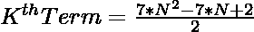
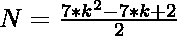

# 检查 N 是否为居中七边数的程序

> 原文:[https://www . geesforgeks . org/program-to-check-if-n-is-a-centered-七边形-number/](https://www.geeksforgeeks.org/program-to-check-if-n-is-a-centered-heptagonal-number/)

给定一个整数 **N** ，任务是检查它是否是一个[中心七边形数](https://www.geeksforgeeks.org/centered-heptagonal-number/)。

> [**【居中七边形数】**](https://www.geeksforgeeks.org/centered-heptagonal-number/) 是居中的图形数，表示一个七边形，点在中心，所有其他点以七边形环绕..前几个居中的七边形数是 1，8，22，43，71，106，148，…

**例:**

> **输入:** N = 8
> **输出:**是
> **说明:**
> 8 是第二个居中的七边数。
> **输入:** 20
> **输出:**否
> **说明:**
> 20 不是 Centered 七边形数。

**方法:**
为了解决上面提到的问题，我们必须知道中心七边形数的第 K<sup>项给出为:
因为我们必须检查给定的数是否可以表示为中心七边形数。这可以通过将等式概括为:
来检查</sup>

> => 
> = > 

最后，如果它是一个整数，用这个公式检查计算值，如果是，那么它意味着 N 是一个居中的七边数。
以下是上述方法的实现:

## C++

```
// C++ implementation to check that
// a number is a Centered
// heptagonal number or not

#include <bits/stdc++.h>
using namespace std;

// Function to check that the
// number is a Centered
// heptagonal number
bool isCenteredheptagonal(int N)
{
    float n = (7 + sqrt(56 * N - 7)) / 14;

    // Condition to check if the
    // number is a Centered heptagonal number
    return (n - (int)n) == 0;
}

// Driver Code
int main()
{
    int n = 8;

    // Function call
    if (isCenteredheptagonal(n)) {
        cout << "Yes";
    }
    else {
        cout << "No";
    }
    return 0;
}
```

## Java 语言(一种计算机语言，尤用于创建网站)

```
// Java implementation to check that
// a number is a Centered
// heptagonal number or not
import java.lang.Math;

class GFG
{

// Function to check that the
// number is a Centered
// heptagonal number
public static boolean isCenteredheptagonal(int N)
{
    double n = (7 + Math.sqrt(56 * N - 7)) / 14;

    // Condition to check if the
    // number is a Centered heptagonal number
    return (n - (int)n) == 0;
}

// Driver Code
public static void main(String[] args)
{
    int n = 8;

    // Function call
    if (isCenteredheptagonal(n))
    {
        System.out.println("Yes");
    }
    else
    {
        System.out.println("No");
    }
}
}

// This code is contributed by divyeshrabadiya07
```

## 蟒蛇 3

```
# Python3 implementation to check
# that a number is a centered
# heptagonal number or not
import math

# Function to check that the
# number is a centered
# heptagonal number
def isCenteredheptagonal(N):

    n = (7 + math.sqrt(56 * N - 7)) / 14

    # Condition to check if the number
    # is a centered heptagonal number
    return (n - int(n)) == 0

# Driver Code
n = 8

# Function call
if (isCenteredheptagonal(n)):
    print("Yes")
else:
    print("No")

# This code is contributed by ShubhamCoder
```

## C#

```
// C# implementation to check that
// a number is a centered
// heptagonal number or not
using System;

class GFG{

// Function to check that the
// number is a centered
// heptagonal number
static bool isCenteredheptagonal(int N)
{
    double n = (7 + Math.Sqrt(56 * N - 7)) / 14;

    // Condition to check if the number
    // is a centered heptagonal number
    return (n - (int)n) == 0;
}

// Driver Code
static public void Main ()
{
    int n = 8;

    // Function call
    if (isCenteredheptagonal(n))
    {
        Console.Write("Yes");
    }
    else
    {
        Console.Write("No");
    }
}
}

// This code is contributed by ShubhamCoder
```

## java 描述语言

```
<script>
// Javascript implementation to check that
// a number is a Centered
// heptagonal number or not

// Function to check that the
// number is a Centered
// heptagonal number
function isCenteredheptagonal(N)
{
    let n = (7 + Math.sqrt(56 * N - 7)) / 14;

    // Condition to check if the
    // number is a Centered heptagonal number
    return (n - parseInt(n)) == 0;
}

// Driver Code
let n = 8;

// Function call
if (isCenteredheptagonal(n)) {
    document.write("Yes");
}
else {
    document.write("No");
}

// This code is contributed by rishavmahato348.
</script>
```

**Output:** 

```
Yes
```