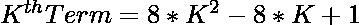
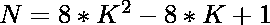
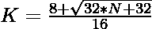

# 检查 N 是否为中心十六边形数的程序

> 原文:[https://www . geesforgeks . org/program-to-check-if-n-a-centered-十六边形-number/](https://www.geeksforgeeks.org/program-to-check-if-n-is-a-centered-hexadecagonal-number/)

给定一个数字 **N** ，任务是检查 **N** 是否是一个[居中的六边形数字](https://www.geeksforgeeks.org/centered-hexadecagonal-number/)。如果数字 **N** 是居中的十六边形数字，则打印**“是”**否则打印**“否”**。

> [**【居中六边形数】**](https://www.geeksforgeeks.org/centered-hexadecagonal-number/) 代表连续[六边形](https://www.geeksforgeeks.org/hexadecagonal-number/) ( **16 边多边形**)图层中中心的一个点及其周围的其他点……前几个居中六边形数为 **1、17、49、97、161、241……**

**示例:**

> **输入:** N = 17
> **输出:**是
> **说明:**
> 秒居中十六边形数为 17。
> **输入:** N = 20
> **输出:**否

**进场:**

1.**中心六边形编号**的 **K <sup>第</sup>T3】项给出为
** 

2.因为我们必须检查给定的数是否可以表示为中心十六边形数。这可以检查为:

> => 
> = > 

3.如果使用上述公式计算的 **K** 的值是整数，那么 **N** 是一个居中的六边形数。

4.否则数字 **N** 不是一个居中的六边形数。

下面是上述方法的实现:

## C++

```
// C++ program for the above approach

#include <bits/stdc++.h>
using namespace std;

// Function to check if the number N
// is a Centered hexadecagonal number
bool isCenteredhexadecagonal(int N)
{
    float n
        = (8 + sqrt(32 * N + 32))
          / 16;

    // Condition to check if the N is a
    // Centered hexadecagonal number
    return (n - (int)n) == 0;
}

// Driver Code
int main()
{
    // Given Number
    int N = 17;

    // Function call
    if (isCenteredhexadecagonal(N)) {
        cout << "Yes";
    }
    else {
        cout << "No";
    }
    return 0;
}
```

## Java 语言(一种计算机语言，尤用于创建网站)

```
// Java program for the above approach
import java.io.*;
import java.util.*;

class GFG {

// Function to check if the number N
// is a centered hexadecagonal number
static boolean isCenteredhexadecagonal(int N)
{
    double n = (8 + Math.sqrt(32 * N + 32)) / 16;

    // Condition to check if the N is a
    // centered hexadecagonal number
    return (n - (int)n) == 0;
}

// Driver code
public static void main(String[] args)
{

    // Given Number
    int N = 17;

    // Function call
    if (isCenteredhexadecagonal(N))
    {
        System.out.println("Yes");
    }
    else
    {
        System.out.println("No");
    }
}
}

// This code is contributed by coder001
```

## 蟒蛇 3

```
# Python3 program for the above approach
import numpy as np

# Function to check if the number N
# is a Centered hexadecagonal number
def isCenteredhexadecagonal(N):

    n = (8 + np.sqrt(32 * N + 32)) / 16

    # Condition to check if the N is a
    # Centered hexadecagonal number
    return (n - int(n)) == 0

# Driver Code
N = 17

# Function call
if (isCenteredhexadecagonal(N)):
    print ("Yes")
else:
    print ("No")

# This code is contributed by PratikBasu
```

## C#

```
// C# program for the above approach
using System;

class GFG {

// Function to check if the number N
// is a centered hexadecagonal number
static bool isCenteredhexadecagonal(int N)
{
    double n = (8 + Math.Sqrt(32 * N + 32)) / 16;

    // Condition to check if the N is a
    // centered hexadecagonal number
    return (n - (int)n) == 0;
}

// Driver code
public static void Main(string[] args)
{

    // Given Number
    int N = 17;

    // Function call
    if (isCenteredhexadecagonal(N))
    {
        Console.Write("Yes");
    }
    else
    {
        Console.Write("No");
    }
}
}

// This code is contributed by rutvik_56
```

## java 描述语言

```
<script>

// javascript program for the above approach

// Function to check if the number N
// is a Centered hexadecagonal number
function isCenteredhexadecagonal( N)
{
    let n
        = (8 + Math.sqrt(32 * N + 32))
          / 16;

    // Condition to check if the N is a
    // Centered hexadecagonal number
    return (n - parseInt(n)) == 0;
}

// Driver Code

    // Given Number
    let N = 17;

    // Function Call
    if (isCenteredhexadecagonal(N)) {
        document.write( "Yes");
    }
    else {
        document.write( "No");
    }

// This code contributed by Rajput-Ji

</script>
```

**Output:** 

```
Yes
```

**时间复杂度:** O(1)

**辅助空间:** O(1)