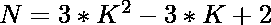
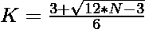

# 检查 N 是否为中心六边形数字的程序

> 原文:[https://www . geesforgeks . org/program-to-check-if-n-a-centered-hexagon-number/](https://www.geeksforgeeks.org/program-to-check-if-n-is-a-centered-hexagonal-number/)

给定一个整数 **N** ，任务是检查 **N** 是否为[中心六边形数](https://www.geeksforgeeks.org/centered-hexagonal-number/)。如果数字 **N** 是居中的六边形数字，则打印“是”，否则打印“否”。

> [](https://www.geeksforgeeks.org/centered-hexagonal-number/)**为正六边形数字，呈六边形。中心六边形数不同于六边形数，因为它在中心包含一个元素..前几个居中的六边形数字是 1，7，19，37，61，91，127 …**

****示例:****

> ****输入:** N = 7
> **输出:**是
> **说明:**
> 第二个居中的六边形数为 7。**
> 
>  ****输入:**N = 20
> T3】输出:否**

****进场:****

*   **中心六边形数字的第**K**项给出为
    **
*   **因为我们必须检查给定的数是否可以表示为中心六边形数。这可以检查为:**

> **=> 
> = > **

*   **如果用上述公式计算的 **K** 的值是一个整数，那么 **N** 就是一个居中的六边形数。**
*   **否则数字 **N** 不是一个居中的六边形数字。**

**下面是上述方法的实现:**

## **C++**

```
// C++ program for the above approach
#include <bits/stdc++.h>
using namespace std;

// Function to check that the
// number is a Centered hexagonal number
bool isCenteredhexagonal(int N)
{
    float n
        = (3 + sqrt(12 * N - 3))
          / 6;

    // Condition to check if the
    // number is a Centered hexagonal number
    return (n - (int)n) == 0;
}

// Driver Code
int main()
{
    int N = 7;

    // Function call
    if (isCenteredhexagonal(N)) {
        cout << "Yes";
    }
    else {
        cout << "No";
    }
    return 0;
}
```

## **Java 语言(一种计算机语言，尤用于创建网站)**

```
// Java program for the above approach
class GFG{

// Function to check that the
// number is a Centered hexagonal number
static boolean isCenteredhexagonal(int N)
{
    float n = (float)((3 + Math.sqrt(12 * N - 3)) / 6);

    // Condition to check if the
    // number is a Centered hexagonal number
    return (n - (int)n) == 0;
}

// Driver Code
public static void main(String[] args)
{
    int N = 7;

    // Function call
    if (isCenteredhexagonal(N))
    {
        System.out.print("Yes");
    }
    else
    {
        System.out.print("No");
    }
}
}

// This code is contributed by sapnasingh4991
```

## **蟒蛇 3**

```
# Python3 program for the above approach
import math

# Function to check that the number
# is a centered hexagonal number
def isCenteredhexagonal(N):

    n = (3 + math.sqrt(12 * N - 3)) / 6

    # Condition to check if the number
    # is a centered hexagonal number
    return (n - int(n)) == 0

# Driver Code
N = 7

if isCenteredhexagonal(N):
    print("Yes")
else :
    print("No")

# This code is contributed by ishayadav181
```

## **C#**

```
// C# program for the above approach
using System;

class GFG{

// Function to check that the number
// is a centered hexagonal number
static bool isCenteredhexagonal(int N)
{
    float n = (float)((3 + Math.Sqrt(12 * N -
                                     3)) / 6);

    // Condition to check if the number
    // is a centered hexagonal number
    return (n - (int)n) == 0;
}

// Driver Code
public static void Main(String[] args)
{
    int N = 7;

    // Function call
    if (isCenteredhexagonal(N))
    {
        Console.Write("Yes");
    }
    else
    {
        Console.Write("No");
    }
}
}

// This code is contributed by amal kumar choubey
```

## **java 描述语言**

```
<script>

// Javascript program for the above approach

// Function to check that the
// number is a Centered hexagonal number
function isCenteredhexagonal(N)
{
    let n = parseInt((3 + Math.sqrt(12 * N - 3)) / 6);

    // Condition to check if the
    // number is a Centered hexagonal number
    return (n - parseInt(n)) == 0;
}

// Driver Code
let N = 7;

// Function call
if (isCenteredhexagonal(N))
{
    document.write("Yes");
}
else
{
    document.write("No");
}

// This code is contributed by souravmahato348

</script>
```

****Output:** 

```
Yes
```** 

****时间复杂度:**O(1)
T3】辅助空间: O(1)**