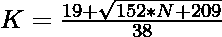

# 检查 N 是否为居中的非十边形数字的程序

> 原文:[https://www . geesforgeks . org/program-to-check-if-n-a-centered-non-decanol-number/](https://www.geeksforgeeks.org/program-to-check-if-n-is-a-centered-nonadecagonal-number/)

给定一个整数 **N** ，任务是检查它是否是一个[中心非十边形数](https://www.geeksforgeeks.org/centered-nonadecagonal-number/)。

> [**【居中的非十边形数字】**](https://www.geeksforgeeks.org/centered-nonadecagonal-number/) 表示在连续的非十边形(19 边多边形)图层中，位于中心的一个点和围绕它的其他点。前几个居中的非十边形数字是 1、20、58、115、191、286

**例:**

> **输入:** N = 20
> **输出:**是
> **说明:**
> 20 是第二个居中的非十边形数是 20。
> **输入:** 38
> **输出:**否
> **说明:**
> 38 不是一个居中的非十边形数。

**方法:**为了解决上面提到的问题，我们必须知道中心非十边形数的第 K<sup>项给出为:
因为我们必须检查给定的数是否可以表示为中心非十边形数。这可以通过将公式推广到:
来检查</sup>

> => 
> = > 

最后，如果它是一个整数，用这个公式检查计算值，如果是，那么它意味着 N 是一个居中的非十边形数。
以下是上述方法的实现:

## C++

```
// C++ implementation to check that
// a number is a Centered
// nonadecagonal number or not

#include <bits/stdc++.h>
using namespace std;

// Function to check that the
// number is a Centered
// nonadecagonal number
bool isCenterednonadecagonal(int N)
{
    float n = (19
               + sqrt(152 * N + 209))
              / 38;

    // Condition to check if the
    // number is a Centered
    // nonadecagonal number
    return (n - (int)n) == 0;
}

// Driver Code
int main()
{
    int n = 20;

    // Function call
    if (isCenterednonadecagonal(n)) {
        cout << "Yes";
    }
    else {
        cout << "No";
    }
    return 0;
}
```

## Java 语言(一种计算机语言，尤用于创建网站)

```
// Java implementation to check that
// a number is a Centered
// nonadecagonal number or not
class GFG{

// Function to check that the
// number is a Centered
// nonadecagonal number
static boolean isCenterednonadecagonal(int N)
{
    float n = (float)((19 + Math.sqrt(152 * N +
                                      209)) / 38);

    // Condition to check if the
    // number is a Centered
    // nonadecagonal number
    return (n - (int)n) == 0;
}

// Driver Code
public static void main(String[] args)
{
    int n = 20;

    // Function call
    if (isCenterednonadecagonal(n))
    {
        System.out.print("Yes");
    }
    else
    {
        System.out.print("No");
    }
}
}

// This code is contributed by sapnasingh4991
```

## 蟒蛇 3

```
# Python3 implementation to check that
# a number is a Centered
# nonadecagonal number or not
import math

# Function to check that the
# number is a Centered
# nonadecagonal number
def isCenterednonadecagonal(N):

    n = (19 + math.sqrt(152 * N +
                        209)) / 38;

    # Condition to check if the
    # number is a Centered
    # nonadecagonal number
    return (n - int(n)) == 0;

# Driver Code
n = 20;

# Function call
if (isCenterednonadecagonal(n)):
    print("Yes");

else:
    print("No");

# This code is contributed by Code_Mech
```

## C#

```
// C# implementation to check that
// a number is a Centered
// nonadecagonal number or not
using System;
class GFG{

// Function to check that the
// number is a Centered
// nonadecagonal number
static bool isCenterednonadecagonal(int N)
{
    float n = (float)((19 + Math.Sqrt(152 * N +
                                      209)) / 38);

    // Condition to check if the
    // number is a Centered
    // nonadecagonal number
    return (n - (int)n) == 0;
}

// Driver Code
public static void Main()
{
    int n = 20;

    // Function call
    if (isCenterednonadecagonal(n))
    {
        Console.Write("Yes");
    }
    else
    {
        Console.Write("No");
    }
}
}

// This code is contributed by Nidhi_biet
```

## java 描述语言

```
<script>

// Javascript implementation to check that
// a number is a Centered
// nonadecagonal number or not

// Function to check that the
// number is a Centered
// nonadecagonal number
function isCenterednonadecagonal(N)
{
    var n = (19
               + Math.sqrt(152 * N + 209))
              / 38;

    // Condition to check if the
    // number is a Centered
    // nonadecagonal number
    return (n - parseInt(n)) == 0;
}

// Driver Code
var n = 20;

// Function call
if (isCenterednonadecagonal(n)) {
    document.write("Yes");
}
else {
    document.write("No");
}

</script>
```

**Output:** 

```
Yes
```

**时间复杂度:**O(1)
T3】辅助空间: O(1)