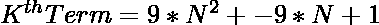
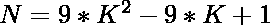
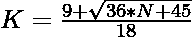

# 检查 N 是否为中心十八进制数的程序

> 原文:[https://www . geesforgeks . org/program-to-check-if-n-a-centered-十八烷醇-number/](https://www.geeksforgeeks.org/program-to-check-if-n-is-a-centered-octadecagonal-number/)

给定一个整数 **N** ，任务是检查它是否是一个[中心十八进制数](https://www.geeksforgeeks.org/centered-octadecagonal-number/)。如果输出为“否”，则打印“是”。

> [**【居中十八边形数】**](https://www.geeksforgeeks.org/centered-octadecagonal-number/) 表示在中心的一个点，其他点在十八边形(18 边多边形)的连续层中围绕它排列。前几个居中的十八进制数是 1，19，55，109，181，271，379，…

**示例:**

> **输入:** N = 19
> **输出:**是
> **说明:**
> 19 是第二个居中的十八进制数是 19。
> 
> **输入:** 38
> **输出:**否
> **说明:**
> 38 不是居中的十八进制数。

**方法:**为了解决上面提到的问题，我们知道中心十八角数的第 K <sup>项</sup>给出为:
因为我们必须检查给定的数是否可以表示为中心十八角数。这可以通过将等式概括为:

> => 
> = > 

最后，用这个公式检查计算值，如果它是一个整数，那么它意味着 N 是一个中心十八进制数。

下面是上述方法的实现:

## C++

```
// C++ implementation to check that
// a number is a Centered
// Octadecagonal number or not

#include <bits/stdc++.h>
using namespace std;

// Function to check that the
// number is a Centered
// Octadecagonal number
bool isCenteredOctadecagonal(int N)
{

    // Implement the formula generated
    float n = (9 + sqrt(36 * N + 45)) / 18;

    // Condition to check if the
    // number is a Centered
    // Octadecagonal number
    return (n - (int)n) == 0;
}

// Driver Code
int main()
{
    int n = 19;

    // Function call
    if (isCenteredOctadecagonal(n)) {
        cout << "Yes";
    }
    else {
        cout << "No";
    }
    return 0;
}
```

## Java 语言(一种计算机语言，尤用于创建网站)

```
// Java implementation to check that
// a number is a centered
// octadecagonal number or not
import java.lang.Math;

class GFG{

// Function to check that the
// number is a centered
// octadecagonal number
public static boolean isCenteredOctadecagonal(int N)
{

    // Implement the formula generated
    double n = (9 + Math.sqrt(36 * N + 45)) / 18;

    // Condition to check if the
    // number is a Centered
    // Octadecagonal number
    return(n - (int)n) == 0;
}

// Driver Code   
public static void main(String[] args)
{
    int n = 19;

    // Function call
    if (isCenteredOctadecagonal(n))
    {
        System.out.println("Yes");
    }
    else
    {
        System.out.println("No");
    }
}
}

// This code is contributed by divyeshrabadiya07
```

## 蟒蛇 3

```
# Python3 implementation to check that
# a number is a centered octadecagonal
# number or not
import math

# Function to check that the
# number is a centered
# octadecagonal number
def isCenteredOctadecagonal(N):

    # Implement the formula generated
    n = (9 + math.sqrt(36 * N + 45)) / 18;

    # Condition to check if the
    # number is a centered
    # octadecagonal number
    return (n - int(n)) == 0

# Driver code
if __name__=='__main__':

    n = 19

    # Function call
    if isCenteredOctadecagonal(n):
        print('Yes')
    else:
        print('No')

# This code is contributed by rutvik_56
```

## C#

```
// C# implementation to check that
// a number is a centered
// octadecagonal number or not
using System;

class GFG{

// Function to check that the
// number is a centered
// octadecagonal number
static bool isCenteredOctadecagonal(int N)
{

    // Implement the formula generated
    double n = (9 + Math.Sqrt(36 * N + 45)) / 18;

    // Condition to check if the
    // number is a Centered
    // octadecagonal number
    return (n - (int)n) == 0;
}

// Driver Code
static public void Main ()
{
    int n = 19;

    // Function call
    if (isCenteredOctadecagonal(n))
    {
        Console.Write("Yes");
    }
    else
    {
        Console.Write("No");
    }
}
}

//This code is contributed by ShubhamCoder
```

## java 描述语言

```
<script>

// Javascript implementation to check that
// a number is a Centered Octadecagonal
// number or not

// Function to check that the
// number is a Centered
// Octadecagonal number
function isCenteredOctadecagonal(N)
{

    // Implement the formula generated
    let n = parseInt((9 + Math.sqrt(36 * N + 45)) / 18);

    // Condition to check if the
    // number is a Centered
    // Octadecagonal number
    return (n - parseInt(n)) == 0;
}

// Driver Code
let n = 19;

// Function call
if (isCenteredOctadecagonal(n))
{
    document.write("Yes");
}
else
{
    document.write("No");
}

// This code is contributed by souravmahato348

</script>
```

**Output:** 

```
Yes
```

**时间复杂度:**O(1)
T3】辅助空间: O(1)