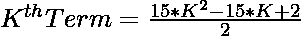
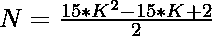

# 检查 N 是否为中心五边形数的程序

> 原文:[https://www . geeksforgeeks . org/program-to-check-if-n-is-a-centered-pentaco nal-number/](https://www.geeksforgeeks.org/program-to-check-if-n-is-a-centered-pentadecagonal-number/)

给定一个数字 **N** ，任务是检查 **N** 是否是一个[居中的五边形数字](https://www.geeksforgeeks.org/centered-pentadecagonal-number/)。如果编号 **N** 是居中的五边形编号，则打印**“是”**否则打印**“否”**。

> [居中的五边形数字](https://www.geeksforgeeks.org/centered-pentadecagonal-number/)表示在连续的五边形( **15 边多边形**层中，中心的一个点和周围的其他点。前几个居中的五边形数字是 **1，16，46 …**

**示例:**

> **输入:** N = 16
> **输出:**是
> **说明:**
> 第二个居中的五边形数是 16。
> 
> **输入:**N = 20
> T3】输出:否

**进场:**

1.中心五边形数的第**K**项给出为:


2.因为我们必须检查给定的数是否可以表示为一个中心五边形数。这可以检查为:

> => 
> = > 

3.如果使用上述公式计算的 **K** 的值是整数，那么 **N** 是一个居中的五边形数。

4.否则数字 **N** 不是一个居中的五边形数。

下面是上述方法的实现:

## C++

```
// C++ program for the above approach
#include <bits/stdc++.h>
using namespace std;

// Function to check if number N is a
// Centered Pentadecagonal Number
bool isCenteredpentadecagonal(int N)
{
    float n
        = (16 + sqrt(120 * N + 105))
          / 30;

    // Condition to check if N is a
    // Centered Pentadecagonal Number
    return (n - (int)n) == 0;
}

// Driver Code
int main()
{
    // Given Number
    int N = 16;

    // Function call
    if (isCenteredpentadecagonal(N)) {
        cout << "Yes";
    }
    else {
        cout << "No";
    }
    return 0;
}
```

## Java 语言(一种计算机语言，尤用于创建网站)

```
// Java program for the above approach
class GFG{

// Function to check if number N is a
// Centered Pentadecagonal Number
static boolean isCenteredpentadecagonal(int N)
{
    float n = (float)(16 + Math.sqrt(120 * N +
                                     105)) / 30;

    // Condition to check if N is a
    // Centered Pentadecagonal Number
    return (n - (int)n) == 0;
}

// Driver Code
public static void main(String[] args)
{
    // Given Number
    int N = 16;

    // Function call
    if (isCenteredpentadecagonal(N))
    {
        System.out.println("Yes");
    }
    else
    {
        System.out.println("No");
    }
}
}

// This code is contributed by rutvik_56
```

## 蟒蛇 3

```
# Python3 program for the above approach
import math

# Function to check if number N is a
# centered pentadecagonal number
def isCenteredpentadecagonal(N):

    n = (16 + math.sqrt(120 * N + 105)) / 30

    # Condition to check if N is a
    # centered pentadecagonal number
    return (n - int(n)) == 0

# Driver Code
N = 16

# Function call
if isCenteredpentadecagonal(N):
    print("Yes")
else :
    print("No")

# This code is contributed by ishayadav181
```

## C#

```
// C# program for the above approach
using System;
class GFG{

// Function to check if number N is a
// centered pentadecagonal number
public static bool isCenteredpentadecagonal(int N)
{
    double n = (16 + Math.Sqrt(120 * N +
                               105)) / 30;

    // Condition to check if N is a
    // centered pentadecagonal number
    return (n - (int)n) == 0;
}

// Driver code
public static void Main()
{

    // Given number
    int N = 16;

    // Function call
    if (isCenteredpentadecagonal(N))
    {
        Console.WriteLine("Yes");
    }
    else
    {
        Console.WriteLine("No");
    }
}
}

// This code is contributed by divyeshrabadiya07
```

## java 描述语言

```
<script>

// Javascript program for the above approach

// Function to check if number N is a
// Centered Pentadecagonal Number
function isCenteredpentadecagonal(N)
{
    var n = (16 + Math.sqrt(120 * N +
                          105)) / 30;

    // Condition to check if N is a
    // Centered Pentadecagonal Number
    return (n - (parseInt(n))) == 0;
}

// Driver Code

// Given Number
var N = 16;

// Function call
if (isCenteredpentadecagonal(N))
{
    document.write("Yes");
}
else
{
    document.write("No");
}

// This code is contributed by Kirti

</script>
```

**Output:** 

```
No
```

***时间复杂度:** O(1)*

***辅助空间:** O(1)*