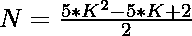
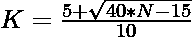

# 检查 N 是否为中心五边形数的程序

> 原文:[https://www . geesforgeks . org/program-to-check-if-n-a-centered-五边形-number-or-not/](https://www.geeksforgeeks.org/program-to-check-if-n-is-a-centered-pentagonal-number-or-not/)

给定一个数字 **N** ，任务是检查 **N** 是否为[中心五边形数字](https://www.geeksforgeeks.org/centered-pentagonal-number/)。如果数字 **N** 是中心五边形数字，则打印**“是”**否则打印**“否”**。

> [**【居中五边形数】**](https://www.geeksforgeeks.org/centered-pentagonal-number/) 是一个居中的图形数，表示一个五边形，中心有一个点，其他点依次围绕在五边形层中。前几个居中的五边形数字是 **1，6，16，31，51，76，106 …**

**示例:**

> **输入:** N = 6
> **输出:**是
> **说明:**
> 秒居中五边形数为 6。
> 
> **输入:**N = 20
> T3】输出:否

**进场:**

1.中心五边形数的第**K**项给出为


2.因为我们必须检查给定的数是否可以表示为[中心五边形数](https://www.geeksforgeeks.org/centered-pentagonal-number/)。这可以检查为:

> => 
> = > 

3.如果用上述公式计算的 **K** 的值是一个整数，那么 **N** 就是一个中心五边形数。

4.否则数字 **N** 不是中心五边形数。

下面是上述方法的实现:

## C++

```
// C++ program for the above approach
#include <bits/stdc++.h>
using namespace std;

// Function to check if number N
// is a Centered pentagonal number
bool isCenteredpentagonal(int N)
{
    float n
        = (5 + sqrt(40 * N - 15))
          / 10;

    // Condition to check if N is a
    // Centered pentagonal number
    return (n - (int)n) == 0;
}

// Driver Code
int main()
{
    // Given Number
    int N = 6;

    // Function call
    if (isCenteredpentagonal(N)) {
        cout << "Yes";
    }
    else {
        cout << "No";
    }
    return 0;
}
```

## Java 语言(一种计算机语言，尤用于创建网站)

```
// Java program for the above approach
import java.util.*;

class GFG{

// Function to check if number N
// is a centered pentagonal number
static boolean isCenteredpentagonal(int N)
{
    float n = (float) ((5 + Math.sqrt(40 * N -
                                      15)) / 10);

    // Condition to check if N is a
    // centered pentagonal number
    return (n - (int)n) == 0;
}

// Driver Code
public static void main(String[] args)
{

    // Given Number
    int N = 6;

    // Function call
    if (isCenteredpentagonal(N))
    {
        System.out.print("Yes");
    }
    else
    {
        System.out.print("No");
    }
}
}

// This code is contributed by sapnasingh4991
```

## 蟒蛇 3

```
# Python3 program for the above approach
import numpy as np

# Function to check if number N
# is a centered pentagonal number
def isCenteredpentagonal(N):

    n = (5 + np.sqrt(40 * N - 15)) / 10

    # Condition to check if N is a
    # centered pentagonal number
    return (n - int(n)) == 0

# Driver Code
N = 6

# Function call
if (isCenteredpentagonal(N)):
    print ("Yes")
else:
    print ("No")

# This code is contributed by PratikBasu
```

## C#

```
// C# program for the above approach
using System;

class GFG{

// Function to check if number N
// is a centered pentagonal number
static bool isCenteredpentagonal(int N)
{
    float n = (float) ((5 + Math.Sqrt(40 * N -
                                      15)) / 10);

    // Condition to check if N is a
    // centered pentagonal number
    return (n - (int)n) == 0;
}

// Driver Code
public static void Main(string[] args)
{

    // Given number
    int N = 6;

    // Function call
    if (isCenteredpentagonal(N))
    {
        Console.Write("Yes");
    }
    else
    {
        Console.Write("No");
    }
}
}

// This code is contributed by rutvik_56
```

## java 描述语言

```
<script>
// javascript program for the above approach

// Function to check if number N
// is a centered pentagonal number
function isCenteredpentagonal(N)
{
    var n =  ((5 + Math.sqrt(40 * N -
                                      15)) / 10);

    // Condition to check if N is a
    // centered pentagonal number
    return (n - parseInt(n) == 0);
}

// Driver Code
//Given Number
var N = 6;

// Function call
if (isCenteredpentagonal(N))
{
    document.write("Yes");
}
else
{
    document.write("No");
}

// This code is contributed by Amit Katiyar
</script>
```

**Output:** 

```
Yes
```

***时间复杂度:** O(1)*

***辅助空间:** O(1)*