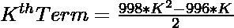
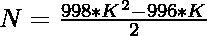
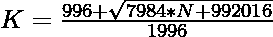

# 检查 N 是否为奇利根数的程序

> 原文:[https://www . geesforgeks . org/program-to-check-if-n-is-a-Chili agon-number/](https://www.geeksforgeeks.org/program-to-check-if-n-is-a-chiliagon-number/)

给定一个整数 **N** ，任务是检查 **N** 是否为奇利亚贡数。如果编号 **N** 是一个[奇利亚贡编号](https://www.geeksforgeeks.org/chiliagon-number/)，则打印“是”，否则打印“否”。

> [**奇利亚贡数**](https://www.geeksforgeeks.org/chiliagon-number/) 是类俑数。它有一个 1000 边的多边形，叫做奇利亚贡。**第 N 个**奇利亚贡数字计算 1000 个点的数量，所有其他点被一个共同的共享角包围并形成一个图案。前几个奇利亚贡数字是 **1，1000，2997，5992，…**

**例:**

> **输入:** N = 1000
> **输出:**是
> **说明:**
> 第二个 chiliagon 数为 1000
> **输入:** 35
> **输出:**否

**进场:**

1.  奇利亚冈号的第 K <sup>个</sup>术语被命名为
    

2.  因为我们必须检查给定的数字是否可以表示为**奇利亚贡数**。这可以通过以下方式进行检查:

> => 
> = > 

3.如果使用上述公式计算的 **K** 的值是整数，那么 **N** 是奇利亚贡数。

4.否则 **N** 不是奇利亚贡数。

以下是上述方法的实现:

## C++

```
// C++ for the above approach
#include <bits/stdc++.h>
using namespace std;

// Function to check that if N is
// Chiliagon Number or not
bool is_Chiliagon(int N)
{
    float n
        = (996 + sqrt(7984 * N + 992016))
          / 1996;

    // Condition to check if N is a
    // Chiliagon Number
    return (n - (int)n) == 0;
}

// Driver Code
int main()
{
    // Given Number
    int N = 1000;

    // Function call
    if (is_Chiliagon(N)) {
        cout << "Yes";
    }
    else {
        cout << "No";
    }
    return 0;
}
```

## Java 语言(一种计算机语言，尤用于创建网站)

```
// Java program for the above approach
class GFG{

// Function to check that if N is
// Chiliagon Number or not
static boolean is_Chiliagon(int N)
{
    float n = (float)(996 + Math.sqrt(7984 * N +
                                      992016)) / 1996;

    // Condition to check if N is a
    // Chiliagon Number
    return (n - (int) n) == 0;
}

// Driver Code
public static void main(String s[])
{
    // Given Number
    int N = 1000;

    // Function call
    if (is_Chiliagon(N))
    {
        System.out.print("Yes");
    }
    else
    {
        System.out.print("No");
    }
}
}

// This code is contributed by rutvik_56
```

## 蟒蛇 3

```
# Python3 for the above approach
import math;

# Function to check that if N is
# Chiliagon Number or not
def is_Chiliagon(N):

    n = (996 + math.sqrt(7984 * N +
                         992016)) // 1996;

    # Condition to check if N is a
    # Chiliagon Number
    return (n - int(n)) == 0;

# Driver Code

# Given Number
N = 1000;

# Function call
if (is_Chiliagon(N)):
    print("Yes");
else:
    print("No");

# This code is contributed by Code_Mech
```

## C#

```
// C# program for the above approach
using System;
class GFG{

// Function to check that if N is
// Chiliagon Number or not
static bool is_Chiliagon(int N)
{
    float n = (float)(996 + Math.Sqrt(7984 * N +
                                      992016)) / 1996;

    // Condition to check if N is a
    // Chiliagon Number
    return (n - (int) n) == 0;
}

// Driver Code
public static void Main()
{
    // Given Number
    int N = 1000;

    // Function call
    if (is_Chiliagon(N))
    {
        Console.Write("Yes");
    }
    else
    {
        Console.Write("No");
    }
}
}

// This code is contributed by Code_Mech
```

## java 描述语言

```
<script>

// Javascript for the above approach

// Function to check that if N is
// Chiliagon Number or not
function is_Chiliagon(N)
{
    let n
        = (996 + Math.sqrt(7984 * N + 992016))
        / 1996;

    // Condition to check if N is a
    // Chiliagon Number
    return (n - Math.floor(n)) == 0;
}

// Driver Code

    // Given Number
    let N = 1000;

    // Function call
    if (is_Chiliagon(N)) {
        document.write("Yes");
    }
    else {
        document.write("No");
    }

// This code is contributed by Mayank Tyagi

</script>
```

**Output:** 

```
Yes
```

***时间复杂度:**O(N<sup>1/2</sup>)*
***辅助空间:*** *O(1)*