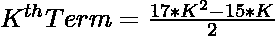
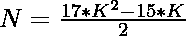
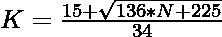

# 检查 N 是否为整数的程序

> 原文:[https://www . geesforgeks . org/program-to-check-if-n-is-enneadecagonal-number/](https://www.geeksforgeeks.org/program-to-check-if-n-is-a-enneadecagonal-number/)

给定一个数字 **N** ，任务是检查 **N** 是否为[恩内卡数字](https://www.geeksforgeeks.org/enneadecagonal-number/)。如果数字 **N** 是一个内部数字，则打印**“是”**否则打印**“否”**。

> [**恩内卡数**](https://www.geeksforgeeks.org/enneadecagonal-number/) 是数学中的 19 边多边形。它属于一类比喻数字。数字包含点的数量，这些点排列成一个图案或系列。一个非十进制数也被称为非十进制数。这些点有公共点，所有其他点都排列在连续的层中。**第 n 个**恩内卡数字计算 17 个点的数量，所有其他点被一个共同的共享角包围并形成一个图案。前几个恩内卡数字是 **1，19，54，106，175…**

**示例:**

> **输入:** N = 19
> **输出:**是
> **说明:**
> 第二个恩内卡数为 19。
> 
> **输入:**N = 30
> T3】输出:否

**进场:**

1.恩内卡数字的第**K**项给出为


2.因为我们必须检查给定的数字是否可以表示为一个**内部数字**。可以勾选为:

> => 
> = > 

3.如果使用上述公式计算出的 **K** 的值是整数，那么 **N** 是一个整数。

4.否则 **N** 不是一个整数。

下面是上述方法的实现:

## C++

```
// C++ program for the above approach
#include <bits/stdc++.h>
using namespace std;

// Function to check if number N
// is a enneadecagonal number
bool isenneadecagonal(int N)
{
    float n
        = (15 + sqrt(136 * N + 225))
          / 34;

    // Condition to check if N is a
    // enneadecagonal number
    return (n - (int)n) == 0;
}

// Driver Code
int main()
{
    // Given Number
    int N = 19;

    // Function call
    if (isenneadecagonal(N)) {
        cout << "Yes";
    }
    else {
        cout << "No";
    }
    return 0;
}
```

## Java 语言(一种计算机语言，尤用于创建网站)

```
// Java program for the above approach
class GFG{

// Function to check if number N
// is a enneadecagonal number
static boolean isenneadecagonal(int N)
{
    float n = (float)(15 + Math.sqrt(136 * N +
                                     225)) / 34;

    // Condition to check if N is a
    // enneadecagonal number
    return (n - (int)n) == 0;
}

// Driver Code
public static void main(String[] args)
{

    // Given Number
    int N = 19;

    // Function call
    if (isenneadecagonal(N))
    {
        System.out.println("Yes");
    }
    else
    {
        System.out.println("No");
    }
}
}

// This code is contributed by rutvik_56
```

## 蟒蛇 3

```
# Python3 program for the above approach
import math

# Function to check if number N
# is a enneadecagonal number
def isenneadecagonal(N):

    n = (15 + math.sqrt(136 * N + 225)) / 34

    # Condition to check if N is a
    # enneadecagonal number
    return (n - int(n)) == 0

# Driver Code
N = 19

# Function call
if (isenneadecagonal(N)):
    print("Yes")
else:
    print("No")

# This code is contributed by divyamohan123
```

## C#

```
// C# program for the above approach
using System;

class GFG{

// Function to check if number N
// is a enneadecagonal number
static bool isenneadecagonal(int N)
{
    float n = (float)(15 + Math.Sqrt(136 * N +
                                     225)) / 34;

    // Condition to check if N is a
    // enneadecagonal number
    return (n - (int)n) == 0;
}

// Driver Code
static public void Main ()
{

    // Given number
    int N = 19;

    // Function call
    if (isenneadecagonal(N))
    {
        Console.Write("Yes");
    }
    else
    {
        Console.Write("No");
    }
}
}

// This code is contributed by shubhamsingh10
```

## java 描述语言

```
<script>

// Javascript program for the above approach

// Function to check if number N
// is a enneadecagonal number
function isenneadecagonal(N){

    let n = parseFloat(15 + Math.sqrt(136 * N + 225)) / 34;

    // Condition to check if N is a
    //enneadecagonal number
    return (n - parseInt(n)) == 0
}
// Driver Code
let N = 19;

// Function call

if (isenneadecagonal(N)){
    document.write("Yes");
    }
else{
    document.write("No");
    }

// This code is contributed by bobby

</script>
```

**Output:** 

```
Yes
```

***时间复杂度:** O(1)*

***辅助空间:** O(1)*