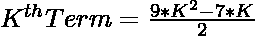
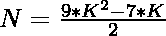
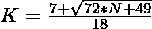

# 检查 N 是否是正交数的程序

> 原文:[https://www . geesforgeks . org/program-to-check-if-n-is-a-hendecagnal-number/](https://www.geeksforgeeks.org/program-to-check-if-n-is-a-hendecagonal-number/)

给定一个整数 **N** ，任务是检查 **N** 是否为[亨德戈纳尔数](https://www.geeksforgeeks.org/hendecagonal-number/)。如果数字 **N** 是亨德卡数字，则打印**“是”**否则打印**“否”**。

> [**亨德戈纳尔数**](https://www.geeksforgeeks.org/hendecagonal-number/) 是一个将三角形和正方形的概念扩展到十边形的图形数( **11 边多边形**)。**第 n 个**十边形数计算 n 个嵌套十边形图案中的点数，所有十边形共享一个公共角，其中图案中的**和**十边形具有由相互间隔一个单位的 **i 个点**组成的边。前几个正交数字是 **1、11、30、58、95、141……**

**例:**

> **输入:** N = 11
> **输出:**是
> **解释:**
> 第二个正交数是 11。
> **输入:** N = 40
> **输出:**否

**进场:**

1.  亨德戈纳尔号的第**K**项给出为
    

2.  因为我们必须检查给定的数字是否可以表示为**正交数字**。可以勾选为:

> => 
> = > 

2.  如果使用上述公式计算的 **K** 的值是整数，那么 **N** 是一个亨德戈纳尔数。
3.  否则 **N** 不是韩德正交数。

以下是上述方法的实现:

## C++

```
// C++ program for the above approach
#include <bits/stdc++.h>
using namespace std;

// Function to check if N is a
// Hendecagonal Number
bool ishendecagonal(int N)
{
    float n
        = (7 + sqrt(72 * N + 49))
          / 18;

    // Condition to check if the
    // number is a hendecagonal number
    return (n - (int)n) == 0;
}

// Driver Code
int main()
{
    // Given Number
    int N = 11;

    // Function call
    if (ishendecagonal(N)) {
        cout << "Yes";
    }
    else {
        cout << "No";
    }
    return 0;
}
```

## Java 语言(一种计算机语言，尤用于创建网站)

```
// Java program for the above approach
import java.lang.Math;

class GFG{

// Function to check if N is a
// hendecagonal number
public static boolean ishendecagonal(int N)
{
    double n = (7 + Math.sqrt(72 * N + 49)) / 18;

    // Condition to check if the
    // number is a hendecagonal number
    return (n - (int)n) == 0;
}

// Driver code   
public static void main(String[] args)
{

    // Given number
    int N = 11;

    // Function call
    if (ishendecagonal(N))
    {
        System.out.println("Yes");
    }
    else
    {
        System.out.println("No");
    }
}
}

// This code is contributed by divyeshrabadiya07   
```

## 蟒蛇 3

```
# Python3 program for the above approach
import math

# Function to check if N is a
# Hendecagonal Number
def ishendecagonal(N):

    n = (7 + math.sqrt(72 * N + 49))// 18;

    # Condition to check if the
    # number is a hendecagonal number
    return (n - int(n)) == 0;

# Driver Code

# Given Number
N = 11;

# Function call
if (ishendecagonal(N)):
    print("Yes");
else:
    print("No");

# This code is contributed by Nidhi_biet
```

## C#

```
// C# program for the above approach
using System;
class GFG{

// Function to check if N is a
// hendecagonal number
public static bool ishendecagonal(int N)
{
    double n = (7 + Math.Sqrt(72 * N + 49)) / 18;

    // Condition to check if the
    // number is a hendecagonal number
    return (n - (int)n) == 0;
}

// Driver code
public static void Main(string[] args)
{

    // Given number
    int N = 11;

    // Function call
    if (ishendecagonal(N))
    {
        Console.Write("Yes");
    }
    else
    {
        Console.Write("No\n");
    }
}
}

// This code is contributed by rutvik_56
```

## java 描述语言

```
<script>

// javascript program for the above approach

// Function to check if N is a
// Hendecagonal Number
function ishendecagonal( N)
{
    let n
        = (7 + Math.sqrt(72 * N + 49))
          / 18;

    // Condition to check if the
    // number is a hendecagonal number
    return (n - parseInt(n)) == 0;
}

// Driver Code

    // Given Number
    let N = 11;

    // Function Call
    if (ishendecagonal(N)) {
        document.write( "Yes");
    }
    else {
        document.write( "No");
    }

// This code contributed by gauravrajput1

</script>
```

**Output:** 

```
Yes
```

***时间复杂度:** O(1)*

***辅助空间:** O(1)*