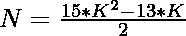
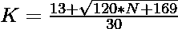

# 检查 N 是否为七进制数的程序

> 原文:[https://www . geeksforgeeks . org/program-to-check-if-n-is-a-hepatecagnal-number/](https://www.geeksforgeeks.org/program-to-check-if-n-is-a-heptadecagonal-number/)

给定一个整数 **N** ，任务是检查它是否是一个[七进制数](https://www.geeksforgeeks.org/heptadecagonal-number/)。如果数字 **N** 是七进制数，则打印**“是”**否则打印**“否”**。

> [**七进制数**](https://www.geeksforgeeks.org/heptadecagonal-number/) 是一类数字。它有一个 17 边的多边形，叫做十七边形。**第 N 个**七进制数计算 17 个数的点，所有其他点被一个共同的共享角包围并形成一个图案。前几个七位数字是 **1，17，48，94，155，231……**

**示例:**

> **输入:** N = 17
> **输出:**是
> **说明:**
> 第二个七进制数是 17。
> 
> **输入:**N = 30
> T3】输出:否

**进场:**

1.**七年号**的 **K <sup>第</sup>T3】项给出为
** 

2.因为我们必须检查给定的数是否可以表示为[七进制数](https://www.geeksforgeeks.org/heptadecagonal-number/)。这可以通过以下方式进行检查–

> => 
> = > 

3.如果用上述公式计算的 **K** 的值是一个整数，那么 **N** 就是一个七进制数。

4.否则 **N** 不是一个七进制数。

下面是上述方法的实现:

## C++

```
// C++ program for the above approach
#include <bits/stdc++.h>
using namespace std;

// Function to check if the number N
// is a heptadecagonal number
bool isheptadecagonal(int N)
{
    float n
        = (13 + sqrt(120 * N + 169))
          / 30;

    // Condition to check if number N
    // is a heptadecagonal number
    return (n - (int)n) == 0;
}

// Driver Code
int main()
{
    // Given Number
    int N = 17;

    // Function call
    if (isheptadecagonal(N)) {
        cout << "Yes";
    }
    else {
        cout << "No";
    }
    return 0;
}
```

## Java 语言(一种计算机语言，尤用于创建网站)

```
// Java program for the above approach
import java.util.*;

class GFG{

// Function to check if the number N
// is a heptadecagonal number
static boolean isheptadecagonal(int N)
{
    float n = (float) ((13 + Math.sqrt(120 * N +
                                       169)) / 30);

    // Condition to check if number N
    // is a heptadecagonal number
    return (n - (int)n) == 0;
}

// Driver Code
public static void main(String[] args)
{

    // Given Number
    int N = 17;

    // Function call
    if (isheptadecagonal(N))
    {
        System.out.print("Yes");
    }
    else
    {
        System.out.print("No");
    }
}
}

// This code is contributed by Amit Katiyar
```

## 蟒蛇 3

```
# Python3 program for the above approach
import numpy as np

# Function to check if the number N
# is a heptadecagonal number
def isheptadecagonal(N):

    n = (13 + np.sqrt(120 * N + 169)) / 30

    # Condition to check if number N
    # is a heptadecagonal number
    return (n - int(n)) == 0

# Driver Code
N = 17

# Function call
if (isheptadecagonal(N)):
    print("Yes")
else:
    print("No")

# This code is contributed by PratikBasu
```

## C#

```
// C# program for the above approach
using System;

class GFG{

// Function to check if the number N
// is a heptadecagonal number
static bool isheptadecagonal(int N)
{
    float n = (float) ((13 + Math.Sqrt(120 * N +
                                       169)) / 30);

    // Condition to check if number N
    // is a heptadecagonal number
    return (n - (int)n) == 0;
}

// Driver Code
public static void Main(string[] args)
{

    // Given Number
    int N = 17;

    // Function call
    if (isheptadecagonal(N))
    {
        Console.Write("Yes");
    }
    else
    {
        Console.Write("No");
    }
}
}

// This code is contributed by rutvik_56
```

## java 描述语言

```
<script>
// Javascript program for the above approach

// Function to check if the number N
// is a heptadecagonal number
function isheptadecagonal(N)
{
    let n
        = (13 + Math.sqrt(120 * N + 169))
          / 30;

    // Condition to check if number N
    // is a heptadecagonal number
    return (n - parseInt(n)) == 0;
}

// Driver Code
// Given Number
let N = 17;

// Function call
if (isheptadecagonal(N)) {
    document.write("Yes");
}
else {
    document.write("No");
}

// This code is contributed by subham348.
</script>
```

**Output:** 

```
Yes
```

***时间复杂度:** O(1)*

***辅助空间:** O(1)*