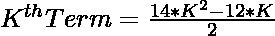
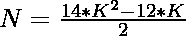

# 检查 N 是否为十六进制数的程序

> 原文:[https://www . geesforgeks . org/program-to-check-if-n-is-十六进制数/](https://www.geeksforgeeks.org/program-to-check-if-n-is-a-hexadecagonal-number/)

给定一个整数 **N** ，任务是检查 **N** 是否为[十六进制数](https://www.geeksforgeeks.org/hexadecagonal-number/)。如果数字 **N** 是十六进制数，则打印**“是”**否则打印**“否”**。

> [**十六边形数**](https://www.geeksforgeeks.org/hexadecagonal-number/) 是类形数和一个完美的正方形。它有 **16 边多边形**叫做**十六边**或者**六边形**。**第 n 个**十六边形数计算十六个数的点，所有其他点都围绕在它的连续层周围。前几个十六进制数是 **1，16，45，88，145，216…**

**示例:**

> **输入:** N = 16
> **输出:**是
> **说明:**
> 第二个十六边数为 16。
> 
> **输入:**N = 30
> T3】输出:否

**进场:**

1.十六边形数的第**K**项给出为


2.因为我们必须检查给定的数是否可以表示为**十六进制数**。这可以检查为:

> => 
> = > 

3.如果用上述公式计算的 **K** 的值是一个整数，那么 **N** 就是一个十六进制数。

4.否则 **N** 不是十六进制数。

下面是上述方法的实现:

## C++

```
// C++ program for the above approach
#include <bits/stdc++.h>
using namespace std;

// Function to check if N is a
// hexadecagonal number
bool ishexadecagonal(int N)
{
    float n
        = (12 + sqrt(112 * N + 144))
          / 28;

    // Condition to check if the
    // number is a hexadecagonal number
    return (n - (int)n) == 0;
}

// Driver Code
int main()
{
    // Given Number
    int N = 16;

    // Function call
    if (ishexadecagonal(N)) {
        cout << "Yes";
    }
    else {
        cout << "No";
    }
    return 0;
}
```

## Java 语言(一种计算机语言，尤用于创建网站)

```
// Java program for the above approach
import java.lang.Math;

class GFG{

// Function to check if N is a
// hexadecagonal number
public static boolean ishexadecagonal(int N)
{
    double n = (12 + Math.sqrt(112 * N +
                               144)) / 28;

    // Condition to check if the
    // number is a hexadecagonal number
    return (n - (int)n) == 0;
}

// Driver code   
public static void main(String[] args)
{

    // Given number
    int N = 16;

    // Function call
    if (ishexadecagonal(N))
    {
        System.out.println("Yes");
    }
    else
    {
        System.out.println("No");
    }
}
}

// This code is contributed by divyeshrabadiya07   
```

## 蟒蛇 3

```
# Python3 program for the above approach
from math import sqrt

# Function to check if N is
# a hexadecagonal number
def ishexadecagonal(N):

    n = (12 + sqrt(112 * N + 144)) / 28;

    # Condition to check if the number
    # is a hexadecagonal number
    return (n - int(n)) == 0;

# Driver code
if __name__ == "__main__":

    # Given number
    N = 16;

    # Function call
    if (ishexadecagonal(N)):
        print("Yes");
    else:
        print("No");

# This code is contributed by AnkitRai01
```

## C#

```
// C# program for the above approach
using System;

class GFG{

// Function to check if N is a
// hexadecagonal number
public static bool ishexadecagonal(int N)
{
    double n = (12 + Math.Sqrt(112 * N +
                             144)) / 28;

    // Condition to check if the
    // number is a hexadecagonal number
    return (n - (int)n) == 0;
}

// Driver code
public static void Main(string[] args)
{

    // Given number
    int N = 16;

    // Function call
    if (ishexadecagonal(N))
    {
        Console.Write("Yes");
    }
    else
    {
        Console.Write("No");
    }
}
}

// This code is contributed by rutvik_56
```

## java 描述语言

```
<script>

// javascript program for the above approach

// Function to check if N is a
// hexadecagonal number
function ishexadecagonal( N)
{
    let n
        = (12 + Math.sqrt(112 * N + 144))
          / 28;

    // Condition to check if the
    // number is a hexadecagonal number
    return (n - parseInt(n)) == 0;
}

// Driver Code

    // Given Number
    let N = 16;

    // Function Call
    if (ishexadecagonal(N)) {
        document.write( "Yes");
    }
    else {
        document.write( "No");
    }

// This code contributed by Rajput-Ji

</script>
```

**Output:** 

```
Yes
```

***时间复杂度:** O(1)*

***辅助空间:** O(1)*