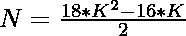

# 检查 N 是否为整数的程序

> 原文:[https://www . geesforgeks . org/program-to-check-if-n-is-a-icosagonal-number/](https://www.geeksforgeeks.org/program-to-check-if-n-is-a-icosagonal-number/)

给定一个整数 **N** ，任务是检查它是否是一个[二进制数](https://www.geeksforgeeks.org/icosagonal-number/)。如果数字 **N** 是一个 Icosagonal 数字，则打印**“是”**否则打印**“否”**。

> [**等角数**](https://www.geeksforgeeks.org/icosagonal-number/)**是一个 20 边的多边形。从比喻类导出的数字。在这个系列中观察到不同的模式。这些点是可计数的，以特定的位置排列，并创建一个图表。所有的点都有公共的点，所有其他的点都连接到这些点，除了这个公共点，这些点都通过它们各自的连续层连接到它们的第 I 个点…前几个 Icosagonal 数字是 **1，20，57，112，185，276…****

****示例:****

> ****输入:** N = 20
> **输出:**是
> **说明:**
> 第二个 Icosagonal 数为 20。**
> 
>  ****输入:**N = 30
> T3】输出:否**

****进场:****

**1.Icosagonal Number 的第**K**项给出为
** 

**2.因为我们必须检查给定的数是否可以表示为二叉数。这可以通过以下方式进行检查–**

> **=> 
> = > **

**3.如果用上述公式计算出的 **K** 的值是整数，那么 **N** 就是一个整数。**

**4.否则数字 **N** 不是一个整数。**

**下面是上述方法的实现:**

## **C++**

```
// C++ program for the above approach
#include <bits/stdc++.h>
using namespace std;

// Function to check if the number
// N is a icosagonal number
bool iicosagonal(int N)
{
    float n
        = (16 + sqrt(144 * N + 256))
          / 36;

    // Condition to check if the
    // N is a icosagonal number
    return (n - (int)n) == 0;
}

// Driver Code
int main()
{
    // Given Number
    int N = 20;

    // Function call
    if (iicosagonal(N)) {
        cout << "Yes";
    }
    else {
        cout << "No";
    }
    return 0;
}
```

## **Java 语言(一种计算机语言，尤用于创建网站)**

```
// Java program for the above approach
import java.util.*;

class GFG{

// Function to check if the number
// N is a icosagonal number
static boolean iicosagonal(int N)
{
    float n = (float)((16 + Math.sqrt(144 * N +
                                      256)) / 36);

    // Condition to check if the
    // N is a icosagonal number
    return (n - (int)n) == 0;
}

// Driver Code
public static void main(String[] args)
{

    // Given Number
    int N = 20;

    // Function call
    if (iicosagonal(N))
    {
        System.out.print("Yes");
    }
    else
    {
        System.out.print("No");
    }
}
}

// This code is contributed by Rohit_ranjan
```

## **蟒蛇 3**

```
# Python3 program for the above approach
import numpy as np

# Function to check if the number
# N is a icosagonal number
def iicosagonal(N):

    n = (16 + np.sqrt(144 * N + 256)) / 36

    # Condition to check if the
    # N is a icosagonal number
    return (n - int(n)) == 0

# Driver Code
N = 20

# Function call
if (iicosagonal(N)):
    print ("Yes")
else:
    print ("No")

# This code is contributed by PratikBasu
```

## **C#**

```
// C# program for the above approach
using System;

class GFG{

// Function to check if the number
// N is a icosagonal number
static bool iicosagonal(int N)
{
    float n = (float)((16 + Math.Sqrt(144 * N +
                                      256)) / 36);

    // Condition to check if the
    // N is a icosagonal number
    return (n - (int)n) == 0;
}

// Driver Code
public static void Main(string[] args)
{

    // Given Number
    int N = 20;

    // Function call
    if (iicosagonal(N))
    {
        Console.Write("Yes");
    }
    else
    {
        Console.Write("No");
    }
}
}

// This code is contributed by rutvik_56
```

## **java 描述语言**

```
<script>

// Javascript program for the above approach

// Function to check if the number
// N is a icosagonal number
function iicosagonal(N)
{
    var n
        = (16 + Math.sqrt(144 * N + 256))
          / 36;

    // Condition to check if the
    // N is a icosagonal number
    return (n - parseInt(n)) == 0;
}

// Driver Code

// Given Number
var N = 20;
// Function call
if (iicosagonal(N)) {
    document.write( "Yes");
}
else {
    document.write("No");
}

</script>
```

****Output:** 

```
Yes
```** 

*****时间复杂度:** O(1)***

*****辅助空间:** O(1)***