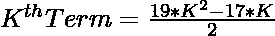
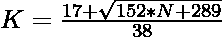

# 检查 N 是否为二十进制数的程序

> 原文:[https://www . geesforgeks . org/program-to-check-if-n-is-a-icosihenagnal-number/](https://www.geeksforgeeks.org/program-to-check-if-n-is-a-icosihenagonal-number/)

给定一个整数 **N** ，任务是检查它是否是一个[二正交数](https://www.geeksforgeeks.org/icosihenagonal-number/)。

> [**二十进制数**](https://www.geeksforgeeks.org/icosihenagonal-number/) 是类形数。它有一个 21 边的多边形，叫做 Icosihenagon。第 n 个 Icosihenagonal 数计算 21 个点的数量，所有其他点都被一个公共共享角包围并形成一个图案。前几个二十进制数是 1，21，60，118，195，291，406…

**例:**

> **输入:** N = 21
> **输出:**是
> **说明:**
> 第二个二十进制数为 21。
> **输入:** N = 30
> **输出:**否

**进场:**

1.  二十进制数的第 K<sup>项给出为
    </sup> 
2.  因为我们必须检查给定的数是否可以表示为二十进制数。这可以通过以下方式进行检查–

> => 
> = > 

2.  最后，检查使用此公式计算的值是否为整数，这意味着 N 是二十进制数。

以下是上述方法的实现:

## C++

```
// C++ implementation to check that
// a number is icosihenagonal number or not

#include <bits/stdc++.h>

using namespace std;

// Function to check that the
// number is a icosihenagonal number
bool isicosihenagonal(int N)
{
    float n
        = (17 + sqrt(152 * N + 289))
          / 38;

    // Condition to check if the
    // number is a icosihenagonal number
    return (n - (int)n) == 0;
}

// Driver Code
int main()
{
    int i = 21;

    // Function call
    if (isicosihenagonal(i)) {
        cout << "Yes";
    }
    else {
        cout << "No";
    }
    return 0;
}
```

## Java 语言(一种计算机语言，尤用于创建网站)

```
// Java implementation to check that a
// number is icosihenagonal number or not
class GFG{

// Function to check that the number
// is a icosihenagonal number
static boolean isicosihenagonal(int N)
{
    float n = (float) ((17 + Math.sqrt(152 * N +
                                       289)) / 38);

    // Condition to check if the number
    // is a icosihenagonal number
    return (n - (int)n) == 0;
}

// Driver Code
public static void main(String[] args)
{
    int i = 21;

    // Function call
    if (isicosihenagonal(i))
    {
        System.out.print("Yes");
    }
    else
    {
        System.out.print("No");
    }
}
}

// This code is contributed by 29AjayKumar
```

## 蟒蛇 3

```
# Python3 implementation to check that
# a number is icosihenagonal number or not
import math

# Function to check that the number
# is a icosihenagonal number
def isicosihenagonal(N):

    n = (17 + math.sqrt(152 * N + 289)) / 38

    # Condition to check if the number
    # is a icosihenagonal number
    return (n - int(n)) == 0

# Driver Code
i = 21

# Function call
if isicosihenagonal(i):
    print("Yes")
else :
    print("No")

# This code is contributed by divyamohan123
```

## C#

```
// C# implementation to check that a
// number is icosihenagonal number or not
using System;

class GFG{

// Function to check that the number
// is a icosihenagonal number
static bool isicosihenagonal(int N)
{
    float n = (float)((17 + Math.Sqrt(152 * N +
                                      289)) / 38);

    // Condition to check if the number
    // is a icosihenagonal number
    return (n - (int)n) == 0;
}

// Driver Code
public static void Main()
{
    int i = 21;

    // Function call
    if (isicosihenagonal(i))
    {
        Console.Write("Yes");
    }
    else
    {
        Console.Write("No");
    }
}
}

// This code is contributed by Code_Mech
```

## java 描述语言

```
<script>

// JavaScript implementation to check that
// a number is icosihenagonal number or not

// Function to check that the
// number is a icosihenagonal number
function isicosihenagonal(N)
{
    var n
        = (17 + Math.sqrt(152 * N + 289))
          / 38;

    // Condition to check if the
    // number is a icosihenagonal number
    return (n - parseInt(n)) == 0;
}

// Driver Code
var i = 21;
// Function call
if (isicosihenagonal(i)) {
    document.write("Yes");
}
else {
    document.write("No");
}

</script>
```

**Output:** 

```
Yes
```

***时间复杂度:** O(1)*

***辅助空间:** O(1)*