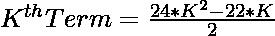
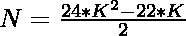
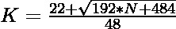

# 检查 N 是否为二十进制数的程序

> 原文:[https://www . geesforgeks . org/program-to-check-if-n-is-a-icosihexagonal-number/](https://www.geeksforgeeks.org/program-to-check-if-n-is-a-icosihexagonal-number/)

给定一个整数 **N** ，任务是检查它是否是一个[二正交数](https://www.geeksforgeeks.org/icosihexagonal-number/)。

> [二十六边形数](https://www.geeksforgeeks.org/icosihexagonal-number/)是图形数的类。它有一个 26 边的多边形，叫做 Icosihexagon。第 N 个 Icosihexagonal 数字计数是 26 个点的数量，所有其他点被一个公共共享角包围并形成一个图案。前几个 Icosihexagonol 数字是 1、26、75、148……

**例:**

> **输入:** N = 26
> **输出:**是
> **说明:**
> 第二个二十六边形数是 26。
> **输入:** 30
> **输出:**否

**进场:**

1.  二十边形数的第 K<sup>项给出为
    </sup> 
2.  因为我们必须检查给定的数是否可以表示为二十六边形数。这可以通过以下方式进行检查–

> => 
> = > 

2.  最后，检查使用此公式计算的值是否为整数，这意味着 N 是一个二十进制数。

以下是上述方法的实现:

## C++

```
// C++ program to check whether
// a number is a icosihexagonal number
// or not

#include <bits/stdc++.h>

using namespace std;

// Function to check whether the
// number is a icosihexagonal number
bool isicosihexagonal(int N)
{
    float n
        = (22 + sqrt(192 * N + 484))
          / 48;

    // Condition to check if the
    // number is a icosihexagonal number
    return (n - (int)n) == 0;
}

// Driver code
int main()
{
    int i = 26;

    if (isicosihexagonal(i)) {
        cout << "Yes";
    }
    else {
        cout << "No";
    }
    return 0;
}
```

## Java 语言(一种计算机语言，尤用于创建网站)

```
// Java program to check whether the
// number is a icosihexagonal number
// or not
class GFG{

// Function to check whether the
// number is a icosihexagonal number
static boolean isicosihexagonal(int N)
{
    float n = (float) ((22 + Math.sqrt(192 * N +
                                       484)) / 48);

    // Condition to check if the number
    // is a icosihexagonal number
    return (n - (int)n) == 0;
}

// Driver Code
public static void main(String[] args)
{

    // Given number
    int N = 26;

    // Function call
    if (isicosihexagonal(N))
    {
        System.out.print("Yes");
    }
    else
    {
        System.out.print("No");
    }
}
}

// This code is contributed by shubham
```

## 蟒蛇 3

```
# Python3 program to check whether
# a number is a icosihexagonal number
# or not
import numpy as np

# Function to check whether the
# number is a icosihexagonal number
def isicosihexagonal(N):

    n = (22 + np.sqrt(192 * N + 484)) / 48

    # Condition to check if the
    # number is a icosihexagonal number
    return (n - (int(n))) == 0

# Driver code
i = 26

if (isicosihexagonal(i)):
    print ("Yes")
else:
    print ("No")

# This code is contributed by PratikBasu
```

## C#

```
// C# program to check whether the
// number is a icosihexagonal number
// or not
using System;
class GFG{

// Function to check whether the
// number is a icosihexagonal number
static bool isicosihexagonal(int N)
{
    float n = (float)((22 + Math.Sqrt(192 * N +
                                      484)) / 48);

    // Condition to check if the number
    // is a icosihexagonal number
    return (n - (int)n) == 0;
}

// Driver Code
public static void Main()
{

    // Given number
    int N = 26;

    // Function call
    if (isicosihexagonal(N))
    {
        Console.Write("Yes");
    }
    else
    {
        Console.Write("No");
    }
}
}

// This code is contributed by Code_Mech
```

## java 描述语言

```
<script>
// Javascript program to check whether
// a number is a icosihexagonal number
// or not

// Function to check whether the
// number is a icosihexagonal number
function isicosihexagonal(N)
{
    let n
        = (22 + Math.sqrt(192 * N + 484))
          / 48;

    // Condition to check if the
    // number is a icosihexagonal number
    return (n - parseInt(n)) == 0;
}

// Driver code
let i = 26;

if (isicosihexagonal(i)) {
    document.write("Yes");
}
else {
    document.write("No");
}

// This code is contributed by rishavmahato348.
</script>
```

**Output:** 

```
Yes
```

***时间复杂度:** O(sqrt(n))*

***辅助空间:** O(1)*