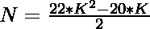
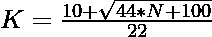

# 检查 N 是否为二进制数字的程序

> 原文:[https://www . geesforgeks . org/program-to-check-if-n-is-a-icositetragonal-number/](https://www.geeksforgeeks.org/program-to-check-if-n-is-a-icositetragonal-number/)

给定一个整数 **N** ，任务是检查它是否是一个[二位悲剧数字](https://www.geeksforgeeks.org/icositetragonal-number/)。

> [**悲喜剧号**](https://www.geeksforgeeks.org/icositetragonal-number/) :
> s 一类人物号。它有一个 24 边的多边形，叫做 Icositetragon。第 N 个悲喜剧数字计数的点的数量和所有其他的点被一个共同的共享角落包围并且形成一个图案
> 前几个悲喜剧数字是 1，24，69，136，225，336，…

**例:**

> **输入:** N = 24
> **输出:**是
> **说明:**
> 第二个悲喜剧数字是 24。
> **输入:** N = 30
> **输出:**否

**进场:**

1.  悲喜剧号的第 K<sup>项给出为
    </sup> 
2.  因为我们必须检查给定的数字是否可以表示为一个二选一的数字。这可以通过以下方式进行检查–

> => 
> = > 

2.  最后，检查使用此公式计算的值是否为整数，这意味着 N 是一个二进制数字。

以下是上述方法的实现:

## C++

```
// C++ implementation to check that
// a number is icositetragonal number or not

#include <bits/stdc++.h>

using namespace std;

// Function to check that the
// number is a icositetragonal number
bool isicositetragonal(int N)
{
    float n
        = (10 + sqrt(44 * N + 100))
          / 22;

    // Condition to check if the
    // number is a icositetragonal number
    return (n - (int)n) == 0;
}

// Driver Code
int main()
{
    int i = 24;

    // Function call
    if (isicositetragonal(i)) {
        cout << "Yes";
    }
    else {
        cout << "No";
    }
    return 0;
}
```

## Java 语言(一种计算机语言，尤用于创建网站)

```
// Java implementation to check that
// a number is icositetragonal number or not
class GFG{

// Function to check that the
// number is a icositetragonal number
static boolean isicositetragonal(int N)
{
    float n = (float)((10 + Math.sqrt(44 * N +
                                      100)) / 22);

    // Condition to check if the
    // number is a icositetragonal number
    return (n - (int)n) == 0;
}

// Driver Code
public static void main(String[] args)
{
    int i = 24;

    // Function call
    if (isicositetragonal(i))
    {
        System.out.print("Yes");
    }
    else
    {
        System.out.print("No");
    }
}
}

// This code is contributed by 29AjayKumar
```

## 蟒蛇 3

```
# Python3 implementation to check that
# a number is icositetragonal number
# or not
import math

# Function to check that the number
# is a icositetragonal number
def isicositetragonal(N):

    n = (10 + math.sqrt(44 * N + 100)) / 22

    # Condition to check if the number
    # is a icositetragonal number
    return (n - int(n)) == 0

# Driver Code
i = 24

# Function call
if (isicositetragonal(i)):
    print("Yes")
else:
    print("No")

# This code is contributed by divyamohan123
```

## C#

```
// C# implementation to check that
// a number is icositetragonal number or not
using System;
class GFG{

// Function to check that the
// number is a icositetragonal number
static bool isicositetragonal(int N)
{
    float n = (float)((10 + Math.Sqrt(44 * N +
                                      100)) / 22);

    // Condition to check if the
    // number is a icositetragonal number
    return (n - (int)n) == 0;
}

// Driver Code
public static void Main()
{
    int i = 24;

    // Function call
    if (isicositetragonal(i))
    {
        Console.Write("Yes");
    }
    else
    {
        Console.Write("No");
    }
}
}

// This code is contributed by Akanksha_Rai
```

## java 描述语言

```
<script>

// JavaScript implementation to check that
// a number is icositetragonal number or not

// Function to check that the
// number is a icositetragonal number
function isicositetragonal(N)
{
    var n = (10 + Math.sqrt(44 * N + 100))
          / 22;

    // Condition to check if the
    // number is a icositetragonal number
    return (n - parseInt(n)) == 0;
}

// Driver Code
var i = 24;
// Function call
if (isicositetragonal(i)) {
    document.write("Yes");
}
else {
    document.write("No");
}

</script>
```

**Output:** 

```
Yes
```

***时间复杂度:** O(1)*

***辅助空间:** O(1)*