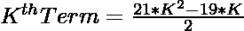
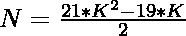
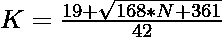

# 检查 N 是否为整数的程序

> 原文:[https://www . geesforgeks . org/program-to-check-if-n-is-a-icositrigonial-number/](https://www.geeksforgeeks.org/program-to-check-if-n-is-a-icositrigonal-number/)

给定一个整数 **N** ，任务是检查它是否是一个 [Icositrigonal 数字](https://www.geeksforgeeks.org/icositrigonal-number/)。

> [**Icositrigonal 数**](https://www.geeksforgeeks.org/icositrigonal-number/) 是一类具象数。它有一个 23 边的多边形，叫做 Icositrigon。第 N 个 Icositrigonal 数字计数是 23 个点的数量，所有其他点都被一个公共的共享角包围并形成一个图案。前几个 Icositrigonol 数字是 1，23，66，130，215，321，448 …

**例:**

> **输入:** N = 23
> **输出:**是
> **说明:**
> 秒 icositrigonal 数为 23。
> **输入:** N = 30
> **输出:**否

**进场:**

1.  icositrigonal 数的第 K<sup>项给出为
    </sup> 
2.  因为我们必须检查给定的数是否可以表示为 icositrigonal 数。这可以通过以下方式进行检查–

> => 
> = > 

2.  最后，检查使用此公式计算的值是否为整数，这意味着 N 是一个整数。

以下是上述方法的实现:

## C++

```
// C++ implementation to check that
// a number is a icositrigonal number or not

#include <bits/stdc++.h>

using namespace std;

// Function to check that the
// number is a icositrigonal number
bool isicositrigonal(int N)
{
    float n
        = (19 + sqrt(168 * N + 361))
          / 42;

    // Condition to check if the
    // number is a icositrigonal number
    return (n - (int)n) == 0;
}

// Driver Code
int main()
{
    int i = 23;

    // Function call
    if (isicositrigonal(i)) {
        cout << "Yes";
    }
    else {
        cout << "No";
    }
    return 0;
}
```

## Java 语言(一种计算机语言，尤用于创建网站)

```
// Java implementation to check that
// a number is a icositrigonal number or not
import java.util.*;
class GFG{

// Function to check that the
// number is a icositrigonal number
static boolean isicositrigonal(int N)
{
    float n = (float)(19 + Math.sqrt(168 * N + 361)) / 42;

    // Condition to check if the
    // number is a icositrigonal number
    return (n - (int)n) == 0;
}

// Driver Code
public static void main(String args[])
{
    int i = 23;

    // Function call
    if (isicositrigonal(i))
    {
        System.out.print("Yes");
    }
    else
    {
        System.out.print("No");
    }
}
}

// This code is contributed by Akanksha_Rai
```

## 蟒蛇 3

```
# Python3 implementation to check that a 
# number is a icositrigonal number or not
import math

# Function to check that the number
# is a icositrigonal number
def isicositrigonal(N):

    n = (19 + math.sqrt(168 * N + 361)) / 42

    # Condition to check if the number 
    # is a icositrigonal number
    return (n - int(n)) == 0

# Driver Code
i = 23

# Function call
if (isicositrigonal(i)):
    print("Yes")
else:
    print("No")

# This code is contributed by divyamohan123
```

## C#

```
// C# implementation to check that
// a number is a icositrigonal number or not
using System;
class GFG{

// Function to check that the
// number is a icositrigonal number
static bool isicositrigonal(int N)
{
    float n = (float)(19 + Math.Sqrt(168 * N + 361)) / 42;

    // Condition to check if the
    // number is a icositrigonal number
    return (n - (int)n) == 0;
}

// Driver Code
public static void Main()
{
    int i = 23;

    // Function call
    if (isicositrigonal(i))
    {
        Console.Write("Yes");
    }
    else
    {
        Console.Write("No");
    }
}
}

// This code is contributed by Nidhi_Biet
```

## java 描述语言

```
<script>

// JavaScript implementation to check that
// a number is a icositrigonal number or not

// Function to check that the
// number is a icositrigonal number
function isicositrigonal(N)
{
    var n
        = (19 + Math.sqrt(168 * N + 361))
          / 42;

    // Condition to check if the
    // number is a icositrigonal number
    return (n - parseInt(n)) == 0;
}

// Driver Code
var i = 23;
// Function call
if (isicositrigonal(i)) {
    document.write("Yes");
}
else {
    document.write("No");
}

</script>
```

**Output:** 

```
Yes
```

***时间复杂度:** O(1)*

***辅助空间:** O(1)*