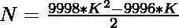
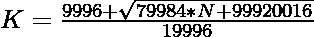

# 检查 N 是否为米里扬数的程序

> 原文:[https://www . geesforgeks . org/program-to-check-if-n-is-a-myriagon-number/](https://www.geeksforgeeks.org/program-to-check-if-n-is-a-myriagon-number/)

给定一个数字 **N** ，任务是检查 **N** 是否为[米里扬数字](https://en.wikipedia.org/wiki/Myriagon)。如果数字 **N** 是米里扬数字，则打印**“是”**否则打印**“否”**。

> [**米里扬数**](https://en.wikipedia.org/wiki/Myriagon) 是一个有 10000 条边的多边形。前几个米里扬号码是 **1，10000，29997，59992，99985，149976……**

**例:**

> **输入:** N = 10000
> **输出:**是
> **说明:**
> 第二个米里扬数为 10000。
> **输入:** N = 300
> **输出:**否

**进场:**

1.  米里亚根编号的第**K**项给出为:
    

2.  因为我们必须检查给定的数字是否可以表示为**米里扬数**。可以勾选为:

> => 
> = > 

2.  如果用上述公式计算的 **K** 的值是一个整数，那么 **N** 就是一个米里扬数。
3.  否则 **N** 不是米里扬数。

以下是上述方法的实现:

## C++

```
// C++ program for the above approach
#include <bits/stdc++.h>
using namespace std;

// Function to check if N is a
// Myriagon Number
bool isMyriagon(int N)
{
    float n
        = (9996 + sqrt(79984 * N + 99920016))
          / 19996;

    // Condition to check if the
    // number is a Myriagon number
    return (n - (int)n) == 0;
}

// Driver Code
int main()
{
    // Given Number
    int N = 10000;

    // Function call
    if (isMyriagon(N)) {
        cout << "Yes";
    }
    else {
        cout << "No";
    }
    return 0;
}
```

## Java 语言(一种计算机语言，尤用于创建网站)

```
// Java program for the above approach
import java.io.*;

class GFG {

// Function to check if N
// is a myriagon number
static boolean isMyriagon(int N)
{
    double n = (9996 + Math.sqrt(79984 * N +
                                 99920016)) / 19996;

    // Condition to check if the
    // number is a myriagon number
    return (n - (int)n) == 0;
}

// Driver Code
public static void main (String[] args)
{

    // Given Number
    int N = 10000;

    // Function call
    if (isMyriagon(N))
    {
        System.out.println("Yes" );
    }
    else
    {
        System.out.println("No" );
    }
}
}

// This code is contributed by ShubhamCoder
```

## 蟒蛇 3

```
# Python3 implementation to check that
# a number is a myriagon number or not
import math

# Function to check that the
# number is a myriagon number
def isMyriagon(N):

    n = (9996 + math.sqrt(79984 * N +
                          99920016)) / 19996

    # Condition to check if the
    # number is a myriagon number
    return (n - int(n)) == 0

# Driver Code
n = 10000

# Function call
if (isMyriagon(n)):
    print("Yes")
else:
    print("No")

# This code is contributed by ShubhamCoder
```

## C#

```
// C# program for the above approach
using System;

class GFG{

// Function to check if N
// is a myriagon number
static bool isMyriagon(int N)
{
    double n = (9996 + Math.Sqrt(79984 * N +
                                 99920016)) / 19996;

    // Condition to check if the
    // number is a myriagon number
    return (n - (int)n) == 0;
}

// Driver Code
static public void Main ()
{

    // Given Number
    int N = 10000;

    // Function call
    if (isMyriagon(N))
    {
        Console.Write( "Yes" );
    }
    else
    {
        Console.Write( "No" );
    }
}
}

// This code is contributed by ShubhamCoder
```

## java 描述语言

```
<script>

// Javascript program for the above approach

// Function to check if N is a
// Myriagon Number
function isMyriagon(N)
{
    n = (9996 + Math.sqrt(79984 * N + 99920016))
          / 19996;

    // Condition to check if the
    // number is a Myriagon number
    return (n - parseInt(n)) == 0;
}

// Driver Code
// Given Number
N = 10000;
// Function call
if (isMyriagon(N)) {
    document.write("Yes");
}
else {
    document.write("No");
}

</script>
```

**Output:** 

```
Yes
```

***时间复杂度:** O(1)*

***辅助空间:** O(1)*